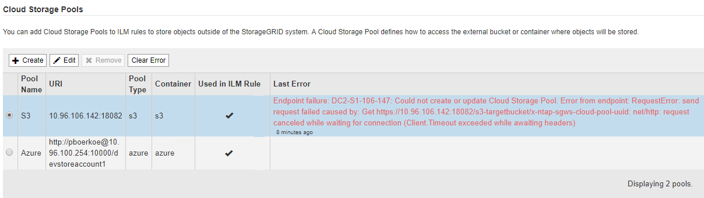
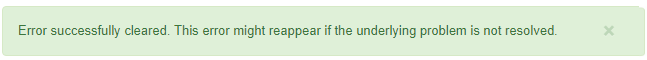

= Troubleshooting Cloud Storage Pools
:icons: font
:imagesdir: ../media/

[.lead]
If you encounter errors when creating, editing, or deleting a Cloud Storage Pool, use these troubleshooting steps to help resolve the issue.

== Determining if an error has occurred

StorageGRID performs a simple health check on every Cloud Storage Pool once a minute to ensure that the Cloud Storage Pool can be accessed and that it is functioning correctly. If the health check detects an issue, a message is shown in the Last Error column of the Cloud Storage Pools table on the Storage Pools page.

The table shows the most recent error detected for each Cloud Storage Pool and indicates how long ago the error occurred.

In addition, a *Cloud Storage Pool connectivity error* alert is triggered if the health check detects that one or more new Cloud Storage Pool errors have occurred within the past 5 minutes. If you receive an email notification for this alert, go to the Storage Pool page (select *ILM* > *Storage Pools*), review the error messages in the Last Error column, and refer to the troubleshooting guidelines below.

== Checking if an error has been resolved

After resolving any underlying issues, you can determine if the error has been resolved. From the Cloud Storage Pool page, select the radio button for the endpoint, and click *Clear Error*. A confirmation message indicates that StorageGRID has cleared the error for the Cloud Storage Pool.

If the underlying problem has been resolved, the error message is no longer displayed. However, if the underlying problem has not been fixed (or if a different error is encountered), the error message will be shown in the Last Error column within a few minutes.

== Error: This Cloud Storage Pool contains unexpected content

You might encounter this error when you try to create, edit, or delete a Cloud Storage Pool. This error occurs if the bucket or container includes the `x-ntap-sgws-cloud-pool-uuid` marker file, but that file does not have the expected UUID.

Typically, you will only see this error if you are creating a new Cloud Storage Pool and another instance of StorageGRID is already using the same Cloud Storage Pool.

Try these steps to correct the issue:

* Check to make sure that no one in your organization is also using this Cloud Storage Pool.
* Delete the `x-ntap-sgws-cloud-pool-uuid` file and try configuring the Cloud Storage Pool again.

== Error: Could not create or update Cloud Storage Pool. Error from endpoint

You might encounter this error when you try to create or edit a Cloud Storage Pool. This error indicates that some kind of connectivity or configuration issue is preventing StorageGRID from writing to the Cloud Storage Pool.

To correct the issue, review the error message from the endpoint.

* If the error message contains `Get _url_: EOF`, check that the service endpoint used for the Cloud Storage Pool does not use the HTTP protocol for a container or bucket that requires HTTPS.
* If the error message contains `Get _url_: net/http: request canceled while waiting for connection`, verify that the network configuration allows Storage Nodes to access the service endpoint used for the Cloud Storage Pool.
* For all other endpoint error messages, try one or more of the following:
 ** Create an external container or bucket with the same name you entered for the Cloud Storage Pool, and try to save the new Cloud Storage Pool again.
 ** Correct the container or bucket name you specified for the Cloud Storage Pool, and try to save the new Cloud Storage Pool again.

== Error: Failed to parse CA certificate

You might encounter this error when you try to create or edit a Cloud Storage Pool. The error occurs if StorageGRID could not parse the certificate you entered when configuring the Cloud Storage Pool.

To correct the issue, check the CA certificate you provided for issues.

== Error: A Cloud Storage Pool with this ID was not found

You might encounter this error when you try to edit or delete a Cloud Storage Pool. This error occurs if the endpoint returns a 404 response, which can mean either of the following:

* The credentials used for the Cloud Storage Pool do not have read permission for the bucket.
* The bucket used for the Cloud Storage Pool does not include the `x-ntap-sgws-cloud-pool-uuid` marker file.

Try one or more of these steps to correct the issue:

* Check that the user associated with the configured Access Key has the requisite permissions.
* Edit the Cloud Storage Pool with credentials that have the requisite permissions.
* If the permissions are correct, contact support.

== Error: Could not check the content of the Cloud Storage Pool. Error from endpoint

You might encounter this error when you try to delete a Cloud Storage Pool. This error indicates that some kind of connectivity or configuration issue is preventing StorageGRID from reading the contents of the Cloud Storage Pool bucket.

To correct the issue, review the error message from the endpoint.

== Error: Objects have already been placed in this bucket

You might encounter this error when you try to delete a Cloud Storage Pool. You cannot delete a Cloud Storage Pool if it contains data that was moved there by ILM, data that was in the bucket before you configured the Cloud Storage Pool, or data that was put in the bucket by some other source after the Cloud Storage Pool was created.

Try one or more of these steps to correct the issue:

* Follow the instructions for moving objects back to StorageGRID in "`Lifecycle of a Cloud Storage Pool object.`"
* If you are certain the remaining objects were not placed in the Cloud Storage Pool by ILM, manually delete the objects from the bucket.
+
NOTE: Never manually delete objects from a Cloud Storage Pool that might have been placed there by ILM. If you later attempt to access a manually deleted object from StorageGRID, the deleted object will not be found.

== Error: Proxy encountered an external error while trying to reach the Cloud Storage Pool

You might encounter this error if you have configured a non-transparent Storage proxy between Storage Nodes and the external S3 endpoint used for the Cloud Storage Pool. This error occurs if the external proxy server cannot reach the Cloud Storage Pool endpoint. For example, the DNS server might not be able to resolve the hostname or there might be an external networking issue.

Try one or more of these steps to correct the issue:

* Check the settings for the Cloud Storage Pool (*ILM* > *Storage Pools*).
* Check the networking configuration of the Storage proxy server.

.Related information

link:lifecycle_of_cloud_storage_pool_object.adoc[Lifecycle of a Cloud Storage Pool object]
