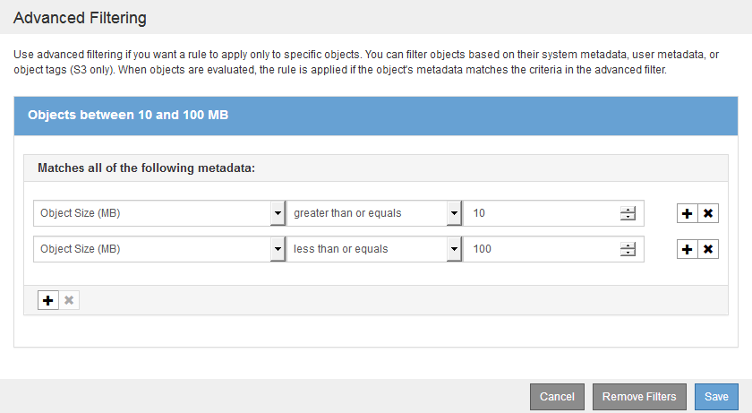
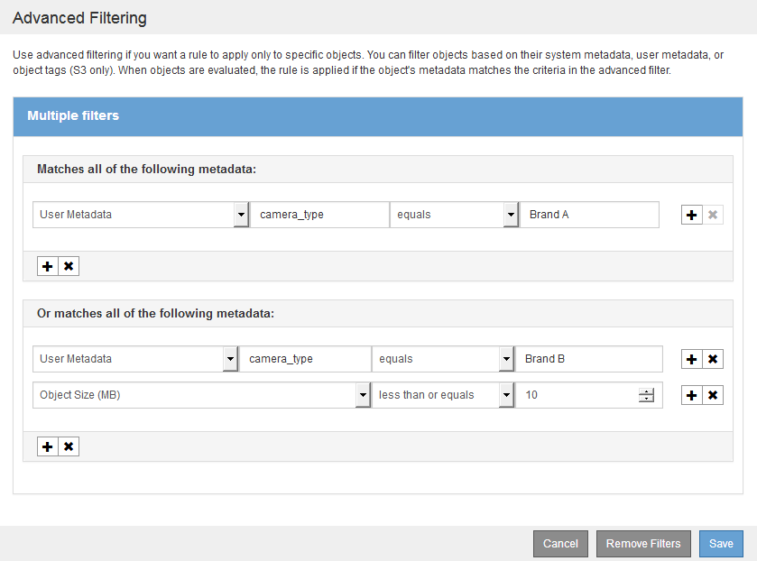

= Using advanced filters in ILM rules
:icons: font
:imagesdir: ../media/

[.lead]
Advanced filtering allows you to create ILM rules that apply only to specific objects based on their metadata. When you set up advanced filtering for a rule, you select the type of metadata you want to match, select an operator, and specify a metadata value. When objects are evaluated, the ILM rule is applied only to those objects that have metadata matching the advanced filter.

The table shows the types of metadata you can specify in advanced filters, the operators you can use for each type of metadata, and the metadata values expected.

[cols="1a,1a,2a" options="header"]
|===
| Metadata type| Supported operators| Metadata value
a|
Ingest Time (microseconds)

a|

* equals
* does not equal
* less than
* less than or equals
* greater than
* greater than or equals

a|
Time and date the object was ingested.

*Note:* To avoid resource issues when activating an new ILM policy, you can use the Ingest Time advanced filter in any rule that might change the location of large numbers of existing objects. Set Ingest Time to be greater than or equal to the approximate time when the new policy will go into effect to ensure that existing objects are not moved unnecessarily.

a|
Key

a|

* equals
* does not equal
* contains
* does not contain
* starts with
* does not start with
* ends with
* does not end with

a|
All or part of a unique S3 or Swift object key.

For example, you might want to match objects that end with `.txt` or start with `test-object/`.

a|
Last Access Time (microseconds)

a|

* equals
* does not equal
* less than
* less than or equals
* greater than
* greater than or equals
* exists
* does not exist

a|
Time and date the object was last retrieved (read or viewed).

*Note:* If you plan to use last access time as an advanced filter, Last Access Time updates must be enabled for the S3 bucket or Swift container.

xref:using-last-access-time-in-ilm-rules.adoc[Using Last Access Time in ILM rules]

a|
Location Constraint (S3 only)

a|

* equals
* does not equal

a|
The region where an S3 bucket was created. Use *ILM* > *Regions* to define the regions that are shown.

*Note:* A value of us-east-1 will match objects in buckets created in the us-east-1 region as well as objects in buckets that have no region specified.

xref:configuring-regions-optional-and-s3-only.adoc[Configuring regions (optional and S3 only)]

a|
Object Size (MB)

a|

* equals
* not equals
* less than
* less than or equals
* greater than
* greater than or equals

a|
The object's size in MB.

To filter on object sizes smaller than 1 MB, type in a decimal value. For example, set the *Object Size (MB)* advanced filter to *greater than 0.2* for any rule that makes erasure-coded copies. This setting ensures that erasure coding is not used for objects 200 KB or smaller.

*Note:* Your browser type and locale settings control whether you need to use a period or a comma as the decimal separator.

a|
User Metadata

a|

* contains
* ends with
* equals
* exists
* does not contain
* does not end with
* does not equal
* does not exist
* does not start with
* starts with

a|
Key-value pair, where *User Metadata Name* is the key and *User Metadata Value* is the value.

For example, to filter on objects that have user metadata of `color=blue`, specify `color` for *User Metadata Name*, `equals` for the operator, and `blue` for *User Metadata Value*.

*Note:* User-metadata names are not case sensitive; user-metadata values are case sensitive.

a|
Object Tag (S3 only)

a|

* contains
* ends with
* equals
* exists
* does not contain
* does not end with
* does not equal
* does not exist
* does not start with
* starts with

a|
Key-value pair, where *Object Tag Name* is the key and *Object Tag Value* is the value.

For example, to filter on objects that have an object tag of `Image=True`, specify `Image` for *Object Tag Name*, `equals` for the operator, and `True` for *Object Tag Value*.

*Note:* Object tag names and object tag values are case sensitive. You must enter these items exactly as they were defined for the object.

|===

== Specifying multiple metadata types and values

When you define advanced filtering, you can specify multiple types of metadata and multiple metadata values. For example, if you want a rule to match objects between 10 MB and 100 MB in size, you would select the *Object Size* metadata type and specify two metadata values.

* The first metadata value specifies objects greater than or equal to 10 MB.
* The second metadata value specifies objects less than or equal to 100 MB.

Using multiple entries allows you to have precise control over which objects are matched. In the following example, the rule applies to objects that have a Brand A or Brand B as the value of the camera_type user metadata. However, the rule only applies to those Brand B objects that are smaller than 10 MB.

.Related information

xref:using-last-access-time-in-ilm-rules.adoc[Using Last Access Time in ILM rules]

xref:configuring-regions-optional-and-s3-only.adoc[Configuring regions (optional and S3 only)]
