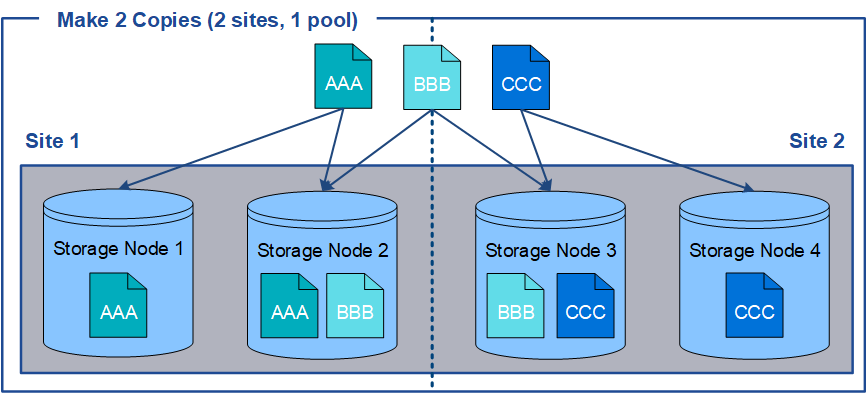
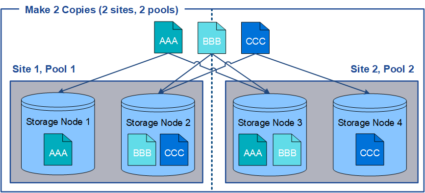

= Using multiple storage pools for cross-site replication
:icons: font
:imagesdir: ../media/

[.lead]
If your StorageGRID deployment includes more than one site, you can enable site-loss protection by creating a storage pool for each site and specifying both storage pools in the rule's placement instructions. For example, if you configure an ILM rule to make two replicated copies and specify storage pools at two sites, one copy of each object will be placed at each site. If you configure a rule to make two copies and specify three storage pools, the copies are distributed to balance disk usage among the storage pools, while ensuring that the two copies are stored at different sites.

The following example illustrates what can happen if an ILM rule places replicated object copies to a single storage pool containing Storage Nodes from two sites. Because the system uses any available nodes in the storage pool when it places the replicated copies, it might place all copies of some objects within only one of the sites. In this example, the system stored two copies of object AAA on Storage Nodes at Site 1, and two copies of object CCC on Storage Nodes at Site 2. Only object BBB is protected if one of the sites fails or becomes inaccessible.

In contrast, this example illustrates how objects are stored when you use multiple storage pools. In the example, the ILM rule specifies that two replicated copies of each object be created, and that the copies be distributed to two storage pools. Each storage pool contains all Storage Nodes at one site. Because a copy of each object is stored at each site, object data is protected from site failure or inaccessibility.

When using multiple storage pools, keep the following rules in mind:

* If you are creating n copies, you must add n or more storage pools. For example, if a rule is configured to make three copies, you must specify three or more storage pools.
* If the number of copies equals the number of storage pools, one copy of the object is stored in each storage pool.
* If the number of copies is less than the number of storage pools, the system distributes the copies to keep disk usage among the pools balanced and to ensure that two or more copies are not stored in the same storage pool.
* If the storage pools overlap (contain the same Storage Nodes), all copies of the object might be saved at only one site. You must ensure that the selected storage pools do not contain the same Storage Nodes.
