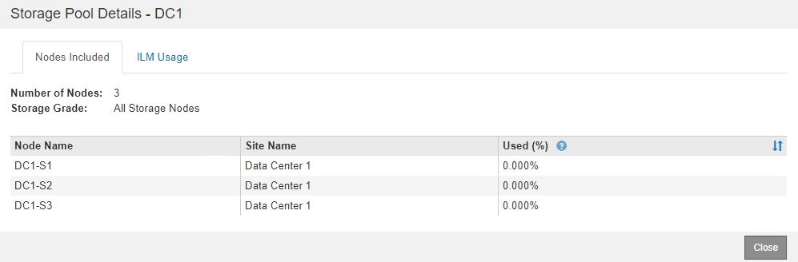
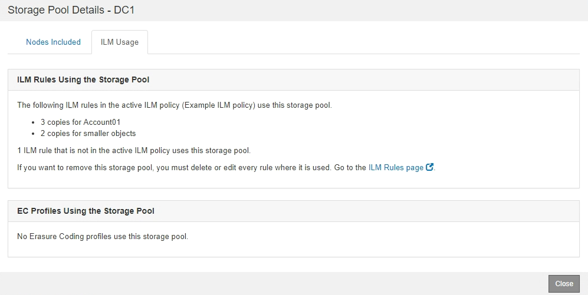
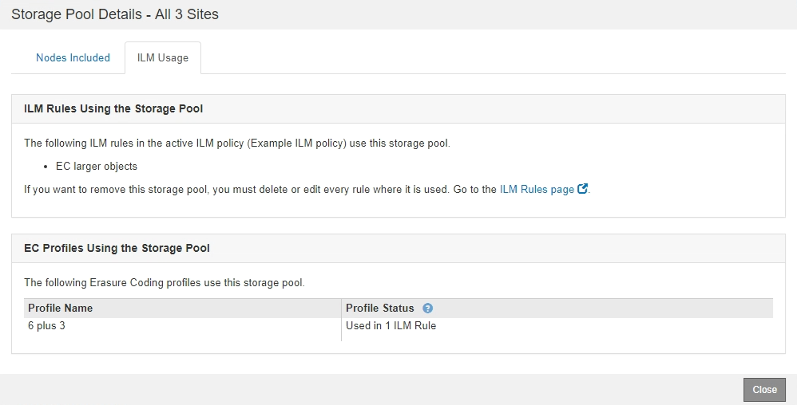

= Viewing storage pool details
:icons: font
:imagesdir: ../media/

[.lead]
You can view the details of a storage pool to determine where the storage pool is used and to see which nodes and storage grades are included.

.What you'll need
* You must be signed in to the Grid Manager using a supported browser.
* You must have specific access permissions.

.Steps
. Select *ILM* > *Storage Pools*.
+
The Storage Pools page appears. This page lists all defined storage pools.
+
image::../media/storage_pools_page_with_pools.png[Storage Pools Page With Pools.png]
+
The table includes the following information for each storage pool that includes Storage Nodes:

 ** *Name*: The unique display name of the storage pool.
 ** *Used Space*: The amount of space that is currently being used to store objects in the storage pool.
 ** *Free Space*: The amount of space that remains available to store objects in the storage pool.
 ** *Total Capacity*: The size of the storage pool, which equals the total amount of usable space for object data for all nodes in the storage pool .
 ** *ILM Usage*: How the storage pool is currently being used. A storage pool might be unused or it might be used in one or more ILM rules, Erasure Coding profiles, or both.
+
NOTE: You cannot remove a storage pool if it is being used.

. To view details about a specific storage pool, select its radio button and select *View Details*.
+
The Storage Pool Details modal appears.

. View the Nodes Included tab to learn about the Storage Nodes or Archive Nodes included in the storage pool.
+

+
The table includes the following information for each node:

 ** Node Name
 ** Site Name
 ** Used (%): For Storage Nodes, the percentage of the total usable space for object data that has been used. This value does not include object metadata.
+
NOTE: The same Used (%) value is also shown in the Storage Used - Object Data chart for each Storage Node (select *Nodes* > *_Storage Node_* > *Storage*).

. Select the ILM Usage tab to determine if the storage pool is currently being used in any ILM rules or Erasure Coding profiles.
+
In this example, the DC1 storage pool is used in three ILM rules: two rules that are in the active ILM policy and one rule that is not in the active policy.
+

+
NOTE: You cannot remove a storage pool if it is used in an ILM rule.
+
In this example, the All 3 Sites storage pool is used in an Erasure Coding profile. In turn, that Erasure Coding profile is used by one ILM rule in the active ILM policy.
+

+
NOTE: You cannot remove a storage pool if it is used in an Erasure Coding profile.

. Optionally, go to the *ILM Rules page* to learn about and manage any rules that use the storage pool.
+
See the instructions for working with ILM rules.

. When you are done viewing storage pool details, select *Close*.

.Related information

xref:working_with_ilm_rules_and_ilm_policies.adoc[Working with ILM rules and ILM policies]
