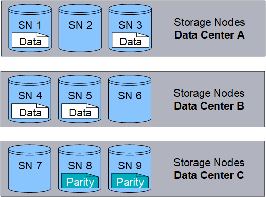
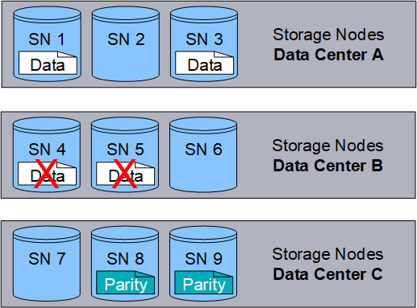
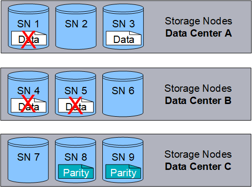

= What erasure coding is
:icons: font
:imagesdir: ../media/

[.lead]
Erasure coding is the second method used by StorageGRID to store object data. When StorageGRID matches objects to an ILM rule that is configured to create erasure-coded copies, it slices object data into data fragments, computes additional parity fragments, and stores each fragment on a different Storage Node. When an object is accessed, it is reassembled using the stored fragments. If a data or a parity fragment becomes corrupt or lost, the erasure-coding algorithm can recreate that fragment using a subset of the remaining data and parity fragments.

The following example illustrates the use of an erasure-coding algorithm on an object's data. In this example, the ILM rule uses a 4+2 erasure-coding scheme. Each object is sliced into four equal data fragments, and two parity fragments are computed from the object data. Each of the six fragments is stored on a different node across three data center sites to provide data protection for node failures or site loss.

The 4+2 erasure-coding scheme requires a minimum of nine Storage Nodes, with three Storage Nodes at each of three different sites. An object can be retrieved as long as any four of the six fragments (data or parity) remain available. Up to two fragments can be lost without loss of the object data. If an entire data center site is lost, the object can still be retrieved or repaired, as long as all of the other fragments remain accessible.

If more than two Storage Nodes are lost, the object is not retrievable.

.Related information

xref:what-storage-pool-is.adoc[What a storage pool is]

xref:what-erasure-coding-schemes-are.adoc[What erasure-coding schemes are]

xref:configuring-erasure-coding-profiles.adoc[Configuring Erasure Coding profiles]
