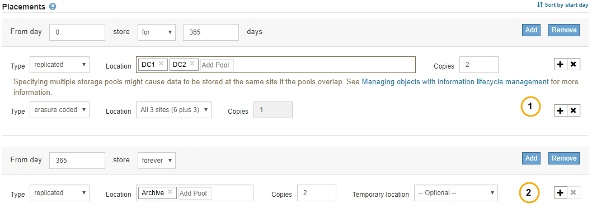

= What ILM rule placement instructions are
:icons: font
:imagesdir: ../media/

[.lead]
Placement instructions determine where, when, and how object data is stored. An ILM rule can include one or more placement instructions. Each placement instruction applies to a single period of time.

When you create a placement instruction, you specify when the placement applies (the time period), which type of copies to create (replicated or erasure coded), and where to store the copies (one or more storage locations). Within a single rule you can specify multiple placements for one time period, and placement instructions for more than one time period:

* To specify more than one object placement during a single time period, click the plus sign icon image:../media/icon_plus_sign_black_on_white.gif[Plus Sign Icon Black on White] to add more than one line for that time period.
* To specify object placements for more than one time period, click the *Add* button to add the next time period. Then, specify one or more lines within the time period.

The example shows the Define Placements page of the Create ILM Rule wizard.

[cols="1a,3a"]
|===
a|
image:../media/icon_number_1.png[icon number 1]
a|
The first placement instruction has two lines for the first year:

. The first line creates two replicated object copies at two data center sites.
. The second line creates a 6+3 erasure-coded copy using three data center sites.

a|

a|
The second placement instruction creates two archived copies after one year and keeps those copies forever.
|===
When you define the set of placement instructions for a rule, you must ensure that at least one placement instruction begins at day 0, that there are no gaps between the time periods you have defined, and that the final placement instruction continues either forever or until you no longer require any object copies.

As each time period in the rule expires, the content placement instructions for the next time period are applied. New object copies are created and any unneeded copies are deleted.
