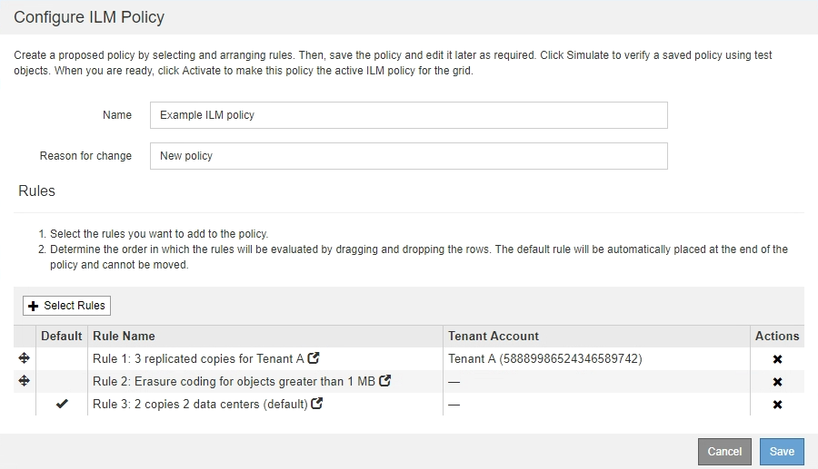
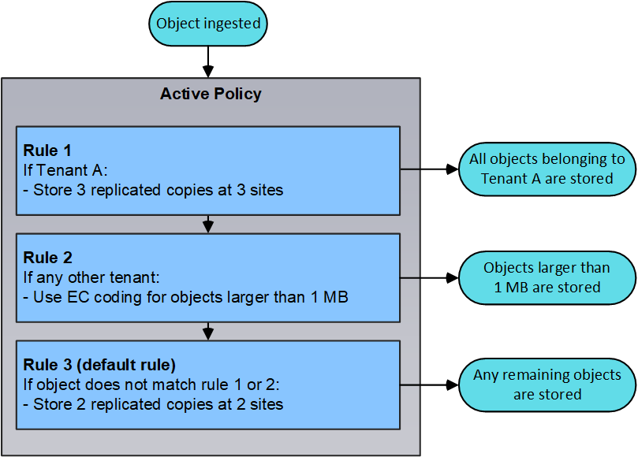
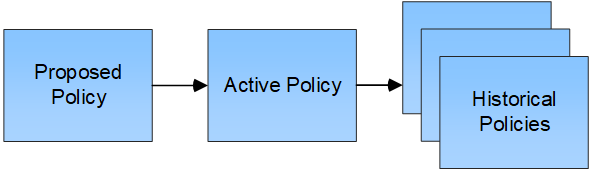

= What an ILM policy is
:icons: font
:imagesdir: ../media/

[.lead]
An information lifecycle management (ILM) policy is an ordered set of ILM rules that determines how the StorageGRID system manages object data over time.

== How an ILM policy evaluates objects

The active ILM policy for your StorageGRID system controls the placement, duration, and data protection of all objects.

When clients save objects to StorageGRID, the objects are evaluated against the ordered set of ILM rules in the active policy, as follows:

. If the filters for the first rule in the policy match an object, the object is ingested according to that rule's ingest behavior and stored according to that rule's placement instructions.
. If the filters for the first rule do not match the object, the object is evaluated against each subsequent rule in the policy until a match is made.
. If no rules match an object, the ingest behavior and placement instructions for the default rule in the policy are applied. The default rule is the last rule in a policy and cannot use any filters.

== Example ILM policy

This example ILM policy uses three ILM rules.

In this example, Rule 1 matches all objects belonging to Tenant A. These objects are stored as three replicated copies at three sites. Objects belonging to other tenants are not matched by Rule 1, so they are evaluated against Rule 2.

Rule 2 matches all objects from other tenants but only if they are larger than 1 MB. These larger objects are stored using 6+3 erasure coding at three sites. Rule 2 does not match objects 1 MB or smaller, so these objects are evaluated against Rule 3.

Rule 3 is the last and default rule in the policy, and it does not use filters. Rule 3 makes two replicated copies of all objects not matched by Rule 1 or Rule 2 (objects not belonging to Tenant A that are 1 MB or smaller).

== What proposed, active, and historical policies are

Every StorageGRID system must have one active ILM policy. A StorageGRID system might also have one proposed ILM policy and any number of historical policies.

When you first create an ILM policy, you create a proposed policy by selecting one or more ILM rules and arranging them in a specific order. After you have simulated the proposed policy to confirm its behavior, you activate it to create the active policy.

When you activate a new ILM policy, StorageGRID uses that policy to manage all objects, including existing objects and newly ingested objects. Existing objects might be moved to new locations when the ILM rules in the new policy are implemented.

Activating the proposed policy causes the previously active policy to become a historical policy. Historical ILM policies cannot be deleted.

.Related information

xref:creating-ilm-policy.adoc[Creating an ILM policy]
