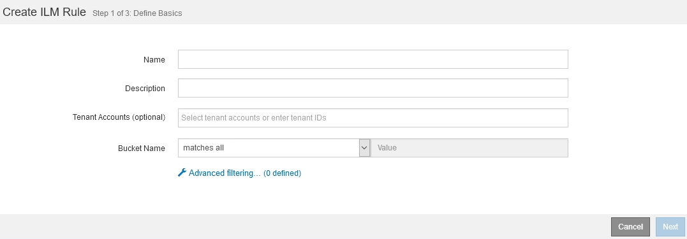

= What ILM rule filtering is
:icons: font
:imagesdir: ../media/

[.lead]
When you create an ILM rule, you specify filters to identify which objects the rule applies to.

In the simplest case, a rule might not use any filters. Any rule that does not use filters applies to all objects, so it must be the last (default) rule in an ILM policy. The default rule provides storage instructions for objects that do not match the filters in another rule.

Basic filters allow you to apply different rules to large, distinct groups of objects. The basic filters on the Define Basics page of the Create ILM Rule wizard allow you to apply a rule to specific tenant accounts, specific S3 buckets or Swift containers, or both.

These basic filters give you a simple way to apply different rules to large numbers of objects. For example, your company's financial records might need to be stored to meet regulatory requirements, while data from the marketing department might need to be stored to facilitate daily operations. After creating separate tenant accounts for each department or after segregating data from the different departments into separate S3 buckets, you can easily create one rule that applies to all financial records and a second rule that applies to all marketing data.

The *Advanced Filtering* page of the Create ILM Rule wizard gives you granular control. You can create filters to select objects based on the following object properties:

* Ingest time
* Last access time
* All or part of the object name (Key)
* S3 bucket region (Location Constraint)
* Object size
* User metadata
* S3 object tags

You can filter objects on very specific criteria. For example, objects stored by a hospital's imaging department might be used frequently when they are less than 30 days old and infrequently afterwards, while objects that contain patient visit information might need to be copied to the billing department at the health network's headquarters. You can create filters that identify each type of object based on object name, size, S3 object tags, or any other relevant criteria, and then create separate rules to store each set of objects appropriately.

You can also combine basic and advanced filters as needed in a single rule. For example, the marketing department might want to store large image files differently than their vendor records, while the Human Resources department might need to store personnel records in a specific geography and policy information centrally. In this case you can create rules that filter by tenant account to segregate the records from each department, while using advanced filters in each rule to identify the specific type of objects that the rule applies to.
