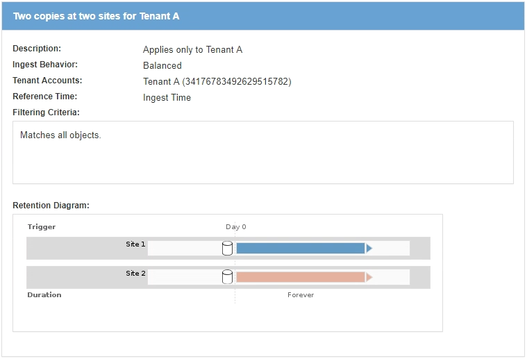

= What an ILM rule is
:icons: font
:imagesdir: ../media/

[.lead]
To manage objects, you create a set of information lifecycle management (ILM) rules and organize them into an ILM policy. Every object ingested into the system is evaluated against the active policy. When a rule in the policy matches an object's metadata, the instructions in the rule determine what actions StorageGRID takes to copy and store that object.

ILM rules define:

* Which objects should be stored. A rule can apply to all objects, or you can specify filters to identify which objects a rule applies to. For example, a rule can apply only to objects associated with certain tenant accounts, specific S3 buckets or Swift containers, or specific metadata values.
* The storage type and location. Objects can be stored on Storage Nodes, in Cloud Storage Pools, or on Archive Nodes.
* The type of object copies made. Copies can be replicated or erasure coded.
* For replicated copies, the number of copies made.
* For erasure coded copies, the erasure-coding scheme used.
* The changes over time to an object's storage location and type of copies.
* How object data is protected as objects are ingested into the grid (synchronous placement or dual commit).

Note that object metadata is not managed by ILM rules. Instead, object metadata is stored in a Cassandra database in what is known as a metadata store. Three copies of object metadata are automatically maintained at each site to protect the data from loss. The copies are evenly distributed across all Storage Nodes.

== Elements of an ILM rule

An ILM rule has three elements:

* *Filtering criteria*: A rule's basic and advanced filters define which objects the rule applies to. If an object matches all filters, StorageGRID applies the rule and creates the object copies specified in the rule's placement instructions.
* *Placement instructions*: A rule's placement instructions define the number, type, and location of object copies. Each rule can include a sequence of placement instructions to change the number, type, and location of object copies over time. When the time period for one placement expires, the instructions in the next placement are automatically applied by the next ILM evaluation.
* *Ingest behavior*: A rule's ingest behavior defines what happens when an S3 or Swift client saves an object to the grid. Ingest behavior controls whether object copies are immediately placed according to the instructions in the rule, or if interim copies are made and the placement instructions are applied later.

== Example ILM rule

This example ILM rule applies to the objects belonging to Tenant A. It makes two replicated copies of those objects and stores each copy at a different site. The two copies are retained "`forever,`" which means that StorageGRID will not automatically delete them. Instead, StorageGRID will retain these objects until they are deleted by a client delete request or by the expiration of a bucket lifecycle.

This rule uses the Balanced option for ingest behavior: the two-site placement instruction is applied as soon as Tenant A saves an object to StorageGRID, unless it is not possible to immediately make both required copies. For example, if Site 2 is unreachable when Tenant A saves an object, StorageGRID will make two interim copies on Storage Nodes at Site 1. As soon as Site 2 becomes available, StorageGRID will make the required copy at that site.

.Related information

xref:data-protection-options-for-ingest.adoc[Data-protection options for ingest]

xref:what-storage-pool-is.adoc[What a storage pool is]

xref:what-cloud-storage-pool-is.adoc[What a Cloud Storage Pool is]

xref:how-objects-are-stored-replication-erasure-coding.adoc[How objects are stored (replication or erasure coding)]

xref:what-ilm-rule-filtering-is.adoc[What ILM rule filtering is]

xref:what-ilm-placement-instructions-are.adoc[What ILM rule placement instructions are]
