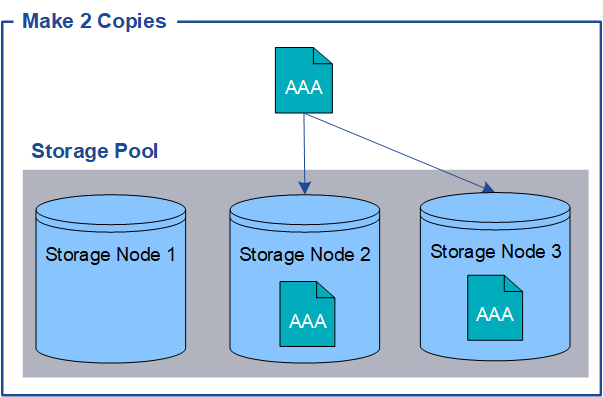

= What replication is
:icons: font
:imagesdir: ../media/

[.lead]
Replication is one of two methods used by StorageGRID to store object data. When objects match an ILM rule that uses replication, the system creates exact copies of object data and stores the copies on Storage Nodes or Archive Nodes.

When you configure an ILM rule to create replicated copies, you specify how many copies should be created, where those copies should be placed, and how long the copies should be stored at each location.

In the following example, the ILM rule specifies that two replicated copies of each object be placed in a storage pool that contains three Storage Nodes.

When StorageGRID matches objects to this rule, it creates two copies of the object, placing each copy on a different Storage Node in the storage pool. The two copies might be placed on any two of the three available Storage Nodes. In this case, the rule placed object copies on Storage Nodes 2 and 3. Because there are two copies, the object can be retrieved if any of the nodes in the storage pool fails.

NOTE: StorageGRID can store only one replicated copy of an object on any given Storage Node. If your grid includes three Storage Nodes and you create a 4-copy ILM rule, only three copies will be made--one copy for each Storage Node. The *ILM placement unachievable* alert is triggered to indicate that the ILM rule could not be completely applied.

.Related information

xref:what-storage-pool-is.adoc[What a storage pool is]

xref:using-multiple-storage-pools-for-cross-site-replication.adoc[Using multiple storage pools for cross-site replication]
