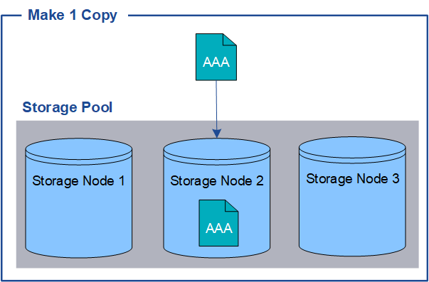
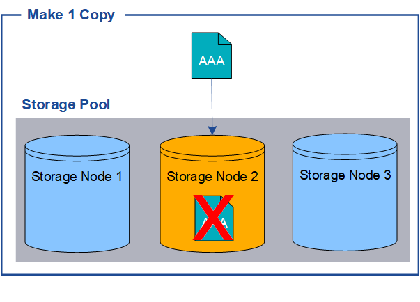
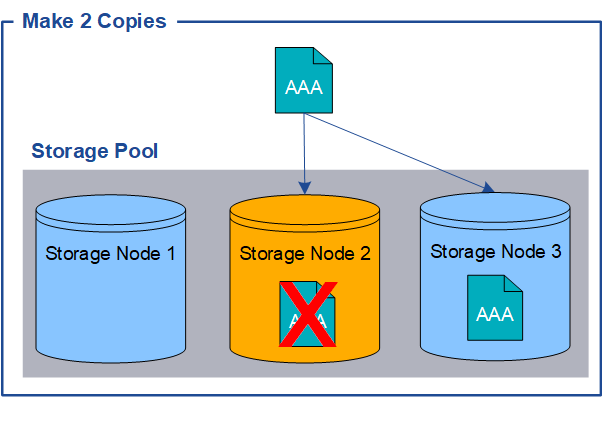

= Why you should not use single-copy replication
:icons: font
:imagesdir: ../media/

[.lead]
When creating an ILM rule to create replicated copies, you should always specify at least two copies for any time period in the placement instructions.

IMPORTANT: Do not use an ILM rule that creates only one replicated copy for any time period. If only one replicated copy of an object exists, that object is lost if a Storage Node fails or has a significant error. You also temporarily lose access to the object during maintenance procedures such as upgrades.

In the following example, the Make 1 Copy ILM rule specifies that one replicated copy of an object be placed in a storage pool that contains three Storage Nodes. When an object is ingested that matches this rule, StorageGRID places a single copy on only one Storage Node.

When an ILM rule creates only one replicated copy of an object, the object becomes inaccessible when the Storage Node is unavailable. In this example, you will temporarily lose access to object AAA whenever Storage Node 2 is offline, such as during an upgrade or other maintenance procedure. You will lose object AAA entirely if Storage Node 2 fails.

To avoid losing object data, you should always make at least two copies of all objects you want to protect with replication. If two or more copies exist, you can still access the object if one Storage Node fails or goes offline.

