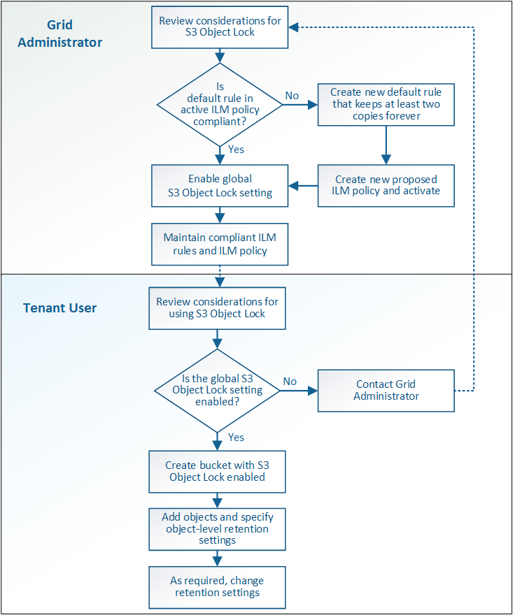

= Workflow for S3 Object Lock
:icons: font
:imagesdir: ../media/

[.lead]
As a grid administrator, you must coordinate closely with tenant users to ensure that the objects are protected in a manner that satisfies their retention requirements.

The workflow diagram shows the high-level steps for using S3 Object Lock. These steps are performed by the grid administrator and by tenant users.

== Grid admin tasks

As the workflow diagram shows, a grid administrator must perform two high-level tasks before S3 tenant users can use S3 Object Lock:

. Create at least one compliant ILM rule and make that rule the default rule in the active ILM policy.
. Enable the global S3 Object Lock setting for the entire StorageGRID system.

== Tenant user tasks

After the global S3 Object Lock setting has been enabled, tenants can perform these tasks:

. Create buckets that have S3 Object Lock enabled.
. Specify default retention settings for the bucket, which are applied to objects added to the bucket that do not specify their own retention settings.
. Add objects to those buckets and specify object-level retention periods and legal hold settings.
. As required, update a retention period or change the legal hold setting for an individual object.

.Related information

* xref:../tenant/index.adoc[Use a tenant account]

* xref:../s3/index.adoc[Use S3]

* xref:../s3/operations-on-buckets.adoc#using-s3-object-lock-default-bucket-retention[Use S3 Object Lock default bucket retention]
