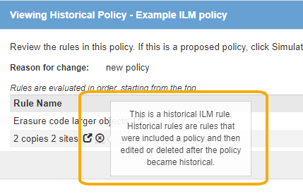
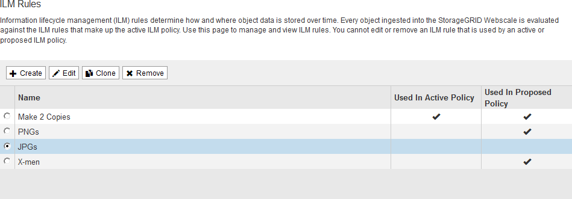
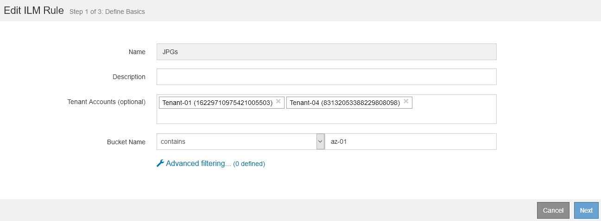

= Work with ILM rules and ILM policies
:icons: font
:imagesdir: ../media/

[.lead]
Once you have created ILM rules and an ILM policy, you can continue to work with them, modifying their configuration as your storage requirements change.

.What you'll need

* You are signed in to the Grid Manager using a xref:../admin/web-browser-requirements.adoc[supported web browser].
* You have specific access permissions.

== Delete an ILM rule

To keep the list of current ILM rules manageable, delete any ILM rules that you are not likely to use.

You cannot delete an ILM rule if it is currently used in the active policy or in the proposed policy. If you need to delete an ILM rule that is used a policy, you must perform these steps first:

. Clone the active policy or edit the proposed policy.
. Remove the ILM rule from the policy.
. Save, simulate, and activate the new policy to make sure objects are protected as expected.

.Steps
. Select *ILM* > *Rules*.
. Review the table entry for the rule you want to remove.
+
Confirm that the rule is not used in the active ILM policy or the proposed ILM policy.

. If the rule you want to remove is not in use, select the radio button and select *Remove*.
. Select *OK* to confirm that you want to delete the ILM rule.
+
The ILM rule is deleted.
+
[NOTE]
====
If you delete a rule that is used in a historical policy, an  icon appears for the rule when you view the policy, which indicates that the rule has become a historical rule.

====

== Edit an ILM rule

You might need to edit an ILM rule to change a filter or placement instruction.

You cannot edit a rule if it is being used in the proposed ILM policy or the active ILM policy. Instead, you can clone these rules and make any required changes to the cloned copy. You also cannot edit the stock ILM rule (Make 2 Copies) or ILM rules created before StorageGRID version 10.3.

NOTE: Before adding an edited rule to the active ILM policy, be aware that a change to an object's placement instructions might cause an increased load on the system.

.Steps

. Select *ILM* > *Rules*.
+
The ILM Rules page appears. This page shows all available rules and indicates which rules are being used in the active policy or the proposed policy.
+

. Select a rule that is not being used, and select *Edit*.
+
The Edit ILM Rule wizard opens.
+

. Complete the pages of the Edit ILM Rule wizard, following the steps for xref:creating-ilm-rule.adoc[creating an ILM rule] and xref:using-advanced-filters-in-ilm-rules.adoc[using advanced filters], as necessary.
+
When editing an ILM rule, you cannot change its name.

. Select *Save*.
+

[NOTE]
====
If you edit a rule that is used in a historical policy, an  icon appears for the rule when you view the policy, which indicates that the rule has become a historical rule.

====

== Clone an ILM rule

You cannot edit a rule if it is being used in the proposed ILM policy or the active ILM policy. Instead, you can clone a rule and make any required changes to the cloned copy. Then, if required, you can remove the original rule from the proposed policy and replace it with the modified version. You cannot clone an ILM rule if it was created using StorageGRID version 10.2 or earlier.

Before adding a cloned rule to the active ILM policy, be aware that a change to an object's placement instructions might cause an increased load on the system.

.Steps

. Select *ILM* > *Rules*.
+
The ILM Rules page appears.
+

. Select the ILM rule you want to clone, and select *Clone*.
+
The Create ILM Rule wizard opens.

. Update the cloned rule by following the steps for editing an ILM rule and using advanced filters.
+
When cloning an ILM rule, you must enter a new name.

. Select *Save*.
+
The new ILM rule is created.

== View the ILM policy activity queue

You can view the number of objects that are in the queue to be evaluated against the ILM policy at any time. You might want to monitor the ILM processing queue to determine system performance. A large queue might indicate that the system is not able to keep up with the ingest rate, the load from the client applications is too great, or that some abnormal condition exists.

.Steps

. Select *Dashboard*.
+
image::../media/grid_manager_dashboard.png[Dashboard in the Grid Management Interface]

. Monitor the Information Lifecycle Management (ILM) section.
+

You can select the question mark  to see a description of the items in this section.
