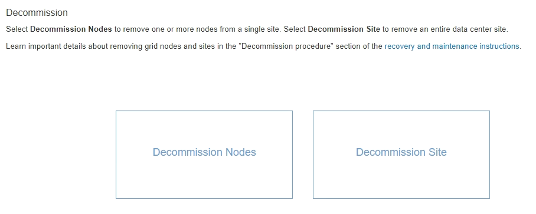

= Accessing the Decommission Nodes page
:icons: font
:imagesdir: ../media/

[.lead]
When you access the Decommission Nodes page in the Grid Manager, you can see at a glance which nodes can be decommissioned.

* You must be signed in to the Grid Manager using a supported browser.
* You must have the Maintenance or Root Access permission.

. Select *Maintenance* > *Maintenance Tasks* > *Decommission*.
+
The Decommission page appears.
+

. Click the *Decommission Nodes* button.
+
The Decommission Nodes page appears. From this page, you can:

 ** Determine which grid nodes can be decommissioned currently.
 ** See the health of all grid nodes
 ** Sort the list in ascending or descending order by *Name*, *Site*, *Type*, or *Has ADC*.
 ** Enter search terms to quickly find particular nodes.
For example, this page shows all grid nodes in a single data center. The Decommission Possible column indicates that you can decommission the non-primary Admin Node, the Gateway Node, and two of the five Storage Nodes.

+
image::../media/decommission_nodes_page_all_connected.png[Decommission Nodes page]

. Review the *Decommission Possible* column for each node you want to decommission.
+
If a grid node can be decommissioned, this column includes a green check mark, and the left-most column includes a check box. If a node cannot be decommissioned, this column describes the issue. If there is more than one reason a node cannot be decommissioned, the most critical reason is shown.
+
|===
| Decommission Possible reason| Description| Steps to resolve
a|
No, node type decommissioning is not supported.
a|
    You cannot decommission the primary Admin Node or an Archive Node.
a|
None.
a|
No, at least one grid node is disconnected.    *Note:* This message is shown for connected grid nodes only.
a|
    You cannot decommission a connected grid node if any grid node is disconnected.
+
The *Health* column includes one of these icons for grid nodes that are disconnected:

 ** image:../media/icon_alarm_gray_administratively_down.png[gray questionmark icon] (gray): Administratively Down
 ** image:../media/icon_alarm_blue_unknown.png[blue question mark icon] (blue): Unknown

a|
Go to step <<STEP_523B52F665D34350A1E23CC9F6A5743C,#STEP_523B52F665D34350A1E23CC9F6A5743C>>.
a|
No, one or more required nodes is currently disconnected and must be recovered.    *Note:* This message is shown for disconnected grid nodes only.
a|
    You cannot decommission a disconnected grid node if one or more required nodes is also disconnected (for example, a Storage Node that is required for the ADC quorum).
a|

 .. Review the Decommission Possible messages for all disconnected nodes.
 .. Determine which nodes cannot be decommissioned because they are required.
  *** If the Health of a required node is Administratively Down, bring the node back online.
  *** If the health of a required node is Unknown, perform a node recovery procedure to recover the required node.

a|
No, member of HA group(s): x. Before you can decommission this node, you must remove it from all HA groups.
a|
    You cannot decommission an Admin Node or a Gateway Node if a node interface belongs to a high availability (HA) group.
a|
Edit the HA group to remove the node's interface or remove the entire HA group. See the instructions for administering StorageGRID.
a|
No, site x requires a minimum of n Storage Nodes with ADC services.
a|
*Storage Nodes only.* You cannot decommission a Storage Node if insufficient nodes would remain at the site to support ADC quorum requirements.
a|
Perform an expansion. Add a new Storage Node to the site, and specify that it should have an ADC service. See information about the ADC quorum.
a|
No, one or more Erasure Coding profiles need at least n Storage Nodes. If the profile is not used in an ILM rule, you can deactivate it.
a|
**Storage Nodes only.**You cannot decommission a Storage Node unless enough nodes would remain for the existing Erasure Coding profiles.    For example, if an Erasure Coding profile exists for 4+2 erasure coding, at least 6 Storage Nodes must remain.
a|
For each affected Erasure Coding profile, perform one of the following steps, based on how the profile is being used:

 ** *Used in the active ILM policy*: Perform an expansion. Add enough new Storage Nodes to allow erasure coding to continue. See the instructions for expanding StorageGRID.
 ** *Used in an ILM rule but not in the active ILM policy*: Edit or delete the rule and then deactivate the Erasure Coding profile.
 ** *Not used in any ILM rule*: Deactivate the Erasure Coding profile.
*Note:* An error message appears if you attempt to deactivate an Erasure Coding profile and object data is still associated with the profile. You might need to wait several weeks before trying the deactivation process again.

+
Learn about deactivating an Erasure Coding profile in the instructions for managing objects with information lifecycle management.
+
|===

. If decommissioning is possible for the node, determine which procedure you need to perform:
+
|===
| If your grid includes...| Go to...
a|
Any disconnected grid nodes
a|
link:decommissioning_disconnected_grid_nodes.md#[Decommissioning disconnected grid nodes]
a|
Only connected grid nodes
a|
link:decommissioning_connected_grid_nodes.md#[Decommissioning connected grid nodes]
|===

*Related information*

xref:checking_data_repair_jobs.adoc[Checking data repair jobs]

xref:understanding_adc_service_quorum.adoc[Understanding the ADC quorum]

http://docs.netapp.com/sgws-115/topic/com.netapp.doc.sg-ilm/home.html[Managing objects with information lifecycle management]

http://docs.netapp.com/sgws-115/topic/com.netapp.doc.sg-expansion/home.html[Expanding a StorageGRID system]

http://docs.netapp.com/sgws-115/topic/com.netapp.doc.sg-admin/home.html[Administering StorageGRID]
