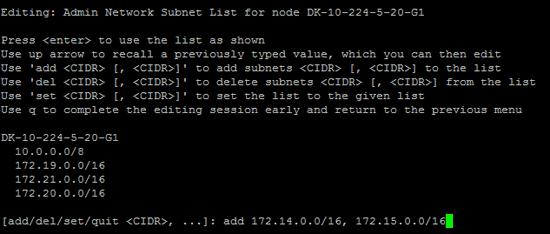
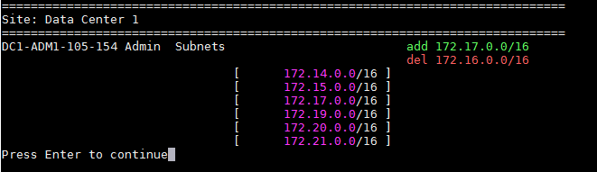

= Adding to or changing subnet lists on the Admin Network
:icons: font
:imagesdir: ../media/

[.lead]
You can add, delete, or change the subnets in the Admin Network Subnet List of one or more nodes.

.What you'll need

* You must have the `Passwords.txt` file.

You can add, delete, or change subnets to all nodes on the Admin Network Subnet List.

.Steps

. Log in to the primary Admin Node:
 .. Enter the following command: `ssh admin@_primary_Admin_Node_IP_`
 .. Enter the password listed in the `Passwords.txt` file.
 .. Enter the following command to switch to root: `su -`
 .. Enter the password listed in the `Passwords.txt` file.
+
When you are logged in as root, the prompt changes from `$` to `#`.
. Start the Change IP tool by entering the following command: `change-ip`
. Enter the provisioning passphrase at the prompt.
+
The main menu appears.
+
image::../media/change_ip_tool_main_menu.png[screenshot showing welcome screen of change IP tool]

. Optionally, limit the networks/nodes on which operations are performed. Choose one of the following:
 ** Select the nodes to edit by choosing *1*, if you want to filter on specific nodes on which to perform the operation. Select one of the following options:
  *** *1*: Single node (select by name)
  *** *2*: Single node (select by site, then by name)
  *** *3*: Single node (select by current IP)
  *** *4*: All nodes at a site
  *** *5*: All nodes in the grid
  *** *0*: Go back
 ** Allow "`all`" to remain selected.
After the selection is made, the main menu screen appears. The Selected nodes field reflects your new selection, and now all operations selected will only be performed on this item.
. On the main menu, select the option to edit subnets for the Admin Network (option *3*).
. Choose one of the following:
 ** Add a subnet by entering this command: `add CIDR`
 ** Delete a subnet by entering this command: `del CIDR`
 ** Set the list of subnets by entering this command: `set CIDR`
+
NOTE: For all commands, you can enter multiple addresses using this format: `add CIDR, CIDR`
+
Example: `add 172.14.0.0/16, 172.15.0.0/16, 172.16.0.0/16`
+
TIP: You can reduce the amount of typing required by using "`up arrow`" to recall previously typed values to the current input prompt, and then edit them if necessary.

+
The example input below shows adding subnets to the Admin Network Subnet List:

+

. When ready, enter *q* to go back to the main menu screen. Your changes are held until cleared or applied.
+
NOTE: If you selected any of the "all" node selection modes in step 2, you must press *Enter* (without *q*) to get to the next node in the list.

. Choose one of the following:
 ** Select option *5* to show edits in output that is isolated to show only the changed item. Changes are highlighted in green (additions) or red (deletions), as shown in the example output below:
+

 ** Select option *6* to show edits in output that displays the full configuration. Changes are highlighted in green (additions) or red (deletions).
*Note:* Certain terminal emulators might show additions and deletions using strikethrough formatting.

+
When you attempt to change the subnet list, the following message is displayed:

+
----
CAUTION: The Admin Network subnet list on the node might contain /32 subnets derived from automatically applied routes that are not persistent. Host routes (/32 subnets) are applied automatically if the IP addresses provided for external services such as NTP or DNS are not reachable using default StorageGRID routing, but are reachable using a different interface and gateway. Making and applying changes to the subnet list will make all automatically applied subnets persistent. If you do not want that to happen, delete the unwanted subnets before applying changes. If you know that all /32 subnets in the list were added intentionally, you can ignore this caution.
----

+
If you did not specifically assign the NTP and DNS server subnets to a network, StorageGRID creates a host route (/32) for the connection automatically. If, for example, you would rather have a /16 or /24 route for outbound connection to a DNS or NTP server, you should delete the automatically created /32 route and add the routes you want. If you do not delete the automatically created host route, it will be persisted after you apply any changes to the subnet list.

+
IMPORTANT: Although you can use these automatically discovered host routes, in general you should manually configure the DNS and NTP routes to ensure connectivity.
. Select option *7* to validate all staged changes.
+
This validation ensures that the rules for the Grid, Admin, and Client Networks are followed, such as using overlapping subnets.

. Optionally, select option *8* to save all staged changes and return later to continue making changes.
+
This option allows you to quit the Change IP tool and start it again later, without losing any unapplied changes.

. Do one of the following:
 ** Select option *9* if you want to clear all changes without saving or applying the new network configuration.
 ** Select option *10* if you are ready to apply changes and provision the new network configuration. During provisioning, the output displays the status as updates are applied as shown in the following sample output:
+
----
Generating new grid networking description file...

Running provisioning...

Updating grid network configuration on Name
----
. Download a new Recovery Package from the Grid Manager.
 .. Select *Maintenance* > *System* > *Recovery Package*.
 .. Enter the provisioning passphrase.

.Related information

xref:configuring-ip-addresses.adoc[Configuring IP addresses]
