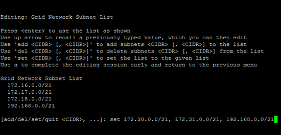
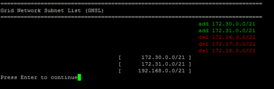

= Adding to or changing subnet lists on the Grid Network
:icons: font
:imagesdir: ../media/

[.lead]
You can use the Change IP tool to add or change subnets on the Grid Network.

.What you'll need

* You must have the `Passwords.txt` file.

You can add, delete, or change subnets in the Grid Network Subnet List. Changes will affect routing on all nodes in the grid.

NOTE: If you are making changes to the Grid Network Subnet List only, use the Grid Manager to add or change the network configuration. Otherwise, use the Change IP tool if the Grid Manager is inaccessible due to a network configuration issue, or you are performing both a Grid Network routing change and other network changes at the same time.

.Steps

. Log in to the primary Admin Node:
 .. Enter the following command: `ssh admin@_primary_Admin_Node_IP_`
 .. Enter the password listed in the `Passwords.txt` file.
 .. Enter the following command to switch to root: `su -`
 .. Enter the password listed in the `Passwords.txt` file.
+
When you are logged in as root, the prompt changes from `$` to `#`.
. Start the Change IP tool by entering the following command: `change-ip`
. Enter the provisioning passphrase at the prompt.
+
The main menu appears.
+
image::../media/change_ip_tool_main_menu.png[screenshot showing welcome screen of change IP tool]

. On the main menu, select the option to edit subnets for the Grid Network (option *4*).
+
NOTE: Changes to the Grid Network Subnet List are grid-wide.

. Choose one of the following:
 ** Add a subnet by entering this command: `add CIDR`
 ** Delete a subnet by entering this command: `del CIDR`
 ** Set the list of subnets by entering this command: `set CIDR`
+
NOTE: For all commands, you can enter multiple addresses using this format: `add CIDR, CIDR`
+
Example: `add 172.14.0.0/16, 172.15.0.0/16, 172.16.0.0/16`
+
TIP: You can reduce the amount of typing required by using "`up arrow`" to recall previously typed values to the current input prompt, and then edit them if necessary.

+
The example input below shows setting subnets for the Grid Network Subnet List:

+

. When ready, enter *q* to go back to the main menu screen. Your changes are held until cleared or applied.
. Choose one of the following:
 ** Select option *5* to show edits in output that is isolated to show only the changed item. Changes are highlighted in green (additions) or red (deletions), as shown in the example output below:
+

 ** Select option *6* to show edits in output that displays the full configuration. Changes are highlighted in green (additions) or red (deletions).
+
NOTE: Certain command line interfaces might show additions and deletions using strikethrough formatting.

. Select option *7* to validate all staged changes.
+
This validation ensures that the rules for the Grid, Admin, and Client Networks are followed, such as using overlapping subnets.

. Optionally, select option *8* to save all staged changes and return later to continue making changes.
+
This option allows you to quit the Change IP tool and start it again later, without losing any unapplied changes.

. Do one of the following:
 ** Select option *9* if you want to clear all changes without saving or applying the new network configuration.
 ** Select option *10* if you are ready to apply changes and provision the new network configuration. During provisioning, the output displays the status as updates are applied as shown in the following sample output:
+
----
Generating new grid networking description file...

Running provisioning...

Updating grid network configuration on Name
----
. If you selected option *10* when making Grid Network changes, select one of the following options:
 ** *apply*: Apply the changes immediately and automatically restart each node if necessary.
+
If the new network configuration will function simultaneously with the old network configuration without any external changes, you can use the *apply* option for a fully automated configuration change.

 ** *stage*: Apply the changes the next time the nodes are restarted.
+
If you need to make physical or virtual networking configuration changes for the new network configuration to function, you must use the *stage* option, shut down the affected nodes, make the necessary physical networking changes, and restart the affected nodes.
+
IMPORTANT: If you use the *stage* option, you must restart the node as soon as possible after staging to minimize disruptions.

 ** *cancel*: Do not make any network changes at this time.
+
If you were unaware that the proposed changes require nodes to be restarted, you can defer the changes to minimize user impact. Selecting *cancel* returns you to the main menu and preserves your changes so you can apply them later.

+
After applying or staging changes, a new Recovery Package is generated as a result of the grid configuration change.
. If configuration is stopped due to errors, the following options are available:
 ** To abort the IP change procedure and return to the main menu, enter *a*.
 ** To retry the operation that failed, enter *r*.
 ** To continue to the next operation, enter *c*.
+
The failed operation can be retried later by selecting option *10* (Apply Changes) from the main menu. The IP change procedure will not be complete until all operations have completed successfully.

 ** If you had to manually intervene (to reboot a node, for example) and are confident that the action the tool thinks has failed was actually completed successfully, enter *f* to mark it as successful and move to the next operation.
. Download a new Recovery Package from the Grid Manager.
 .. Select *Maintenance* > *System* > *Recovery Package*.
 .. Enter the provisioning passphrase.

+
IMPORTANT: The Recovery Package file must be secured because it contains encryption keys and passwords that can be used to obtain data from the StorageGRID system.

.Related information

xref:configuring-ip-addresses.adoc[Configuring IP addresses]
