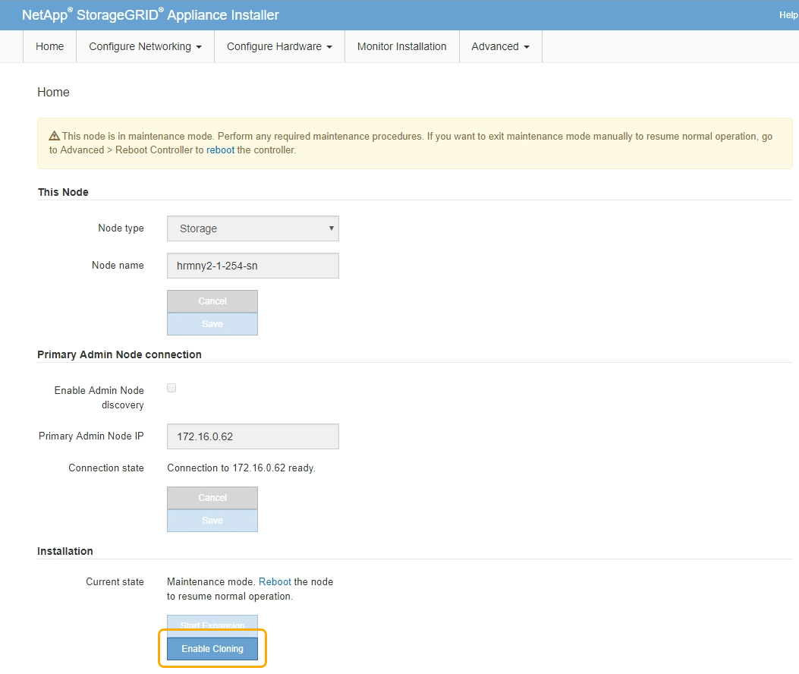
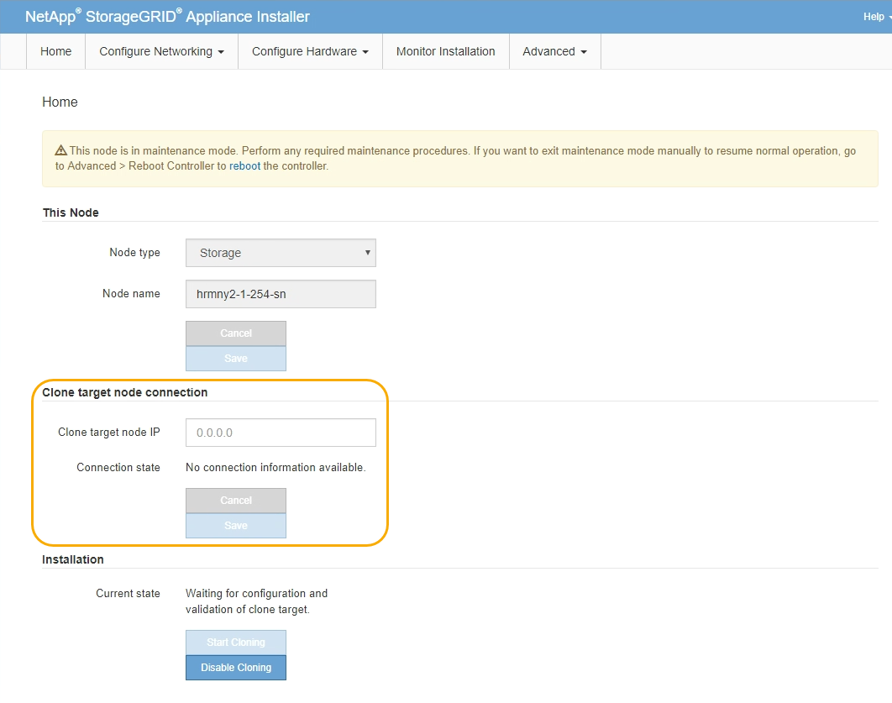
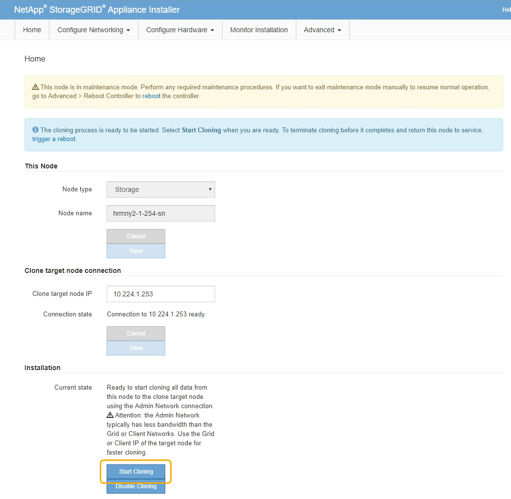
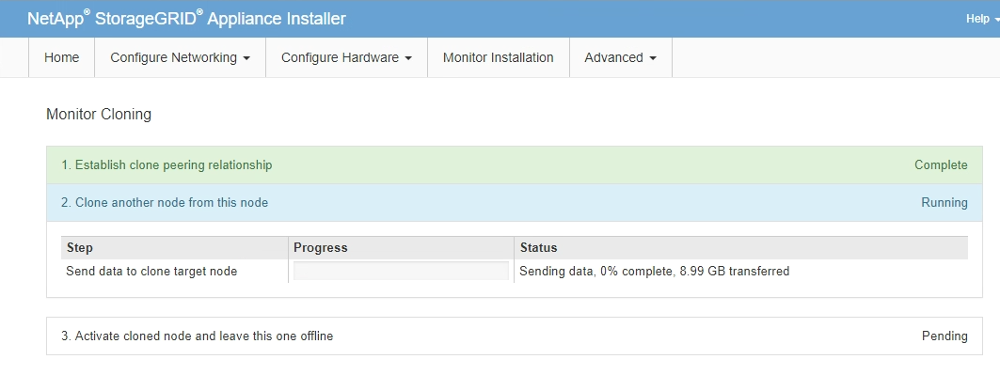

= Appliance node cloning procedure
:icons: font
:imagesdir: ../media/

[.lead]
The cloning process might take several days to transfer data between the source node (appliance being replaced) and the target (new) appliance.

.What you'll need

* You have installed the compatible target appliance into a cabinet or rack, connected all cables, and applied power.
* You have verified that the StorageGRID Appliance Installer version on the replacement appliance matches the software version of your StorageGRID system, upgrading the StorageGRID Appliance Installer firmware, if necessary.
* You have configured the target appliance, including configuring StorageGRID connections, SANtricity System Manager (storage appliances only), and the BMC interface.
 ** When configuring StorageGRID connections, use the temporary IP addresses.
 ** When configuring network links, use the final link configuration.

NOTE: Leave the StorageGRID Appliance Installer open after you complete initial target appliance configuration. You will return to the target appliance's installer page after you start the node cloning process.

* You have optionally enabled node encryption for the target appliance.
* You have optionally set the RAID mode for the target appliance (storage appliances only).
* xref:considerations-and-requirements-for-appliance-node-cloning.adoc[Considerations and requirements for appliance node cloning]
+
xref:../sg100-1000/index.adoc[SG100 & SG1000 services appliances]
+
xref:../sg5600/index.adoc[SG5600 storage appliances]
+
xref:../sg5700/index.adoc[SG5700 storage appliances]
+
xref:../sg6000/index.adoc[SG6000 storage appliances]

You should clone only one appliance node at a time to maintain StorageGRID network performance and data availability.

.Steps

. Place the source node you are cloning into maintenance mode.
+
xref:placing-appliance-into-maintenance-mode.adoc[Placing an appliance into maintenance mode]

. From the StorageGRID Appliance Installer on the source node, in the Installation section of the Home page, select *Enable Cloning*.
+

+
The Primary Admin Node connection section is replaced with the Clone target node connection section.
+

. For *Clone target node IP*, enter the temporary IP address assigned to the target node for the network to use for clone data-transfer traffic, and then select *Save*.
+
Typically, you enter the IP address for the Grid Network, but if you need to use a different network for clone data-transfer traffic, enter the IP address of the target node on that network.
+
NOTE: Using the 1-GbE Admin Network for clone data transfer results in slower cloning.
+
After the target appliance is configured and validated, in the Installation section, *Start Cloning* is enabled on the source node.
+

+
If issues exist that prevent cloning, *Start Cloning* is not enabled and issues that you must resolve are listed as the *Connection state*. These issues are listed on the StorageGRID Appliance Installer Home page of both the source node and the target appliance. Only one issue displays at a time and the state automatically updates as conditions change. Resolve all cloning issues to enable *Start Cloning*.
+
When *Start Cloning* is enabled, the *Current state* indicates the StorageGRID network that was selected for cloning traffic, along with information about using that network connection.
+
xref:considerations-and-requirements-for-appliance-node-cloning.adoc[Considerations and requirements for appliance node cloning]

. Select *Start Cloning* on the source node.
. Monitor the cloning progress using the StorageGRID Appliance Installer on either the source or target node.
+
The StorageGRID Appliance Installer on both the source and target nodes indicates the same status.
+

+
The Monitor Cloning page provides detailed progress for each stage of the cloning process:

 ** *Establish clone peering relationship* shows the progress of cloning set up and configuration.
 ** *Clone another node from this node* shows the progress of data transfer. (This part of the cloning process can take several days to complete.)
 ** *Activate cloned node and leave this one offline* shows the progress of transferring control to the target node and placing the source node in a pre-install state, after data transfer is complete.

. If you need to terminate the cloning process and return the source node to service before cloning is complete, on the source node go to the StorageGRID Appliance Installer Home page and select *Advanced* > *Reboot Controller*, and then select *Reboot into StorageGRID*.
+
If the cloning process is terminated:

 ** The source node exits maintenance mode and rejoins StorageGRID.
 ** The target node remains in the pre-install state.
To restart cloning the source node, start the cloning process again from step 1.

When cloning successfully completes:

* The source and target nodes swap IP addresses:
 ** The target node now uses the IP addresses originally assigned to the source node for the Grid, Admin, and Client Networks.
 ** The source node now uses the temporary IP address initially assigned to the target node.
* The target node exits maintenance mode and joins StorageGRID, replacing the source node.
* The source appliance is in a pre-installed state, as if you had prepared it for reinstallation.
+
xref:preparing-appliance-for-reinstallation-platform-replacement-only.adoc[Preparing an appliance for reinstallation (platform replacement only)]

NOTE: If the appliance does not rejoin the grid, go to the StorageGRID Appliance Installer Home page for the source node, select *Advanced* > *Reboot Controller*, and then select *Reboot into Maintenance Mode*. After the source node reboots in maintenance mode, repeat the node cloning procedure.

User data remains on the source appliance as a recovery option if an unexpected issue occurs with the target node. After the target node has successfully rejoined StorageGRID, user data on the source appliance is outdated and is no longer needed. If desired, ask StorageGRID Support to clear the source appliance to destroy this data.

You can:

* Use the source appliance as a target for additional cloning operations: no additional configuration is required. This appliance already has the temporary IP address assigned that were originally specified for the first clone target.
* Install and set up the source appliance as a new appliance node.
* Discard the source appliance if it is no longer of use with StorageGRID.
