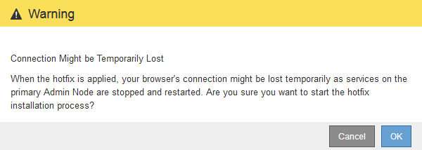
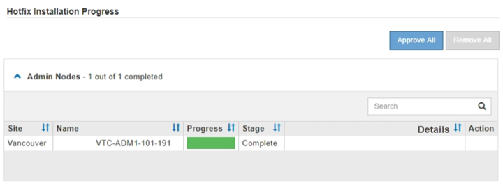

= Apply hotfix
:icons: font
:imagesdir: ../media/

[.lead]
The hotfix is first applied automatically to the primary Admin Node. Then, you must approve the application of the hotfix to other grid nodes until all nodes are running the same software version. You can customize the approval sequence by selecting to approve individual grid nodes, groups of grid nodes, or all grid nodes.

.What you'll need

* You have reviewed the considerations and completed the steps in xref:hotfix-planning-and-preparation.adoc[Plan and prepare for a hotfix].
* You have the provisioning passphrase.
* You have Root Access or the Maintenance permission.

.About this task
* You can delay applying a hotfix to a node, but the hotfix process is not complete until you apply the hotfix to all nodes.
* You cannot perform a StorageGRID software upgrade or a SANtricity OS upgrade until you have completed the hotfix process.

.Steps

. Sign in to the Grid Manager using a xref:../admin/web-browser-requirements.adoc[supported web browser].
. Select *MAINTENANCE* > *System* > *Software update*.
+
The Software Update page appears.
+
image::../media/software_update_landing.png[Software Update Landing Page]

. Select *Apply hotfix*.
+
The StorageGRID Hotfix page appears.
+
image::../media/hotfix_choose_file.png[Hotfix Choose File]

. Select the hotfix file you downloaded from the NetApp support site.
 .. Select *Browse*.
 .. Locate and select the file.
+
`hotfix-install-_version_`

 .. Select *Open*.
+
The file is uploaded. When the upload is finished, the file name is shown in the Details field.
+
NOTE: Do not change the file name since it is part of the verification process.

. Enter the provisioning passphrase in the text box.
+
The *Start* button becomes enabled.

. Select *Start*.
+
A warning appears stating that your browser's connection might be lost temporarily as services on the primary Admin Node are restarted.
+

. Select *OK* to start applying the hotfix to the primary Admin Node.
+
When the hotfix starts:

 .. The hotfix validations are run.
+
NOTE: If any errors are reported, resolve them, re-upload the hotfix file, and select *Start* again.

 .. The hotfix installation progress table appears. This table shows all nodes in your grid and the current stage of the hotfix installation for each node. The nodes in the table are grouped by type:
  *** Admin Nodes
  *** Gateway Nodes
  *** Storage Nodes
  *** Archive Nodes

+
NOTE: The progress bar reaches completion, and then the primary Admin Node is shown first with stage "`Complete.`"

+

+
. Optionally, sort the lists of nodes in each grouping in ascending or descending order by *Site*, *Name*, *Progress*, *Stage*, or *Details*. Or, enter a term in the *Search* box to search for specific nodes.
. Approve the grid nodes that are ready to be updated. Approved nodes of the same type are upgraded one at a time.
+
IMPORTANT: Do not approve the hotfix for a node unless you are sure the node is ready to be updated.When the hotfix is applied to a grid node, some services on that node might be restarted. These operations might cause service interruptions for clients that are communicating with the node.

 ** Select one or more *Approve* buttons to add one or more individual nodes to the hotfix queue.
 ** Select the *Approve All* button within each grouping to add all nodes of the same type to the hotfix queue. If you have entered search criteria in the *Search* box, the *Approve All* button applies to all the nodes selected by the search criteria.
+
NOTE: The *Approve All* button at the top of the page approves all nodes listed on the page, while the *Approve All* button at the top of a table grouping only approves all nodes in that group. If the order in which nodes are upgraded is important, approve nodes or groups of nodes one at a time and wait until the upgrade is complete on each node before approving the next node(s).

 ** Select the top-level *Approve All* button at the top of the page to add all nodes in the grid to the hotfix queue.
+
NOTE: You must complete the StorageGRID hotfix before you can start a different software update. If you are unable to complete the hotfix, contact technical support.
+
** Select *Remove* or *Remove All* to remove a node or all nodes from the hotfix queue.
+
When the Stage progresses beyond "`Queued,`" the *Remove* button is hidden and you can no longer remove the node from the hotfix process.
+
image::../media/approve_all_progresstable.png[Hotfix progress with remove button]

. Wait while the hotfix is applied to each approved grid node.
+
When the hotfix has been successfully installed on all nodes, the Hotfix Installation Progress table closes. A green banner shows the date and time the hotfix was completed.

. If the hotfix could not be applied to any nodes, review the error for each node, resolve the issue, and repeat these steps.
+
The procedure is not complete until the hotfix is successfully applied to all nodes. You can safely retry the hotfix process as many times as required until it is complete.

.Related information

xref:../admin/index.adoc[Administer StorageGRID]

xref:../monitor/index.adoc[Monitor and troubleshoot]
