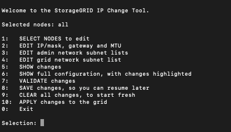
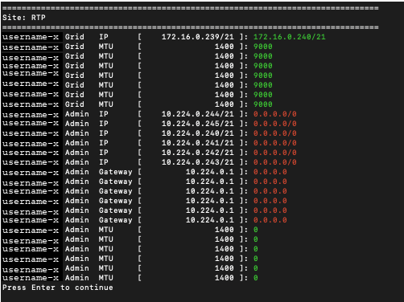
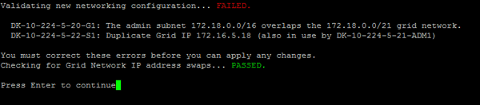
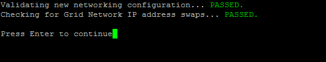

= Changing a node's network configuration
:icons: font
:imagesdir: ../media/

[.lead]
You can change the network configuration of one or more nodes using the Change IP tool. You can change the configuration of the Grid Network, or add, change, or remove the Admin or Client Networks.

.What you'll need

You must have the `Passwords.txt` file.

.About this task

*Linux:* If you are adding a grid node to the Admin Network or Client Network for the first time, and you did not previously configure ADMIN_NETWORK_TARGET or CLIENT_NETWORK_TARGET in the node configuration file, you must do so now.

See the StorageGRID installation instructions for your Linux operating system.

*Appliances:* On StorageGRID appliances, if the Client or Admin Network was not configured in the StorageGRID Appliance Installer during the initial installation, the network cannot be added by using only the Change IP tool. First, you must place the appliance in maintenance mode, configure the links, return the appliance to normal operating mode, and then use the Change IP tool to modify the network configuration. See the procedure for configuring network links in the installation and maintenance instructions for your appliance.

You can change the IP address, subnet mask, gateway, or MTU value for one or more nodes on any network.

You can also add or remove a node from a Client Network or from an Admin Network:

* You can add a node to a Client Network or to an Admin Network by adding an IP address/subnet mask on that network to the node.
* You can remove a node from a Client Network or from an Admin Network by deleting the IP address/subnet mask for the node on that network.
+
Nodes cannot be removed from the Grid Network.

IMPORTANT: IP address swaps are not allowed. If you must exchange IP addresses between grid nodes, you must use a temporary intermediate IP address.

IMPORTANT: If single sign-on (SSO) is enabled for your StorageGRID system and you are changing the IP address of an Admin Node, be aware that any relying party trust that was configured using the Admin Node's IP address (instead of its fully qualified domain name, as recommended) will become invalid. You will no longer be able to sign in to the node. Immediately after changing the IP address, you must update or reconfigure the node's relying party trust in Active Directory Federation Services (AD FS) with the new IP address. See the instructions for administering StorageGRID.

NOTE: Any changes you make to the network using the Change IP tool are propagated to the installer firmware for the StorageGRID appliances. That way, if StorageGRID software is reinstalled on an appliance, or if an appliance is placed into maintenance mode, the networking configuration will be correct.

.Steps

. Log in to the primary Admin Node:
 .. Enter the following command: `ssh admin@_primary_Admin_Node_IP_`
 .. Enter the password listed in the `Passwords.txt` file.
 .. Enter the following command to switch to root: `su -`
 .. Enter the password listed in the `Passwords.txt` file.
+
When you are logged in as root, the prompt changes from `$` to `#`.
. Start the Change IP tool by entering the following command: `change-ip`
. Enter the provisioning passphrase at the prompt.
+
The main menu appears.
+

. Optionally select *1* to choose which nodes to update. Then select one of the following options:
 ** *1*: Single node -- select by name
 ** *2*: Single node -- select by site, then by name
 ** *3*: Single node -- select by current IP
 ** *4*: All nodes at a site
 ** *5*: All nodes in the grid
+

*Note:* If you want to update all nodes, allow "all" to remain selected.

+
After you make your selection, the main menu appears, with the *Selected nodes* field updated to reflect your choice. All subsequent actions are performed only on the nodes displayed.
. On the main menu, select option *2* to edit IP/mask, gateway, and MTU information for the selected nodes.
 .. Select the network where you want to make changes:
  *** *1*: Grid network
  *** *2*: Admin network
  *** *3*: Client network
  *** *4*: All networks
After you make your selection, the prompt shows the node name, network name (Grid, Admin, or Client), data type (IP/mask, Gateway, or MTU), and current value.

+
Editing the IP address, prefix length, gateway, or MTU of a DHCP-configured interface will change the interface to static. When you select to change an interface configured by DHCP, a warning is displayed to inform you that the interface will change to static.

+
Interfaces configured as `fixed` cannot be edited.

 .. To set a new value, enter it in the format shown for the current value.
 .. To leave the current value unchanged, press *Enter*.
 .. If the data type is `IP/mask`, you can delete the Admin or Client Network from the node by entering *d* or *0.0.0.0/0*.
 .. After editing all nodes you want to change, enter *q* to return to the main menu.
+
Your changes are held until cleared or applied.
. Review your changes by selecting one of the following options:
 ** *5*: Shows edits in output that is isolated to show only the changed item. Changes are highlighted in green (additions) or red (deletions), as shown in the example output:
+

 ** *6*: Shows edits in output that displays the full configuration. Changes are highlighted in green (additions) or red (deletions).
+
NOTE: Certain command line interfaces might show additions and deletions using strikethrough formatting. Proper display depends on your terminal client supporting the necessary VT100 escape sequences.

. Select option *7* to validate all changes.
+
This validation ensures that the rules for the Grid, Admin, and Client Networks, such as not using overlapping subnets, are not violated.
+
In this example, validation returned errors.
+

+
In this example, validation passed.
+

. Once validation passes, choose one of the following options:
 ** *8*: Save unapplied changes.
+
This option allows you to quit the Change IP tool and start it again later, without losing any unapplied changes.

 ** *10*: Apply the new network configuration.
. If you selected option *10*, choose one of the following options:
 ** *apply*: Apply the changes immediately and automatically restart each node if necessary.
+
If the new network configuration does not require any physical networking changes, you can select *apply* to apply the changes immediately. Nodes will be restarted automatically, if necessary. Nodes that need to be restarted will be displayed.

 ** *stage*: Apply the changes the next time the nodes are restarted manually.
+
If you need to make physical or virtual networking configuration changes for the new network configuration to function, you must use the *stage* option, shut down the affected nodes, make the necessary physical networking changes, and restart the affected nodes. If you select *apply* without first making these networking changes, the changes will usually fail.
+
IMPORTANT: If you use the *stage* option, you must restart the node as soon as possible after staging to minimize disruptions.

 ** *cancel*: Do not make any network changes at this time.
+
If you were unaware that the proposed changes require nodes to be restarted, you can defer the changes to minimize user impact. Selecting *cancel* returns you to the main menu and preserves your changes so you can apply them later.

+
When you select *apply* or *stage*, a new network configuration file is generated, provisioning is performed, and nodes are updated with new working information.

+
During provisioning, the output displays the status as updates are applied.

+
----
Generating new grid networking description file...

Running provisioning...

Updating grid network configuration on Name
----

+
After applying or staging changes, a new Recovery Package is generated as a result of the grid configuration change.

. If you selected *stage*, follow these steps after provisioning is complete:
 .. Make the physical or virtual networking changes that are required.
+
*Physical networking changes*: Make the necessary physical networking changes, safely shutting down the node if necessary.
+
*Linux*: If you are adding the node to an Admin Network or Client Network for the first time, ensure that you have added the interface as described in "`Adding interfaces to an existing node.`"

 .. Restart the affected nodes.
. Select *0* to exit the Change IP tool after your changes are complete.
. Download a new Recovery Package from the Grid Manager.
 .. Select *Maintenance* > *System* > *Recovery Package*.
 .. Enter the provisioning passphrase.

.Related information

xref:linux-adding-interfaces-to-existing-node.adoc[Linux: Adding interfaces to an existing node]

xref:../rhel/index.adoc[Install Red Hat Enterprise Linux or CentOS]

xref:../ubuntu/index.adoc[Install Ubuntu or Debian]

xref:../sg100-1000/index.adoc[SG100 & SG1000 services appliances]

xref:../sg6000/index.adoc[SG6000 storage appliances]

xref:../sg5700/index.adoc[SG5700 storage appliances]

xref:../admin/index.adoc[Administer StorageGRID]

xref:configuring-ip-addresses.adoc[Configuring IP addresses]
