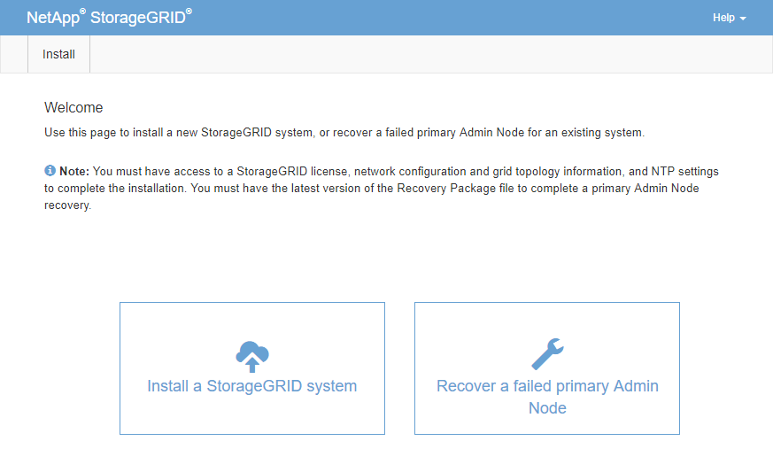

= Configure replacement primary Admin Node
:icons: font
:imagesdir: ../media/

[.lead]
The replacement node must be configured as the primary Admin Node for your StorageGRID system.

.What you'll need

* For primary Admin Nodes hosted on virtual machines, the virtual machine must be deployed, powered on, and initialized.
* For primary Admin Nodes hosted on a services appliance, you have replaced the appliance and have installed software. See the installation guide for your appliance.
+
xref:../sg100-1000/index.adoc[SG100 and SG1000 services appliances]

* You must have the latest backup of the Recovery Package file (`sgws-recovery-package-_id-revision_.zip`).
* You must have the provisioning passphrase.

.Steps

. Open your web browser and navigate to `https://primary_admin_node_ip`.
+

. Click *Recover a failed primary Admin Node*.
. Upload the most recent backup of the Recovery Package:
 .. Click *Browse*.
 .. Locate the most recent Recovery Package file for your StorageGRID system, and click *Open*.
. Enter the provisioning passphrase.
. Click *Start Recovery*.
+
The recovery process begins. The Grid Manager might become unavailable for a few minutes as the required services start. When the recovery is complete, the sign in page is displayed.

. If single sign-on (SSO) is enabled for your StorageGRID system and the relying party trust for the Admin Node you recovered was configured to use the default management interface certificate, update (or delete and recreate) the node's relying party trust in Active Directory Federation Services (AD FS). Use the new default server certificate that was generated during the Admin Node recovery process.
+
NOTE: To configure a relying party trust, see the instructions for administering StorageGRID. To access the default server certificate, log in to the command shell of the Admin Node. Go to the `/var/local/mgmt-api` directory, and select the `server.crt` file.

. Determine if you need to apply a hotfix.
 .. Sign in to the Grid Manager using a xref:../admin/web-browser-requirements.adoc[supported web browser].
 .. Select *NODES*.
 .. From the list on the left, select the primary Admin Node.
 .. On the Overview tab, note the version displayed in the *Software Version* field.
 .. Select any other grid node.
 .. On the Overview tab, note the version displayed in the *Software Version* field.
  *** If the versions displayed in the *Software Version* fields are the same, you do not need to apply a hotfix.
  *** If the versions displayed in the *Software Version* fields are different, you must apply a hotfix to update the recovered primary Admin Node to the same version.

.Related information

xref:../admin/index.adoc[Administer StorageGRID]

xref:storagegrid-hotfix-procedure.adoc[StorageGRID hotfix procedure]
