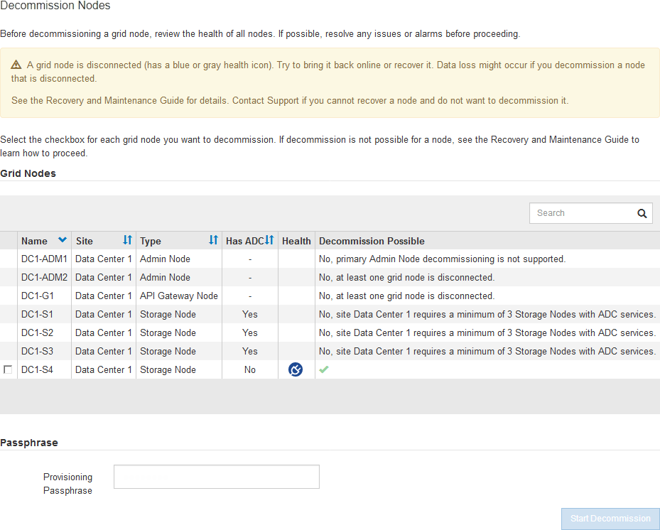

= Decommission disconnected grid nodes
:icons: font
:imagesdir: ../media/

[.lead]
You might need to decommission a node that is not currently connected to the grid (one whose Health is Unknown or Administratively Down).

.What you'll need

* You understand the requirements and xref:considerations-for-decommissioning-grid-nodes.adoc[considerations for decommissioning grid nodes].
* You have obtained all prerequisite items.
* You have ensured that no data repair jobs are active. See xref:checking-data-repair-jobs.adoc[Check data repair jobs].
* You have confirmed that Storage Node recovery is not in progress anywhere in the grid. If it is, you must wait until any Cassandra rebuild performed as part of the recovery is complete. You can then proceed with decommissioning.
* You have ensured that other maintenance procedures will not be run while the node decommission procedure is running, unless the node decommission procedure is paused.
* The *Decommission Possible* column for the disconnected node or nodes you want to decommission includes a green check mark.
* You must have the provisioning passphrase.

.About this task

You can identify disconnected nodes by looking for Unknown (blue) or Administratively Down (gray) icons in the *Health* column. In the example, the Storage Node named DC1-S4 is disconnected; all of the other nodes are connected.

Before decommissioning any disconnected node, note the following:

* This procedure is primarily intended for removing a single disconnected node. If your grid contains multiple disconnected nodes, the software requires you to decommission them all at the same time, which increases the potential for unexpected results.
+
IMPORTANT: Be very careful when decommissioning more than one disconnected grid node at a time, especially if you are selecting multiple disconnected Storage Nodes.

* If a disconnected node cannot be removed (for example, a Storage Node that is required for the ADC quorum), no other disconnected node can be removed.

Before decommissioning a disconnected *Storage Node*, note the following

* You should never decommission a disconnected Storage Node unless you are sure it cannot be brought online or recovered.
+
IMPORTANT: If you believe that object data can still be recovered from the node, do not perform this procedure. Instead, contact technical support to determine if node recovery is possible.

* If you decommission more than one disconnected Storage Node, data loss might occur. The system might not be able to reconstruct data if not enough object copies, erasure-coded fragments, or object metadata remain available.
+
IMPORTANT: If you have more than one disconnected Storage Node that you cannot recover, contact technical support to determine the best course of action.

* When you decommission a disconnected Storage Node, StorageGRID starts data repair jobs at the end of the decommissioning process. These jobs attempt to reconstruct the object data and metadata that was stored on the disconnected node.
* When you decommission a disconnected Storage Node, the decommission procedure completes relatively quickly. However, the data repair jobs can take days or weeks to run and are not monitored by the decommission procedure. You must manually monitor these jobs and restart them as needed. See xref:checking-data-repair-jobs.adoc[Check data repair jobs].

* If you decommission a disconnected Storage Node that contains the only copy of an object, the object will be lost. The data repair jobs can only reconstruct and recover objects if at least one replicated copy or enough erasure-coded fragments exist on Storage Nodes that are currently connected.

Before decommissioning a disconnected *Admin Node* or *Gateway Node*, note the following:

* When you decommission a disconnected Admin Node, you will lose the audit logs from that node; however, these logs should also exist on the primary Admin Node.
* You can safely decommission a Gateway Node while it is disconnected.

.Steps

. Attempt to bring any disconnected grid nodes back online or to recover them.
+
See the recovery procedures for instructions.

. If you are unable to recover a disconnected grid node and you want to decommission it while it is disconnected, select the check box for that node.
+
NOTE: If your grid contains multiple disconnected nodes, the software requires you to decommission them all at the same time, which increases the potential for unexpected results.
+
IMPORTANT: Be very careful when choosing to decommission more than one disconnected grid node at a time, especially if you are selecting multiple disconnected Storage Nodes. If you have more than one disconnected Storage Node that you cannot recover, contact technical support to determine the best course of action.

. Enter the provisioning passphrase.
+
The *Start Decommission* button is enabled.

. Click *Start Decommission*.
+
A warning appears, indicating that you have selected a disconnected node and that object data will be lost if the node has the only copy of an object.
+
image::../media/decommission_warning.gif[screenshot of decommission warning message]

. Review the list of nodes, and click *OK*.
+
The decommission procedure starts, and the progress is displayed for each node. During the procedure, a new Recovery Package is generated containing the grid configuration change.
+
image::../media/decommission_nodes_procedure_in_progress_disconnected.png[screenshot of node decommissioning in progress]

. As soon as the new Recovery Package is available, click the link or select *MAINTENANCE* > *System* > *Recovery package* to access the Recovery Package page. Then, download the `.zip` file.
+
See the instructions for xref:downloading-recovery-package.adoc[downloading the Recovery Package].
+
NOTE: Download the Recovery Package as soon as possible to ensure you can recover your grid if something goes wrong during the decommission procedure.
+
IMPORTANT: The Recovery Package file must be secured because it contains encryption keys and passwords that can be used to obtain data from the StorageGRID system.

. Periodically monitor the Decommission page to ensure that all selected nodes are decommissioned successfully.
+
Storage Nodes can take days or weeks to decommission. When all tasks are complete, the node selection list is redisplayed with a success message. If you decommissioned a disconnected Storage Node, an information message indicates that the repair jobs have been started.
+
image::../media/decommission_nodes_data_repair.png[screenshot showing that repair jobs have started]

. After the nodes have shut down automatically as part of the decommission procedure, remove any remaining virtual machines or other resources that are associated with the decommissioned node.
+
IMPORTANT: Do not perform this step until the nodes have shut down automatically.

. If you are decommissioning a Storage Node, monitor the status of the *replicated data* and *erasure-coded (EC) data* repair jobs that are automatically started during the decommissioning process.

include::../_include/restore-data-monitor.adoc[]

.After you finish

As soon as the disconnected nodes have been decommissioned and all data repair jobs have been completed, you can decommission any connected grid nodes as required.

Then, complete these steps after you complete the decommission procedure:

* Ensure that the drives of the decommissioned grid node are wiped clean. Use a commercially available data wiping tool or service to permanently and securely remove data from the drives.
* If you decommissioned an appliance node and the data on the appliance was protected using node encryption, use the StorageGRID Appliance Installer to clear the key management server configuration (Clear KMS). You must clear the KMS configuration if you want to add the appliance to another grid.

** xref:../sg100-1000/index.adoc[SG100 and SG1000 services appliances]
** xref:../sg5600/index.adoc[SG5600 storage appliances]
** xref:../sg5700/index.adoc[SG5700 storage appliances]
** xref:../sg6000/index.adoc[SG6000 storage appliances]

.Related information

xref:grid-node-recovery-procedures.adoc[Grid node recovery procedures]
