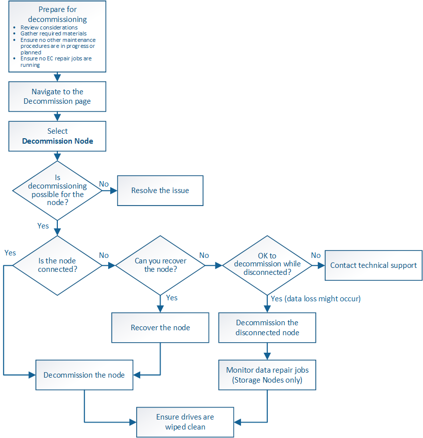

= Grid node decommissioning
:icons: font
:imagesdir: ../media/

[.lead]
You can use the node decommission procedure to remove one or more Storage Nodes, Gateway Nodes, or non-primary Admin Nodes at one or more sites. You cannot decommission the primary Admin Node or an Archive Node.

In general, you should decommission grid nodes only while they are connected to the StorageGRID system and all nodes are in normal health (have green icons on the *Nodes* pages and on the *Decommission Nodes* page). However, if required, you can decommission a grid node that is disconnected. Before removing a disconnected node, make sure you understand the implications and restrictions of that process.

Use the node decommission procedure when any of the following are true:

* You have added a larger Storage Node to the system and you want to remove one or more smaller Storage Nodes, while at the same time preserving objects.
* You require less total storage.
* You no longer require a Gateway Node.
* You no longer require a non-primary Admin Node.
* Your grid includes a disconnected node that you cannot recover or bring back online.

The flowchart shows the high-level steps for decommissioning grid nodes.

.Steps

* xref:preparing-to-decommission-grid-nodes.adoc[Preparing to decommission grid nodes]
* xref:gathering-required-materials-node-decom.adoc[Gathering required materials]
* xref:accessing-decommission-nodes-page.adoc[Accessing the Decommission Nodes page]
* xref:decommissioning-disconnected-grid-nodes.adoc[Decommissioning disconnected grid nodes]
* xref:decommissioning-connected-grid-nodes.adoc[Decommissioning connected grid nodes]
* xref:pausing-and-resuming-decommission-process-for-storage-nodes.adoc[Pausing and resuming the decommission process for Storage Nodes]
* xref:troubleshooting-node-decommissioning.adoc[Troubleshooting node decommissioning]
