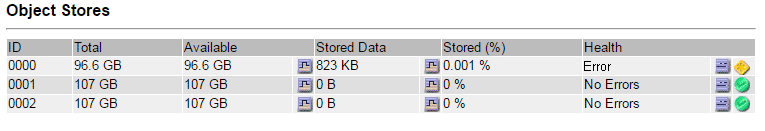
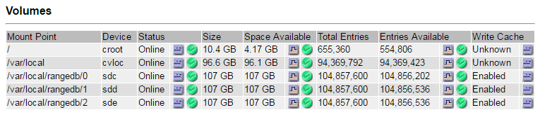
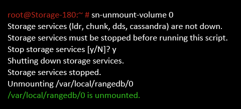

= Identify and unmount failed storage volumes
:icons: font
:imagesdir: ../media/

[.lead]
When recovering a Storage Node with failed storage volumes, you must identify and unmount the failed volumes. You must verify that only the failed storage volumes are reformatted as part of the recovery procedure.

.What you'll need

You must be signed in to the Grid Manager using a xref:../admin/web-browser-requirements.adoc[supported web browser].

.About this task

You should recover failed storage volumes as soon as possible.

The first step of the recovery process is to detect volumes that have become detached, need to be unmounted, or have I/O errors. If failed volumes are still attached but have a randomly corrupted file system, the system might not detect any corruption in unused or unallocated parts of the disk.

NOTE: You must finish this procedure before performing manual steps to recover the volumes, such as adding or re-attaching the disks, stopping the node, starting the node, or rebooting. Otherwise, when you run the `reformat_storage_block_devices.rb` script, you might encounter a file system error that causes the script to hang or fail.

NOTE: Repair the hardware and properly attach the disks before running the `reboot` command.

CAUTION: Identify failed storage volumes carefully. You will use this information to verify which volumes must be reformatted. Once a volume has been reformatted, data on the volume cannot be recovered.

To correctly recover failed storage volumes, you need to know both the device names of the failed storage volumes and their volume IDs.

At installation, each storage device is assigned a file system universal unique identifier (UUID) and is mounted to a rangedb directory on the Storage Node using that assigned file system UUID. The file system UUID and the rangedb directory are listed in the `/etc/fstab` file. The device name, rangedb directory, and the size of the mounted volume are displayed in the Grid Manager.

In the following example, device `/dev/sdc` has a volume size of 4 TB, is mounted to `/var/local/rangedb/0`, using the device name `/dev/disk/by-uuid/822b0547-3b2b-472e-ad5e-e1cf1809faba` in the /`etc/fstab` file:

image::../media/mounting_storage_devices.gif[Volume size sample]

.Steps

. Complete the following steps to record the failed storage volumes and their device names:
 .. Select *SUPPORT* > *Tools* > *Grid topology*.
 .. Select *site* > *failed Storage Node* > *LDR* > *Storage* > *Overview* > *Main*, and look for object stores with alarms.
+

 .. Select *site* > *failed Storage Node* > *SSM* > *Resources* > *Overview* > *Main*. Determine the mount point and volume size of each failed storage volume identified in the previous step.
+
Object stores are numbered in hex notation. For example, 0000 is the first volume and 000F is the sixteenth volume. In the example, the object store with an ID of 0000 corresponds to `/var/local/rangedb/0` with device name sdc and a size of 107 GB.
+

. Log in to the failed Storage Node:
 .. Enter the following command: `ssh admin@_grid_node_IP_`
 .. Enter the password listed in the `Passwords.txt` file.
 .. Enter the following command to switch to root: `su -`
 .. Enter the password listed in the `Passwords.txt` file.

+
When you are logged in as root, the prompt changes from `$` to `#`.
. Run the following script to stop the storage services and unmount a failed storage volume:
+
`sn-unmount-volume object_store_ID`
+
The `object_store_ID` is the ID of the failed storage volume. For example, specify `0` in the command for an object store with ID 0000.

. If prompted, press *y* to stop the storage services on the Storage Node.
+
NOTE: If the storage services are already stopped, you are not prompted. The Cassandra service is stopped only for volume 0.
+

+
In a few seconds, the storage services are stopped and the volume is unmounted. Messages appear indicating each step of the process. The final message indicates that the volume is unmounted.
