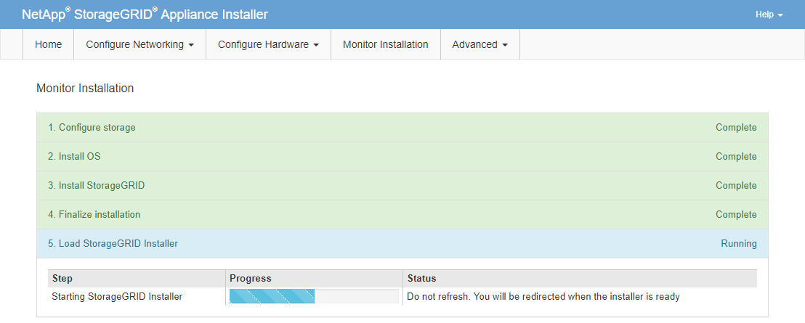

= Monitoring services appliance installation
:icons: font
:imagesdir: ../media/

[.lead]
The StorageGRID Appliance Installer provides status until installation is complete. When the software installation is complete, the appliance is rebooted.

. To monitor the installation progress, click *Monitor Installation* from the menu bar.
+
The Monitor Installation page shows the installation progress.
+
image::../media/monitor_installation_services_appl.png[Monitor Installation - Services Appl]
+
The blue status bar indicates which task is currently in progress. Green status bars indicate tasks that have completed successfully.
+
NOTE: The installer ensures that tasks completed in a previous install are not re-run. If you are re-running an installation, any tasks that do not need to be re-run are shown with a green status bar and a status of "`Skipped.`"

. Review the progress of first two installation stages.
 ** *1. Configure storage*
+
During this stage, the installer clears any existing configuration from the drives, and configures host settings.

 ** *2. Install OS*
+
During this stage, the installer copies the base operating system image for StorageGRID from the primary Admin Node to the appliance or installs the base operating system from the installation package for the primary Admin Node.
. Continue monitoring the installation progress until one of the following occurs:
 ** For appliance Gateway Nodes or non-primary appliance Admin Nodes, the *Install StorageGRID* stage pauses and a message appears on the embedded console, prompting you to approve this node on the Admin Node using the Grid Manager.
+
image:../media/monitor_installation_install_sgws.gif[Image is described by surrounding text]

** For appliance primary Admin Nodes, a fifth phase (Load StorageGRID Installer) appears. If the fifth phase is in progress for more than 10 minutes, refresh the page manually.
+

. Go on to the next step of the recovery process for the type of appliance grid node that you are recovering.
+
[cols="1a,2a" options="header"]
|===
| Type of recovery| Reference
|Gateway Node
|xref:selecting-start-recovery-to-configure-gateway-node.adoc[Selecting Start Recovery to configure a Gateway Node]

|Non-primary Admin Node
|xref:selecting-start-recovery-to-configure-non-primary-admin-node.adoc[Selecting Start Recovery to configure a non-primary Admin Node]

|Primary Admin Node
|xref:configuring-replacement-primary-admin-node.adoc[Configuring the replacement primary Admin Node]
|===
