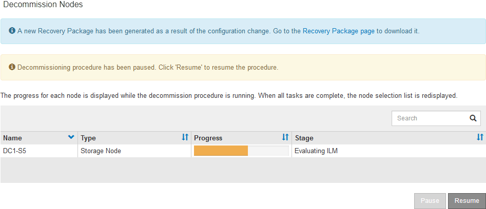

= Pausing and resuming the decommission process for Storage Nodes
:icons: font
:imagesdir: ../media/

[.lead]
If necessary, you can pause the decommission procedure for a Storage Node during certain stages. You must pause decommissioning on a Storage Node before you can start a second maintenance procedure. After the other procedure is finished, you can resume decommissioning.

.What you'll need

* You must be signed in to the Grid Manager using a xref:../admin/web-browser-requirements.adoc[supported web browser].
* You must have the Maintenance or Root Access permission.

.Steps

. Select *Maintenance* > *Maintenance Tasks* > *Decommission*.
+
The Decommission page appears.

. Click *Decommission Nodes*.
+
The Decommission Nodes page appears. When the decommission procedure reaches either of the following stages, the *Pause* button is enabled.

 ** Evaluating ILM
 ** Decommissioning Erasure Coded data

. Click *Pause* to suspend the procedure.
+
The current stage is paused, and the *Resume* button is enabled.
+

. After the other maintenance procedure is finished, click *Resume* to proceed with the decommission.
