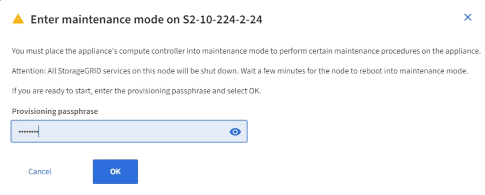
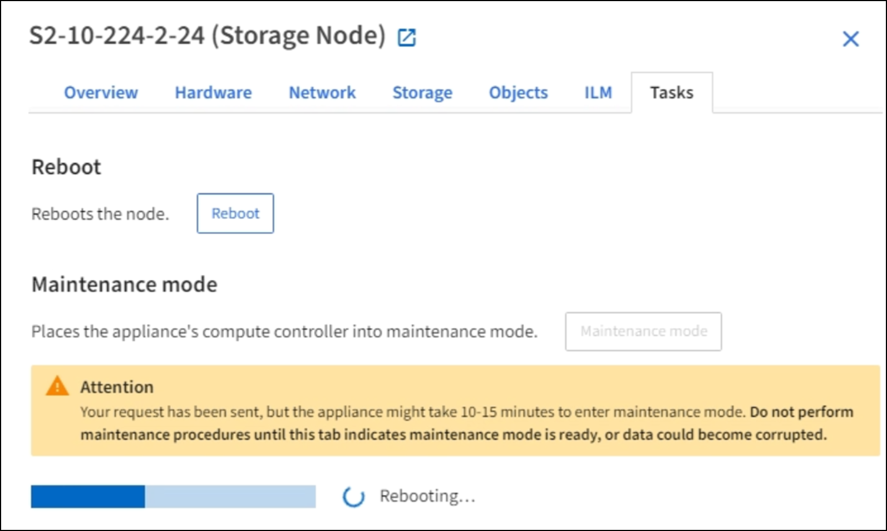

= Place appliance into maintenance mode
:icons: font
:imagesdir: ../media/

[.lead]
You must place the appliance into maintenance mode before performing specific maintenance procedures.

.What you'll need

* You are signed in to the Grid Manager using a xref:../admin/web-browser-requirements.adoc[supported web browser].
* You have the Maintenance or Root access permission. For details, see the instructions for administering StorageGRID.

.About this task

In rare instances, placing a StorageGRID appliance into maintenance mode might make the appliance unavailable for remote access.

NOTE: The admin account password and SSH host keys for a StorageGRID appliance in maintenance mode remain the same as they were when the appliance was in service.

.Steps

. From the Grid Manager, select *NODES*.
. From the tree view of the Nodes page, select the appliance Storage Node.
. Select *Tasks*.
+
image::../media/maintenance_mode.png[Maintenance Mode button for appliance]

. Select *Maintenance mode*.
+
A confirmation dialog box appears.
+

. Enter the provisioning passphrase, and select *OK*.
+
A progress bar and a series of messages, including "Request Sent","Stopping StorageGRID", and "Rebooting", indicate that the appliance is completing the steps for entering maintenance mode.
+

+
When the appliance is in maintenance mode, a confirmation message lists the URLs you can use to access the StorageGRID Appliance Installer.
+
image::../media/maintenance_mode_urls.png[Maintenance Mode URLs]

. To access the StorageGRID Appliance Installer, browse to any of the URLs displayed.
+
If possible, use the URL containing the IP address of the appliance's Admin Network port.
+
NOTE: Accessing `+https://169.254.0.1:8443+` requires a direct connection to the local management port.

. From the StorageGRID Appliance Installer, confirm that the appliance is in maintenance mode.
+
image::../media/maintenance_mode_notification_bar.png[maintenance mode message]

. Perform any required maintenance tasks.
. After completing maintenance tasks, exit maintenance mode and resume normal node operation. From the StorageGRID Appliance Installer, select *Advanced* > *Reboot Controller*, and then select *Reboot into StorageGRID*.
+
image::../media/reboot_controller_from_maintenance_mode.png[Reboot controller in maintenance mode]
+
It can take up to 20 minutes for the appliance to reboot and rejoin the grid. To confirm that the reboot is complete and that the node has rejoined the grid, go back to the Grid Manager. The *Nodes* page should display a normal status (no icons to the left of the node name) for the appliance node, indicating that no alerts are active and the node is connected to the grid.
+
image::../media/node_rejoin_grid_confirmation.png[Appliance node rejoined grid]
