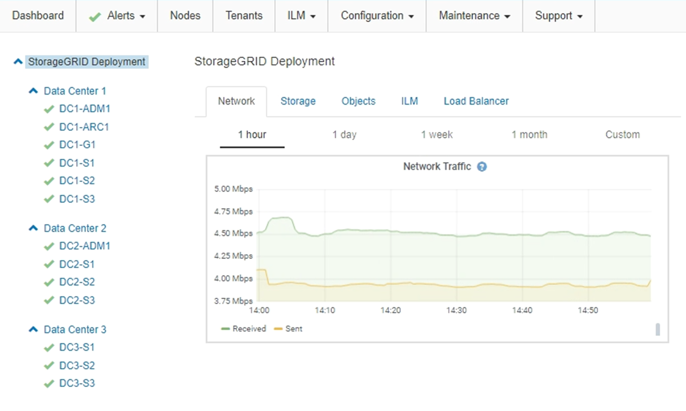

= Starting up the grid nodes
:icons: font
:imagesdir: ../media/

[.lead]
Follow this sequence to start up the grid nodes after a complete shutdown.

.What you'll need

CAUTION: If the entire grid has been shut down for more than 15 days, you must contact technical support before starting up any grid nodes. Do not attempt the recovery procedures that rebuild Cassandra data. Doing so might result in data loss.

.About this task

If possible, you should power on the grid nodes in this order:

* Apply power to Admin Nodes first.
* Apply power to Gateway Nodes last.

NOTE: If a host includes multiple grid nodes, the nodes will come back online automatically when you power on the host.

.Steps

. Power on the hosts for the primary Admin Node and any non-primary Admin Nodes.
+
NOTE: You will not be able to log in to the Admin Nodes until the Storage Nodes have been restarted.

. Power on the hosts for all Archive Nodes and Storage Nodes.
+
You can power on these nodes in any order.

. Power on the hosts for all Gateway Nodes.
. Sign into the Grid Manager.
. Click *Nodes*, and monitor the status of the grid nodes. Verify that all nodes return to "`green`" status.
+

