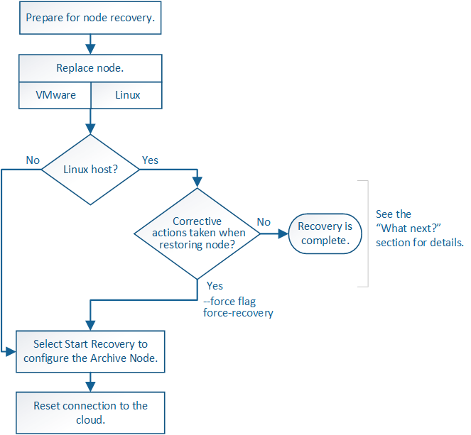

= Recover from Archive Node failures
:icons: font
:imagesdir: ../media/

[.lead]
You must complete a sequence of tasks in exact order to recover from an Archive Node failure.

.About this task

Archive Node recovery is affected by the following issues:

* If the ILM policy is configured to replicate a single copy.
+
In a StorageGRID system that is configured to make a single copy of objects, an Archive Node failure might result in an unrecoverable loss of data. If there is a failure, all such objects are lost; however, you must still perform recovery procedures to "`clean up`" your StorageGRID system and purge lost object information from the database.

* If an Archive Node failure occurs during Storage Node recovery.
+
If the Archive Node fails while processing bulk retrievals as part of a Storage Node recovery, you must repeat the procedure to recover copies of object data to the Storage Node from the beginning to ensure that all object data retrieved from the Archive Node is restored to the Storage Node.
