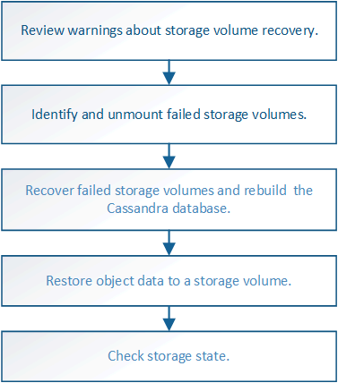

= Recovering from storage volume failure where the system drive is intact
:icons: font
:imagesdir: ../media/

[.lead]
You must complete a series of tasks to recover a software-based Storage Node where one or more storage volumes on the Storage Node have failed, but the system drive is intact. If only storage volumes have failed, the Storage Node is still available to the StorageGRID system.

.About this task

This recovery procedure applies to software-based Storage Nodes only. If storage volumes have failed on an appliance Storage Node, use the procedure for "`Recovering a StorageGRID appliance Storage Node.`"

.Related information

xref:recovering-storagegrid-appliance-storage-node.adoc[Recovering a StorageGRID appliance Storage Node]

.Steps

* xref:reviewing-warnings-about-storage-volume-recovery.adoc[Reviewing warnings about storage volume recovery]
* xref:identifying-and-unmounting-failed-storage-volumes.adoc[Identifying and unmounting failed storage volumes]
* xref:recovering-failed-storage-volumes-and-rebuilding-cassandra-database.adoc[Recovering failed storage volumes and rebuilding the Cassandra database]
* xref:restoring-object-data-to-storage-volume-where-system-drive-is-intact.adoc[Restoring object data to a storage volume where the system drive is intact]
* xref:checking-storage-state-after-recovering-storage-volumes.adoc[Checking the storage state after recovering storage volumes]
