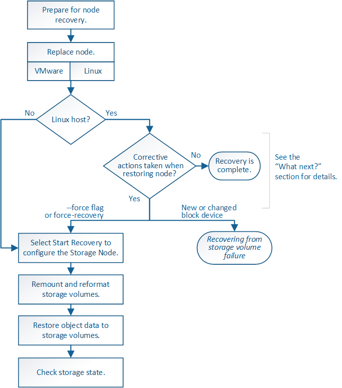

= Recovering from system drive failure
:icons: font
:imagesdir: ../media/

[.lead]
If the system drive on a software-based Storage Node has failed, the Storage Node is not available to the StorageGRID system. You must complete a specific set of tasks to recover from a system drive failure.

.About this task

Use this procedure to recover from a system drive failure on a software-based Storage Node. This procedure includes the steps to follow if any storage volumes also failed or cannot be remounted.

NOTE: This procedure applies to software-based Storage Nodes only. You must follow a different procedure to recover an appliance Storage Node.

xref:recovering-storagegrid-appliance-storage-node.adoc[Recovering a StorageGRID appliance Storage Node]

.Steps

* xref:reviewing-warnings-for-system-drive-recovery.adoc[Reviewing warnings for Storage Node system drive recovery]
* xref:replacing-storage-node.adoc[Replacing the Storage Node]
* xref:selecting-start-recovery-to-configure-storage-node.adoc[Selecting Start Recovery to configure a Storage Node]
* xref:remounting-and-reformatting-storage-volumes-manual-steps.adoc[Remounting and reformatting storage volumes ("`Manual Steps`")]
* xref:restoring-object-data-to-storage-volume-if-required.adoc[Restoring object data to a storage volume, if required]
* xref:checking-storage-state-after-recovering-storage-node-system-drive.adoc[Checking the storage state after recovering a Storage Node system drive]
