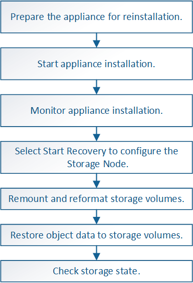

= Recovering a StorageGRID appliance Storage Node
:icons: font
:imagesdir: ../media/

[.lead]
The procedure for recovering a failed StorageGRID appliance Storage Node is the same whether you are recovering from the loss of the system drive or from the loss of storage volumes only.

.About this task

You must prepare the appliance and reinstall software, configure the node to rejoin the grid, reformat storage, and restore object data.

CAUTION: If more than one Storage Node has failed (or is offline), contact technical support. Do not perform the following recovery procedure. Data loss could occur.

CAUTION: If this is the second Storage Node failure in less than 15 days after a Storage Node failure or recovery, contact technical support. Rebuilding Cassandra on two or more Storage Nodes within 15 days can result in data loss.

NOTE: If more than one Storage Node at a site has failed, a site recovery procedure might be required. Contact technical support.

xref:how-site-recovery-is-performed-by-technical-support.adoc[How site recovery is performed by technical support]

IMPORTANT: If ILM rules are configured to store only one replicated copy and the copy exists on a storage volume that has failed, you will not be able to recover the object.

NOTE: If you encounter a Services: Status - Cassandra (SVST) alarm during recovery, see the monitoring and troubleshooting instructions to recover from the alarm by rebuilding Cassandra. After Cassandra is rebuilt, alarms should clear. If alarms do not clear, contact technical support.

NOTE: For hardware maintenance procedures, such as instructions for replacing a controller or reinstalling SANtricity OS, see the installation and maintenance instructions for your storage appliance.

.Related information

xref:../monitor/index.adoc[Monitor & troubleshoot]

xref:../sg6000/index.adoc[SG6000 storage appliances]

xref:../sg5700/index.adoc[SG5700 storage appliances]

xref:../sg5600/index.adoc[SG5600 storage appliances]

.Steps

* xref:preparing-appliance-storage-node-for-reinstallation.adoc[Preparing an appliance Storage Node for reinstallation]
* xref:starting-storagegrid-appliance-installation.adoc[Starting StorageGRID appliance installation]
* xref:monitoring-storagegrid-appliance-installation-sn.adoc[Monitoring StorageGRID appliance installation]
* xref:selecting-start-recovery-to-configure-appliance-storage-node.adoc[Selecting Start Recovery to configure an appliance Storage Node]
* xref:remounting-and-reformatting-appliance-storage-volumes.adoc[Remounting and reformatting appliance storage volumes ("`Manual Steps`")]
* xref:restoring-object-data-to-storage-volume-for-appliance.adoc[Restoring object data to a storage volume for an appliance]
* xref:checking-storage-state-after-recovering-sga.adoc[Checking the storage state after recovering an appliance Storage Node]
