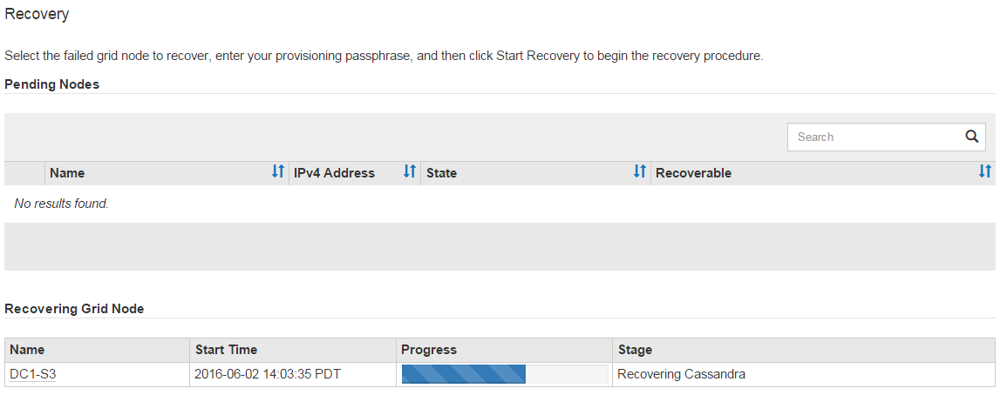

= Remounting and reformatting appliance storage volumes ("`Manual Steps`")
:icons: font
:imagesdir: ../media/

[.lead]
You must manually run two scripts to remount preserved storage volumes and reformat any failed storage volumes. The first script remounts volumes that are properly formatted as StorageGRID storage volumes. The second script reformats any unmounted volumes, rebuilds the Cassandra database, if needed, and starts services.

.What you'll need

* You have already replaced the hardware for any failed storage volumes that you know require replacement.
+
Running the `sn-remount-volumes` script might help you identify additional failed storage volumes.

* You have checked that a Storage Node decommissioning is not in progress, or you have paused the node decommission procedure. (In the Grid Manager, select *Maintenance* > *Maintenance Tasks* > *Decommission*.)
* You have checked that an expansion is not in progress. (In the Grid Manager, select *Maintenance* > *Maintenance Tasks* > *Expansion*.)

CAUTION: Contact technical support if more than one Storage Node is offline or if a Storage Node in this grid has been rebuilt in the last 15 days. Do not run the `sn-recovery-postinstall.sh` script. Rebuilding Cassandra on two or more Storage Nodes within 15 days of each other might result in data loss.

.About this task

To complete this procedure, you perform these high-level tasks:

* Log in to the recovered Storage Node.
* Run the `sn-remount-volumes` script to remount properly formatted storage volumes. When this script runs, it does the following:
 ** Mounts and unmounts each storage volume to replay the XFS journal.
 ** Performs an XFS file consistency check.
 ** If the file system is consistent, determines if the storage volume is a properly formatted StorageGRID storage volume.
 ** If the storage volume is properly formatted, remounts the storage volume. Any existing data on the volume remains intact.
* Review the script output and resolve any issues.
* Run the `sn-recovery-postinstall.sh` script. When this script runs, it does the following.
+
IMPORTANT: Do not reboot a Storage Node during recovery before running `sn-recovery-postinstall.sh` (step 4) to reformat the failed storage volumes and restore object metadata. Rebooting the Storage Node before `sn-recovery-postinstall.sh` completes causes errors for services that attempt to start and causes StorageGRID appliance nodes to exit maintenance mode.

 ** Reformats any storage volumes that the `sn-remount-volumes` script could not mount or that were found to be improperly formatted.
+
NOTE: If a storage volume is reformatted, any data on that volume is lost. You must perform an additional procedure to restore object data from other locations in the grid, assuming that ILM rules were configured to store more than one object copy.

 ** Rebuilds the Cassandra database on the node, if needed.
 ** Starts the services on the Storage Node.

.Steps

. Log in to the recovered Storage Node:
 .. Enter the following command: `ssh admin@_grid_node_IP_`
 .. Enter the password listed in the `Passwords.txt` file.
 .. Enter the following command to switch to root: `su -`
 .. Enter the password listed in the `Passwords.txt` file.

+
When you are logged in as root, the prompt changes from `$` to `#`.
. Run the first script to remount any properly formatted storage volumes.
+
NOTE: If all storage volumes are new and need to be formatted, or if all storage volumes have failed, you can skip this step and run the second script to reformat all unmounted storage volumes.

 .. Run the script: `sn-remount-volumes`
+
This script might take hours to run on storage volumes that contain data.

 .. As the script runs, review the output and answer any prompts.
+
NOTE: As required, you can use the `tail -f` command to monitor the contents of the script's log file (`/var/local/log/sn-remount-volumes.log`) . The log file contains more detailed information than the command line output.
+

----
root@SG:~ # sn-remount-volumes
The configured LDR noid is 12632740

====== Device /dev/sdb ======
Mount and unmount device /dev/sdb and checking file system consistency:
The device is consistent.
Check rangedb structure on device /dev/sdb:
Mount device /dev/sdb to /tmp/sdb-654321 with rangedb mount options
This device has all rangedb directories.
Found LDR node id 12632740, volume number 0 in the volID file
Attempting to remount /dev/sdb
Device /dev/sdb remounted successfully

====== Device /dev/sdc ======
Mount and unmount device /dev/sdc and checking file system consistency:
Error: File system consistency check retry failed on device /dev/sdc.
You can see the diagnosis information in the /var/local/log/sn-remount-volumes.log.

This volume could be new or damaged. If you run sn-recovery-postinstall.sh, this volume and any data on this volume will be deleted. If you only had two copies of object data, you will temporarily have only a single copy.
StorageGRID Webscale will attempt to restore data redundancy by making additional replicated copies or EC fragments, according to the rules in the active ILM policy.

Do not continue to the next step if you believe that the data remaining on this volume cannot be rebuilt from elsewhere in the grid (for example, if your ILM policy uses a rule that makes only one copy or if volumes have failed on multiple nodes). Instead, contact support to determine how to recover your data.

====== Device /dev/sdd ======
Mount and unmount device /dev/sdd and checking file system consistency:
Failed to mount device /dev/sdd
This device could be an uninitialized disk or has corrupted superblock.
File system check might take a long time. Do you want to continue? (y or n) [y/N]? y

Error: File system consistency check retry failed on device /dev/sdd.
You can see the diagnosis information in the /var/local/log/sn-remount-volumes.log.

This volume could be new or damaged. If you run sn-recovery-postinstall.sh, this volume and any data on this volume will be deleted. If you only had two copies of object data, you will temporarily have only a single copy.
StorageGRID Webscale will attempt to restore data redundancy by making additional replicated copies or EC fragments, according to the rules in the active ILM policy.

Do not continue to the next step if you believe that the data remaining on this volume cannot be rebuilt from elsewhere in the grid (for example, if your ILM policy uses a rule that makes only one copy or if volumes have failed on multiple nodes). Instead, contact support to determine how to recover your data.

====== Device /dev/sde ======
Mount and unmount device /dev/sde and checking file system consistency:
The device is consistent.
Check rangedb structure on device /dev/sde:
Mount device /dev/sde to /tmp/sde-654321 with rangedb mount options
This device has all rangedb directories.
Found LDR node id 12000078, volume number 9 in the volID file
Error: This volume does not belong to this node. Fix the attached volume and re-run this script.
----
+
In the example output, one storage volume was remounted successfully and three storage volumes had errors.

  *** `/dev/sdb` passed the XFS file system consistency check and had a valid volume structure, so it was remounted successfully. Data on devices that are remounted by the script is preserved.
  *** `/dev/sdc` failed the XFS file system consistency check because the storage volume was new or corrupt.
  *** `/dev/sdd` could not be mounted because the disk was uninitialized or the disk's superblock was corrupted. When the script cannot mount a storage volume, it asks if you want to run the file system consistency check.
   **** If the storage volume is attached to a new disk, answer *N* to the prompt. You do not need check the file system on a new disk.
   **** If the storage volume is attached to an existing disk, answer *Y* to the prompt. You can use the results of the file system check to determine the source of the corruption. The results are saved in the `/var/local/log/sn-remount-volumes.log` log file.
  *** `/dev/sde` passed the XFS file system consistency check and had a valid volume structure; however, the LDR node ID in the `volID` file did not match the ID for this Storage Node (the `configured LDR noid` displayed at the top). This message indicates that this volume belongs to another Storage Node.

. Review the script output and resolve any issues.
+
IMPORTANT: If a storage volume failed the XFS file system consistency check or could not be mounted, carefully review the error messages in the output. You must understand the implications of running the `sn-recovery-postinstall.sh` script on these volumes.

 .. Check to make sure that the results include an entry for all of the volumes you expected. If any volumes are not listed, rerun the script.
 .. Review the messages for all mounted devices. Make sure there are no errors indicating that a storage volume does not belong to this Storage Node.
+
In the example, the output for /dev/sde includes the following error message:
+
----
Error: This volume does not belong to this node. Fix the attached volume and re-run this script.
----
+
CAUTION: If a storage volume is reported as belonging to another Storage Node, contact technical support. If you run the `sn-recovery-postinstall.sh` script, the storage volume will be reformatted, which might cause data loss.

 .. If any storage devices could not be mounted, make a note of the device name, and repair or replace the device.
+
NOTE: You must repair or replace any storage devices that could not be mounted.
+
You will use the device name to look up the volume ID, which is required input when you run the `repair-data` script to restore object data to the volume (the next procedure).

 .. After repairing or replacing all unmountable devices, run the `sn-remount-volumes` script again to confirm that all storage volumes that can be remounted have been remounted.

+
IMPORTANT: If a storage volume cannot be mounted or is improperly formatted, and you continue to the next step, the volume and any data on the volume will be deleted. If you had two copies of object data, you will have only a single copy until you complete the next procedure (restoring object data).

+
CAUTION: Do not run the `sn-recovery-postinstall.sh` script if you believe that the data remaining on a failed storage volume cannot be rebuilt from elsewhere in the grid (for example, if your ILM policy uses a rule that makes only one copy or if volumes have failed on multiple nodes). Instead, contact technical support to determine how to recover your data.

. Run the `sn-recovery-postinstall.sh` script: `sn-recovery-postinstall.sh`
+
This script reformats any storage volumes that could not be mounted or that were found to be improperly formatted; rebuilds the Cassandra database on the node, if needed; and starts the services on the Storage Node.
+
Be aware of the following:

 ** The script might take hours to run.
 ** In general, you should leave the SSH session alone while the script is running.
 ** Do not press *Ctrl+C* while the SSH session is active.
 ** The script will run in the background if a network disruption occurs and terminates the SSH session, but you can view the progress from the Recovery page.
 ** If the Storage Node uses the RSM service, the script might appear to stall for 5 minutes as node services are restarted. This 5-minute delay is expected whenever the RSM service boots for the first time.
+
NOTE: The RSM service is present on Storage Nodes that include the ADC service.

+
NOTE: Some StorageGRID recovery procedures use Reaper to handle Cassandra repairs. Repairs occur automatically as soon as the related or required services have started. You might notice script output that mentions "`reaper`" or "`Cassandra repair.`" If you see an error message indicating the repair has failed, run the command indicated in the error message.

. As the `sn-recovery-postinstall.sh` script runs, monitor the Recovery page in the Grid Manager.
+
The Progress bar and the Stage column on the Recovery page provide a high-level status of the `sn-recovery-postinstall.sh` script.
+

. Return to the Monitor Install page of the StorageGRID Appliance Installer by entering `http://Controller_IP:8080`, using the IP address of the compute controller.
+
The Monitor Install page shows the installation progress while the script is running.

After the `sn-recovery-postinstall.sh` script has started services on the node, you can restore object data to any storage volumes that were formatted by the script, as described in the next procedure.

.Related information

xref:reviewing-warnings-for-system-drive-recovery.adoc[Reviewing warnings for Storage Node system drive recovery]

xref:restoring-object-data-to-storage-volume-for-appliance.adoc[Restoring object data to a storage volume for an appliance]
