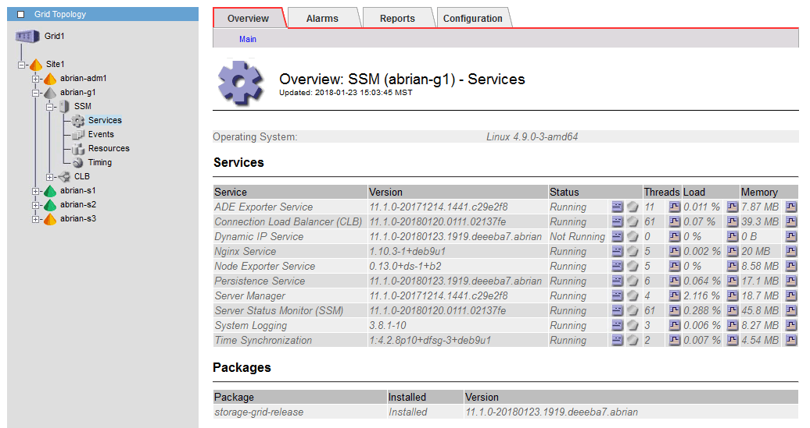

= Restoring network connectivity for isolated nodes
:icons: font
:imagesdir: ../media/

[.lead]
Under certain circumstances, such as site- or grid-wide IP address changes, one or more groups of nodes might not be able to contact the rest of the grid.

In the Grid Manager (*Support* > *Tools* > *Grid Topology*), if a node is gray, or if a node is blue with many of its services showing a status other than Running, you should check for node isolation.

Some of the consequences of having isolated nodes include the following:

* If multiple nodes are isolated, you might not be able to sign in to or access the Grid Manager.
* If multiple nodes are isolated, the storage usage and quota values shown on the Dashboard for the Tenant Manager might be out of date. The totals will be updated when network connectivity is restored.

To resolve the isolation issue, you run a command line utility on each isolated node or on one node in a group (all nodes in a subnet that does not contain the primary Admin Node) that is isolated from the grid. The utility provides the nodes with the IP address of a non-isolated node in the grid, which allows the isolated node or group of nodes to contact the entire grid again.

NOTE: If the multicast Domain Name System (mDNS) is disabled in the networks, the command line utility might have to be run on each isolated node.

. Access the node and check `/var/local/log/dynip.log` for isolation messages.
+
For example:
+
----
[2018-01-09T19:11:00.545] UpdateQueue - WARNING -- Possible isolation, no contact with other nodes.
If this warning persists, manual action may be required.
----
+
If you are using the VMware console, it will contain a message that the node might be isolated.
+
On Linux deployments, isolation messages would appear in `/var/log/storagegrid/node/<nodename>.log` files.

. If the isolation messages are recurring and persistent, run the following command:
+
`add_node_ip.py <address\>`
+
where `<address\>` is the IP address of a remote node that is connected to the grid.
+
----
# /usr/sbin/add_node_ip.py  10.224.4.210

Retrieving local host information
Validating remote node at address 10.224.4.210
Sending node IP hint for 10.224.4.210 to local node
Local node found on remote node. Update complete.
----

. Verify the following for each node that was previously isolated:
 ** The node's services have started.
 ** The status of the Dynamic IP Service is "`Running`" after you run the `storagegrid-status` command.
 ** In the Grid Topology tree, the node no longer appears disconnected from the rest of the grid.

IMPORTANT: If running the `add_node_ip.py` command does not solve the problem, there could be other networking issues that need to be resolved.
