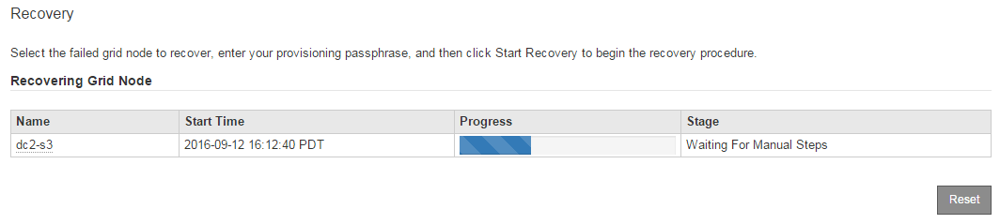

= Select Start Recovery to configure appliance Storage Node
:icons: font
:imagesdir: ../media/

[.lead]
You must select Start Recovery in the Grid Manager to configure an appliance Storage Node as a replacement for the failed node.

.What you'll need

* You must be signed in to the Grid Manager using a xref:../admin/web-browser-requirements.adoc[supported web browser].
* You must have the Maintenance or Root Access permission.
* You must have the provisioning passphrase.
* You must have deployed a recovery appliance Storage Node.
* You must know the start date of any repair jobs for erasure-coded data.
* You must have verified that the Storage Node has not been rebuilt within the last 15 days.

.Steps

. From the Grid Manager, select *MAINTENANCE* > *Tasks* > *Recovery*.
. Select the grid node you want to recover in the Pending Nodes list.
+
Nodes appear in the list after they fail, but you cannot select a node until it has been reinstalled and is ready for recovery.

. Enter the *Provisioning Passphrase*.
. Click *Start Recovery*.
+
image::../media/4b_select_recovery_node.png[screenshot showing the Maintenance > Recovery page]

. Monitor the progress of the recovery in the Recovering Grid Node table.
+
When the grid node reaches the "`Waiting for Manual Steps`" stage, go to the next topic and perform the manual steps to remount and reformat appliance storage volumes.
+

+
NOTE: At any point during the recovery, you can click *Reset* to start a new recovery. An Info dialog box appears, indicating that the node will be left in an indeterminate state if you reset the procedure.
+
image::../media/recovery_reset_warning.gif[screenshot showing the reset recovery warning dialog box]
+
If you want to retry the recovery after resetting the procedure, you must restore the appliance node to a pre-installed state by running `sgareinstall` on the node.
