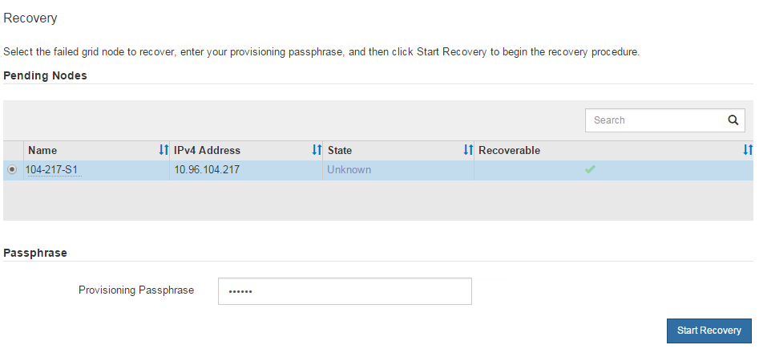
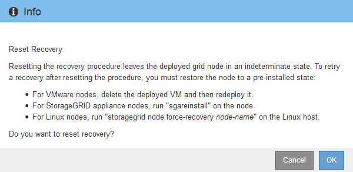

= Select Start Recovery to configure Archive Node
:icons: font
:imagesdir: ../media/

[.lead]
After replacing an Archive Node, you must select Start Recovery in the Grid Manager to configure the new node as a replacement for the failed node.

.What you'll need

* You must be signed in to the Grid Manager using a xref:../admin/web-browser-requirements.adoc[supported web browser].
* You must have the Maintenance or Root Access permission.
* You must have the provisioning passphrase.
* You must have deployed and configured the replacement node.

.Steps

. From the Grid Manager, select *MAINTENANCE* > *Tasks* > *Recovery*.
. Select the grid node you want to recover in the Pending Nodes list.
+
Nodes appear in the list after they fail, but you cannot select a node until it has been reinstalled and is ready for recovery.

. Enter the *Provisioning Passphrase*.
. Click *Start Recovery*.
+

. Monitor the progress of the recovery in the Recovering Grid Node table.
+
NOTE: While the recovery procedure is running, you can click *Reset* to start a new recovery. An Info dialog box appears, indicating that the node will be left in an indeterminate state if you reset the procedure.
+

+
If you want to retry the recovery after resetting the procedure, you must restore the node to a pre-installed state, as follows:

 ** *VMware*: Delete the deployed virtual grid node. Then, when you are ready to restart the recovery, redeploy the node.
 ** *Linux*: Restart the node by running this command on the Linux host: `storagegrid node force-recovery _node-name_`
