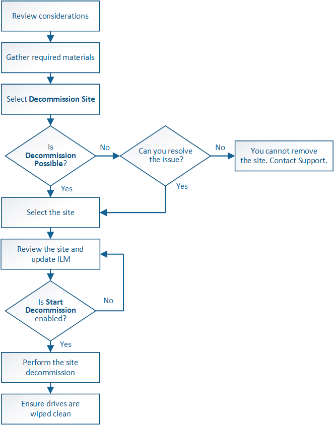

= Site decommissioning
:icons: font
:imagesdir: ../media/

[.lead]
You might need to remove a data center site from the StorageGRID system. To remove a site, you must decommission it.

The flowchart shows the high-level steps for decommissioning a site.

.Steps

* xref:considerations-for-removing-site.adoc[Considerations for removing a site]
* xref:gathering-required-materials-site-decom.adoc[Gathering required materials]
* xref:step-1-select-site.adoc[Step 1: Select Site]
* xref:step-2-view-details.adoc[Step 2: View Details]
* xref:step-3-revise-ilm-policy.adoc[Step 3: Revise ILM Policy]
* xref:step-4-remove-ilm-references.adoc[Step 4: Remove ILM References]
* xref:step-5-resolve-node-conflicts.adoc[Step 5: Resolve Node Conflicts (and start decommission)]
* xref:step-6-monitor-decommission.adoc[Step 6: Monitor Decommission]
