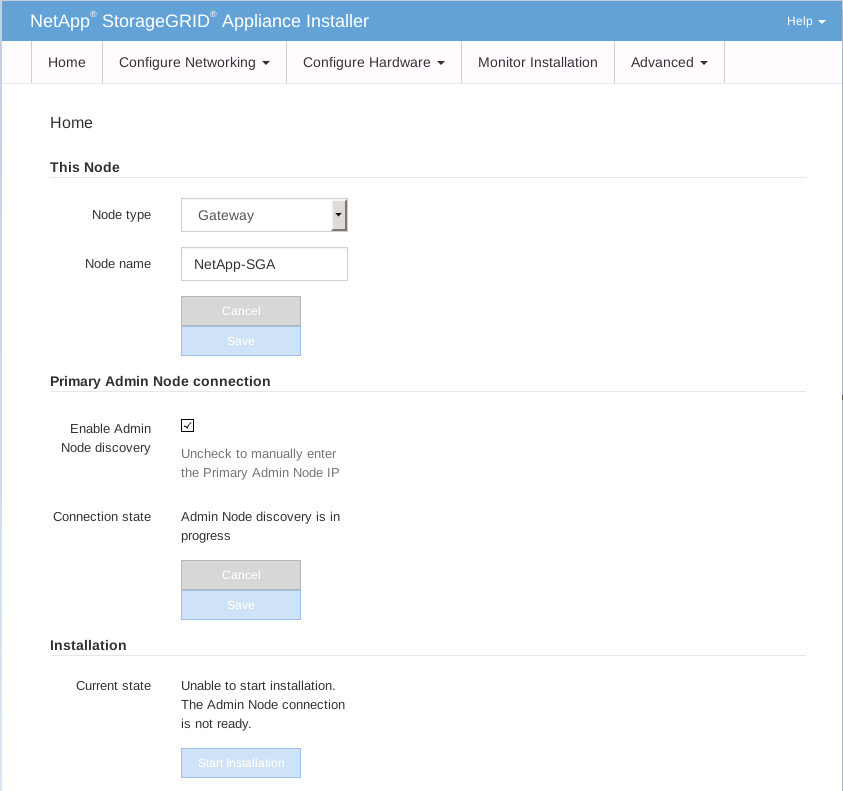
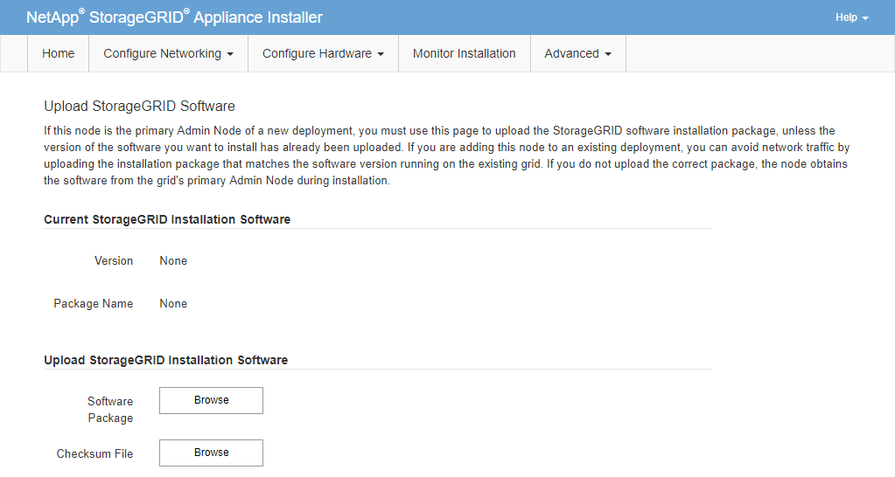

= Start software installation on services appliance
:icons: font
:imagesdir: ../media/

[.lead]
To install a Gateway Node or Admin Node on an SG100 or SG1000 services appliance, you use the StorageGRID Appliance Installer, which is included on the appliance.

.What you'll need

* The appliance must be installed in a rack, connected to your networks, and powered on.
* Network links and IP addresses must be configured for the appliance using the StorageGRID Appliance Installer.
* If you are installing a Gateway Node or non-primary Admin Node, you know the IP address of the primary Admin Node for the StorageGRID grid.
* All Grid Network subnets listed on the IP Configuration page of the StorageGRID Appliance Installer must be defined in the Grid Network Subnet List on the primary Admin Node.

For instructions for completing these prerequisite tasks, see the installation and maintenance instructions for an SG100 or SG1000 services appliance.

* You must be using a xref:../admin/web-browser-requirements.adoc[supported web browser].
* You must know one of the IP addresses assigned to the appliance. You can use the IP address for the Admin Network, the Grid Network, or the Client Network.
* If you are installing a primary Admin Node, you have the Ubuntu or Debian install files for this version of StorageGRID available.
+
NOTE: A recent version of StorageGRID software is preloaded onto the services appliance during manufacturing. If the preloaded version of software matches the version being used in your StorageGRID deployment, you do not need the installation files.

.About this task

To install StorageGRID software on an SG100 or SG1000 services appliance:

* For a primary Admin Node, you specify the name of the node and then upload the appropriate software packages (if required).
* For a non-primary Admin Node or a Gateway Node, you specify or confirm the IP address of the primary Admin Node and the name of the node.
* You start the installation and wait as volumes are configured and the software is installed.
* Partway through the process, the installation pauses. To resume the installation, you must sign into the Grid Manager and configure the pending node as a replacement for the failed node.
* After you have configured the node, the appliance installation process completes, and the appliance is rebooted.

.Steps

. Open a browser and enter one of the IP addresses for the SG100 or SG1000 services appliance.
+
`+https://Controller_IP:8443+`
+
The StorageGRID Appliance Installer Home page appears.
+

. To install a Primary Admin Node:
 .. In the This Node section, for *Node Type*, select *Primary Admin*.
 .. In the *Node Name* field, enter the same name that was used for the node you are recovering, and click *Save*.
 .. In the Installation section, check the software version listed under Current state
+
If the version of software that is ready to install is correct, skip ahead to the <<installation_section_step,Installation step>>.

 .. If you need to upload a different version of software, under the *Advanced* menu, select *Upload StorageGRID Software*.
+
TheUpload StorageGRID Software page appears.
+

 .. Click *Browse* to upload the *Software Package* and *Checksum File* for StorageGRID software.
+
The files are automatically uploaded after you select them.

 .. Click *Home* to return to the StorageGRID Appliance Installer Home page.
. To install a Gateway Node or non-Primary Admin Node:
 .. In the This Node section, for *Node Type*, select *Gateway* or *Non-Primary Admin*, depending on the type of node you are restoring.
 .. In the *Node Name* field, enter the same name that was used for the node you are recovering, and click *Save*.
 .. In the Primary Admin Node connection section, determine whether you need to specify the IP address for the primary Admin Node.
+
The StorageGRID Appliance Installer can discover this IP address automatically, assuming the primary Admin Node, or at least one other grid node with ADMIN_IP configured, is present on the same subnet.

 .. If this IP address is not shown or you need to change it, specify the address:

+
[cols="1a,2a" options="header"]
|===
| Option| Description
|Manual IP entry
|.. Unselect the *Enable Admin Node discovery* check box.
 .. Enter the IP address manually.
 .. Click *Save*.
 .. Wait while the connection state for the new IP address becomes "`ready.`"

|Automatic discovery of all connected primary Admin Nodes
|.. Select the *Enable Admin Node discovery* check box.
 .. From the list of discovered IP addresses, select the primary Admin Node for the grid where this services appliance will be deployed.
 .. Click *Save*.
 .. Wait while the connection state for the new IP address becomes "`ready.`"
|===
. [[installation_section_step]]In the Installation section, confirm that the current state is Ready to start installation of node name and that the *Start Installation* button is enabled.
+
If the *Start Installation* button is not enabled, you might need to change the network configuration or port settings. For instructions, see the installation and maintenance instructions for your appliance.

. From the StorageGRID Appliance Installer home page, click *Start Installation*.
+
The Current state changes to "`Installation is in progress,`" and the Monitor Installation page is displayed.
+
NOTE: If you need to access the Monitor Installation page manually, click *Monitor Installation* from the menu bar.

.Related information

xref:../sg100-1000/index.adoc[SG100 and SG1000 services appliances]
