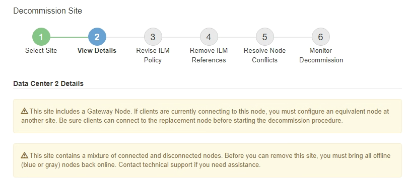
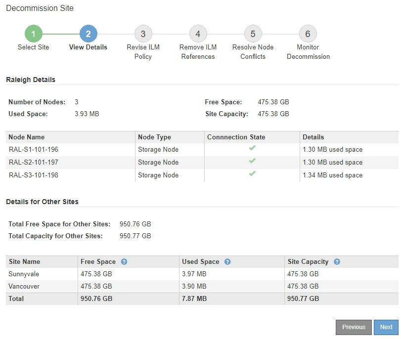
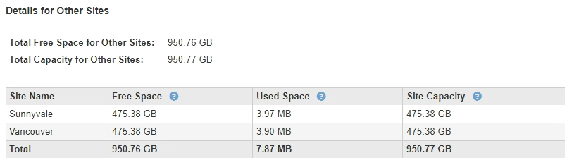

= Step 2: View Details
:icons: font
:imagesdir: ../media/

[.lead]
From Step 2 (View Details) of the Decommission Site wizard, you can review which nodes are included at the site, see how much space has been used on each Storage Node, and assess how much free space is available at the other sites in your grid.

.What you'll need

Before decommissioning a site, you must review how much object data exists at the site.

* If you are performing a connected site decommission, you must understand how much object data currently exists at the site before updating ILM. Based on site capacities and your data protection needs, you can create new ILM rules to move data to other sites or to delete object data from the site.
* Perform any required Storage Node expansions before starting the decommission procedure if possible.
* If you are performing a disconnected site decommission, you must understand how much object data will become permanently inaccessible when you remove the site.

IMPORTANT: If you are performing a disconnected site decommission, ILM cannot move or delete object data. Any data that remains at the site will be lost. However, if your ILM policy was designed to protect against the loss of a single site, copies of your object data still exist on the remaining sites.

.Steps

. From Step 2 (View Details), review any warnings related to the site you selected to remove.
+

+
A warning appears in these cases:

 ** The site includes a Gateway Node. If S3 and Swift clients are currently connecting to this node, you must configure an equivalent node at another site. Be sure clients can connect to the replacement node before continuing with the decommission procedure.
 ** The site contains a mixture of connected (image:../media/icon_alert_green_checkmark.png[Icon Alert Green Checkmark]) and disconnected nodes (image:../media/icon_alarm_gray_administratively_down.png[Icon Alarm Gray Administratively Down] or image:../media/icon_alarm_blue_unknown.png[Icon Alarm Blue Unknown]). Before you can remove this site, you must bring all offline nodes back online.

. Review details about the site you selected to remove.
+

+
The following information is included for the selected site:

 ** Number of nodes
 ** The total used space, free space, and capacity of all Storage Nodes in the site.
  *** For a connected site decommission, the *Used Space* value represents how much object data must be moved to other sites or deleted with ILM.
  *** For a disconnected site decommission, the *Used Space* value indicates how much object data will become inaccessible when you remove the site.
 ** Node names, types, and connection states:
  *** image:../media/icon_alert_green_checkmark.png[Icon Alert Green Checkmark] (Connected)
  *** image:../media/icon_alarm_gray_administratively_down.png[Icon Alarm Gray Administratively Down] (Administratively Down)
  *** image:../media/icon_alarm_blue_unknown.png[Icon Alarm Blue Unknown] (Unknown)
 ** Details about each node:
  *** For each Storage Node, the amount of space that has been used for object data.
  *** For Admin Nodes and Gateway Nodes, whether the node is currently used in a high availability (HA) group. You cannot decommission an Admin Node or a Gateway Node that is used in a HA group. Before you start the decommission, you must edit HA groups to remove all nodes at the site. Or, you can remove the HA group if it only includes nodes from this site.
+
xref:../admin/index.adoc[Administer StorageGRID]

. In the Details for Other Sites section of the page, assess how much space is available at the other sites in your grid.
+

+
If you are performing a connected site decommission and you plan to use ILM to move object data from the selected site (instead of just deleting it), you must ensure that the other sites have enough capacity to accommodate the moved data and that adequate capacity remains for future growth.
+
NOTE: A warning appears if the *Used Space* for the site you want to remove is greater than the *Total Free Space for Other Sites*. To ensure that adequate storage capacity is available after the site is removed, you might need to perform an expansion before performing this procedure.

. Select *Next*.
+
Step 3 (Revise ILM Policy) appears.

.Related information

xref:../ilm/index.adoc[Manage objects with ILM]
