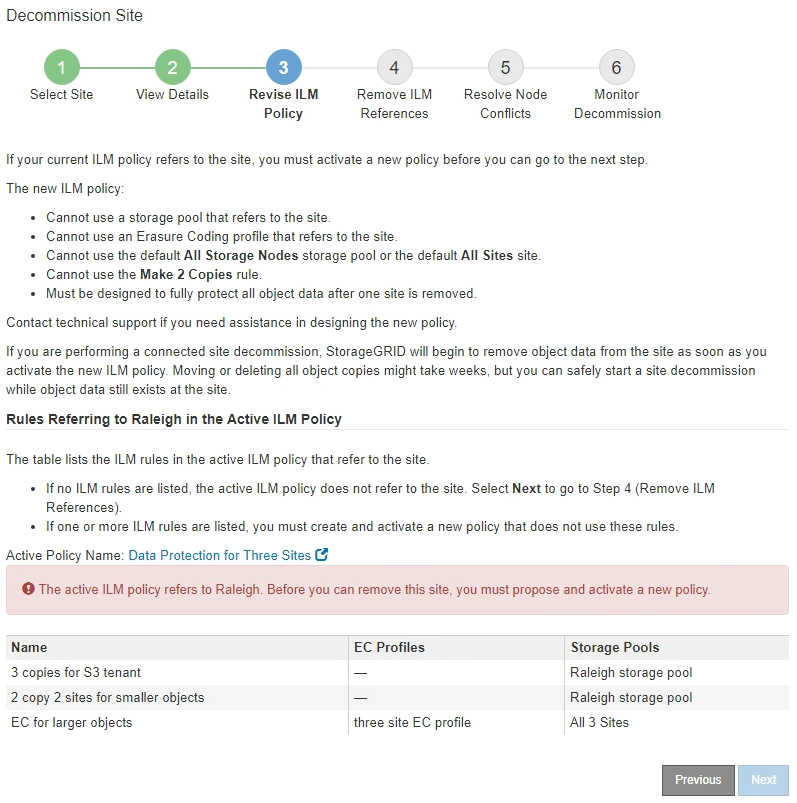
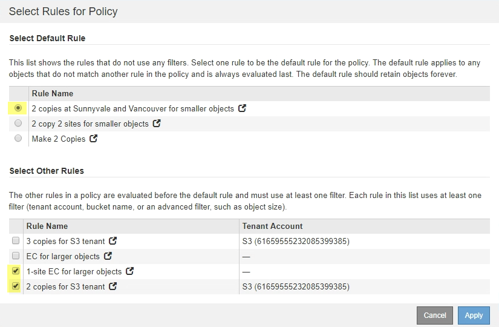
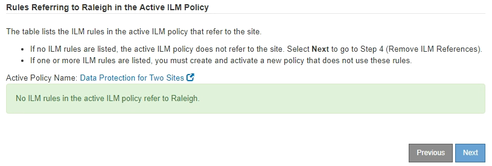

= Step 3: Revise ILM Policy
:icons: font
:imagesdir: ../media/

[.lead]
From Step 3 (Revise ILM Policy) of the Decommission Site wizard, you can determine if the site is referred to by the active ILM policy.

.What you'll need

You have a good understanding of how ILM works and you are familiar with creating storage pools, Erasure Coding profiles, ILM rules, and simulating and activating an ILM policy.

xref:../ilm/index.adoc[Manage objects with ILM]

.About this task

StorageGRID cannot decommission a site if that site is referred to by any ILM rule in the active ILM policy.

If your current ILM policy refers to the site you want to remove, you must activate a new ILM policy that meets certain requirements. Specifically, the new ILM policy:

* Cannot use a storage pool that refers to the site.
* Cannot use an Erasure Coding profile that refers to the site.
* Cannot use the default *All Storage Nodes* storage pool or the default *All Sites* site.
* Cannot use the stock *Make 2 Copies* rule.
* Must be designed to fully protect all object data.
+
IMPORTANT: Never create a single-copy ILM rule to accommodate the removal of a site. An ILM rule that creates only one replicated copy for any time period puts data at risk of permanent loss. If only one replicated copy of an object exists, that object is lost if a Storage Node fails or has a significant error. You also temporarily lose access to the object during maintenance procedures such as upgrades.

If you are performing a _connected site decommission_, you must consider how StorageGRID should manage the object data currently at the site you want to remove. Depending on your data protection requirements, the new rules can move existing object data to different sites or they can delete any extra object copies that are no longer needed.

Contact technical support if you need assistance designing the new policy.

.Steps

. From Step 3 (Revise ILM Policy), determine if any ILM rules in the active ILM policy refer to the site you selected to remove.
+

. If no rules are listed, select *Next* to go to Step 4 (Remove ILM References)
+
xref:step-4-remove-ilm-references.adoc[Step 4: Remove ILM References]

. If one or more ILM rules are listed in the table, select the link next to *Active Policy Name*.
+
The ILM Policies page appears in a new browser tab. Use this tab to update ILM. The Decommission Site page will remain open on the other tab.

 .. If necessary, select *ILM* > *Storage Pools* to create one or more storage pools that do not refer to the site.
+
NOTE: For details, see the instructions for managing objects with information lifecycle management.

 .. If you plan to use erasure coding, select *ILM* > *Erasure Coding* to create one or more Erasure Coding profiles.
+
You must select storage pools that do not refer to the site.
+
NOTE: Do not use the *All Storage Nodes* storage pool in the Erasure Coding profiles.

. Select *ILM* > *Rules* and clone each of the rules listed in the table for Step 3 (Revise ILM Policy).
+
NOTE: For details, see the instructions for managing objects with information lifecycle management.

 .. Use names that will make it easy to select these rules in a new policy.
 .. Update the placement instructions.
+
Remove any storage pools or Erasure Coding profiles that refer to the site and replace them with new storage pools or Erasure Coding profiles.
+
NOTE: Do not use the *All Storage Nodes* storage pool in the new rules.

. Select *ILM* > *Policies* and create a new policy that uses the new rules.
+
NOTE: For details, see the instructions for managing objects with information lifecycle management.

 .. Select the active policy, and select *Clone*.
 .. Specify a policy name and a reason for change.
 .. Select rules for the cloned policy.
  *** Unselect all rules listed for Step 3 (Revise ILM Policy) of the Decommission Site page.
  *** Select a default rule that does not refer to the site.
+
NOTE: Do not select the *Make 2 Copies* rule because that rule uses the *All Storage Nodes* storage pool, which is not allowed.

  *** Select the other replacement rules you created. These rules should not refer to the site.

 .. Select *Apply*.
 .. Drag and drop the rows to reorder the rules in the policy.
+
You cannot move the default rule.
+
IMPORTANT: You must confirm that the ILM rules are in the correct order. When the policy is activated, new and existing objects are evaluated by the rules in the order listed, starting at the top.

 .. Save the proposed policy.

. Ingest test objects, and simulate the proposed policy to ensure that the correct rules are applied.
+
CAUTION: Errors in an ILM policy can cause unrecoverable data loss. Carefully review and simulate the policy before activating it to confirm that it will work as intended.
+
CAUTION: When you activate a new ILM policy, StorageGRID uses it to manage all objects, including existing objects and newly ingested objects. Before activating a new ILM policy, review any changes to the placement of existing replicated and erasure-coded objects. Changing an existing object's location might result in temporary resource issues when the new placements are evaluated and implemented.

. Activate the new policy.
+
If you are performing a connected site decommission, StorageGRID begins to remove object data from the selected site as soon as you activate the new ILM policy. Moving or deleting all object copies might take weeks. Although you can safely start a site decommission while object data still exists at the site, the decommission procedure will complete more quickly and with fewer disruptions and performance impacts if you allow data to be moved from the site before starting the actual decommission procedure (by selecting *Start Decommission* in Step 5 of the wizard).

. Return to *Step 3 (Revise ILM Policy)* to ensure that no ILM rules in the new active policy refer to the site and the *Next* button is enabled.
+

+
NOTE: If any rules are listed, you must create and activate a new ILM policy before you can continue.

. If no rules are listed, select *Next*.
+
Step 4 (Remove ILM References) appears.
