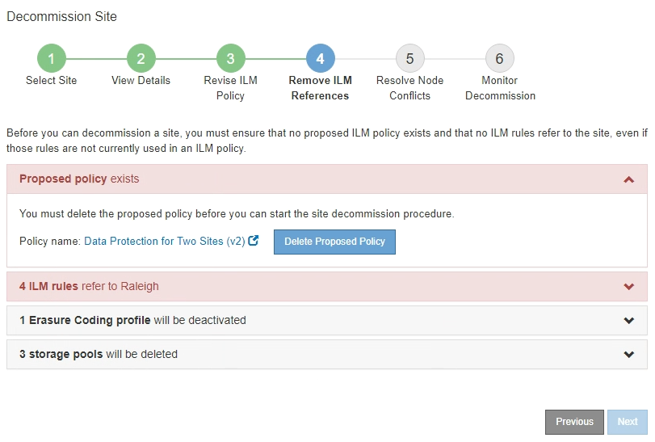
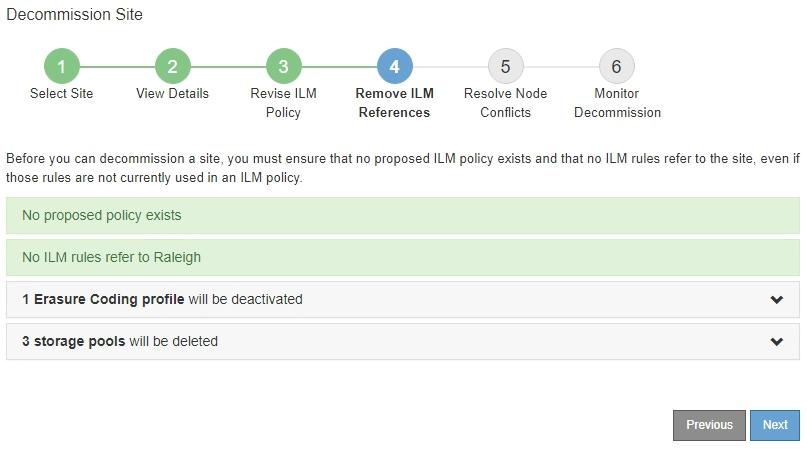

= Step 4: Remove ILM References
:icons: font
:imagesdir: ../media/

[.lead]
From Step 4 (Remove ILM References) of the Decommission Site wizard, you can remove the proposed policy if one exists and delete or edit any unused ILM rules that still refer to the site.

.About this task

You are prevented from starting the site decommission procedure in these cases:

* A proposed ILM policy exists. If you have a proposed policy, you must delete it.
* Any ILM rule refers to the site, even if that rule is not used in any ILM policy. You must delete or edit all rules that refer to the site.

.Steps

. If a proposed policy is listed, remove it.
+

 .. Select *Delete Proposed Policy*.
 .. Select *OK* in the confirmation dialog box.

. Determine whether any unused ILM rules refer to the site.
+
image::../media/decommission_site_step_4_ilm_rules.png[Decommission Site Step 4 ILM Rules]
+
Any ILM rules that are listed still refer to the site but are not used in any policy. In the example:

 ** The stock *Make 2 Copies* rule uses the system-default *All Storage Nodes* storage pool, which uses the All Sites site.
 ** The unused *3 copies for S3 tenant* rule refers to the *Raleigh* storage pool.
 ** The unused *2 copy 2 sites for smaller objects* rule refers to the *Raleigh* storage pool.
 ** The unused *EC larger objects* rules uses the Raleigh site in the *All 3 Sites* Erasure Coding profile.
 ** If no ILM rules are listed, select *Next* to go to *Step 5 (Resolve Node Conflicts)*.
+
xref:step-5-resolve-node-conflicts.adoc[Step 5: Resolve Node Conflicts (and start decommission)]
+
NOTE: When StorageGRID decommissions the site, it will automatically deactivate any unused Erasure Coding profiles that refer to the site, and it will automatically delete any unused storage pools that refer to the site. The system-default All Storage Nodes storage pool is removed because it uses the All Sites site.

 ** If one or more ILM rules are listed, go to the next step.

. Edit or delete each unused rule:
 ** To edit a rule, go the ILM Rules page and update all placements that use an Erasure Coding profile or storage pool that refers to the site. Then, return to *Step 4 (Remove ILM References)*.
+
NOTE: For details, see the instructions for managing objects with information lifecycle management.

 ** To delete a rule, select the trash can icon  and select *OK*.
+
IMPORTANT: You must delete the stock *Make 2 Copies* rule before you can decommission a site.
. Confirm that no proposed ILM policy exists, no unused ILM rules refer to the site, and the *Next* button is enabled.
+

. Select *Next*.
+
NOTE: Any remaining storage pools and Erasure Coding profiles that refer to the site will become invalid when the site is removed. When StorageGRID decommissions the site, it will automatically deactivate any unused Erasure Coding profiles that refer to the site, and it will automatically delete any unused storage pools that refer to the site. The system-default All Storage Nodes storage pool is removed because it uses the All Sites site.
+
Step 5 (Resolve Node Conflicts) appears.
