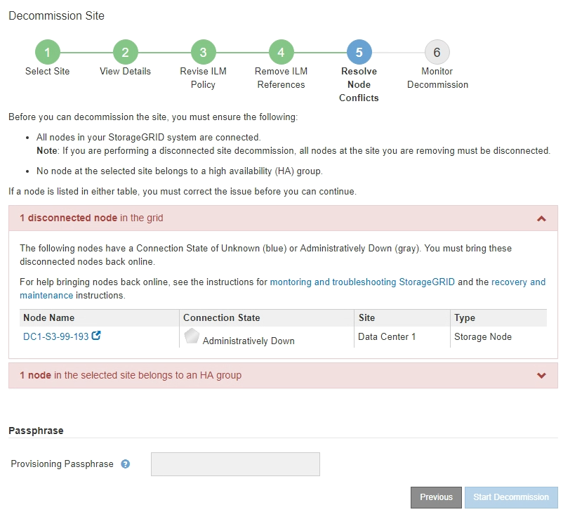
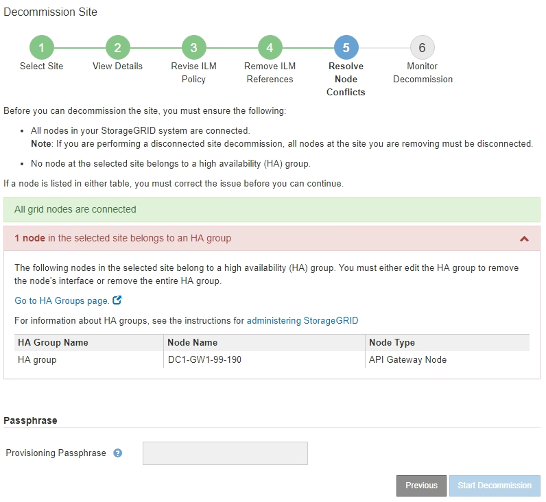
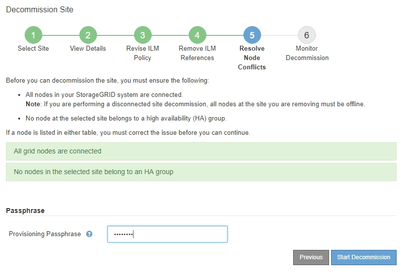
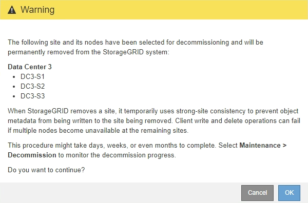

= Step 5: Resolve Node Conflicts (and start decommission)
:icons: font
:imagesdir: ../media/

[.lead]
From Step 5 (Resolve Node Conflicts) of the Decommission Site wizard, you can determine if any nodes in your StorageGRID system are disconnected or if any nodes at the selected site belong to a high availability (HA) group. After any node conflicts are resolved, you start the decommission procedure from this page.

You must ensure that all nodes in your StorageGRID system are in the correct state, as follows:

* All nodes in your StorageGRID system must be connected (image:../media/icon_alert_green_checkmark.png[Icon Alert Green Checkmark]).
+
NOTE: If you are performing a disconnected site decommission, all nodes at the site you are removing must be disconnected, and all nodes at all other sites must be connected.

* No node at the site you are removing can have an interface that belongs to a high availability (HA) group.

If any node is listed for Step 5 (Resolve Node Conflicts), you must correct the issue before you can start the decommission.

Before starting the site decommission procedure from this page, review the following considerations:

* You must allow adequate time for the decommission procedure to complete.
+
IMPORTANT: Moving or deleting object data from a site might take days, weeks, or even months, depending on the amount of data at the site, the load on your system, network latencies, and the nature of the required ILM changes.

* While the site decommission procedure is running:
 ** You cannot create ILM rules that refer to the site being decommissioned. You also cannot edit an existing ILM rule to refer to the site.
 ** You cannot perform other maintenance procedures, such as expansion or upgrade.
+
NOTE: If you need to perform another maintenance procedure during a connected site decommission, you can pause the procedure while the Storage Nodes are being removed. The *Pause* button is enabled during the "`Decommissioning Replicated and Erasure Coded Data`" stage.

 ** If you need to recover any node after starting the site decommission procedure, you must contact support.

.Steps

. Review the disconnected nodes section of Step 5 (Resolve Node Conflicts) to determine if any nodes in your StorageGRID system have a Connection State of Unknown () or Administratively Down ().
+

. If any nodes are disconnected, bring them back online.
+
See the instructions for monitoring and troubleshooting StorageGRID and the grid node procedures. Contact technical support if you need assistance.

. When all disconnected nodes have been brought back online, review the HA groups section of Step 5 (Resolve Node Conflicts).
+
This table lists any nodes at the selected site that belong to a high availability (HA) group.
+

. If any nodes are listed, do either of the following:
+
** Edit each affected HA group to remove the node interface.
** Remove an HA group that only includes nodes from this site.
See the instructions for administering StorageGRID.

+
If all nodes are connected and no nodes in the selected site are used in an HA group, the *Provisioning Passphrase* field is enabled.
. Enter the provisioning passphrase.
+
The *Start Decommission* button becomes enabled.
+

. If you are ready to start the site decommission procedure, select *Start Decommission*.
+
A warning lists the site and nodes that will be removed. You are reminded that it might take days, weeks, or even months to completely remove the site.
+

. Review the warning. If you are ready to begin, select *OK*.
+
A message appears as the new grid configuration is generated. This process might take some time, depending on the type and number of decommissioned grid nodes.
+
image::../media/decommission_site_step_5_grid_configuration.png[Decommission Site Step 5 Grid Configuration]
+
When the new grid configuration has been generated, Step 6 (Monitor Decommission) appears.
+
NOTE: The *Previous* button remains disabled until the decommission is complete.

.Related information

xref:../monitor/index.adoc[Monitor & troubleshoot]

xref:grid-node-procedures.adoc[Grid node procedures]

xref:../admin/index.adoc[Administer StorageGRID]
