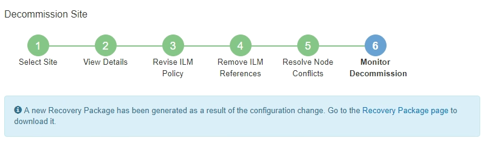
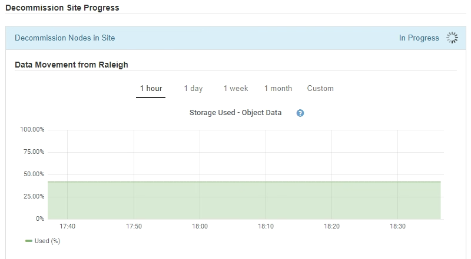
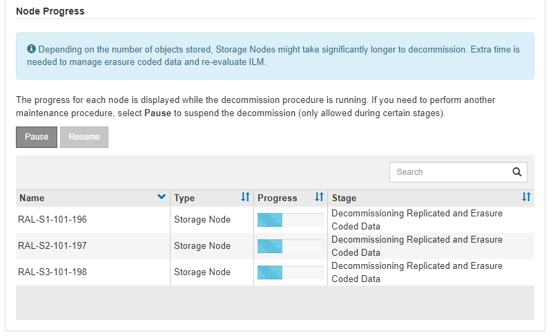
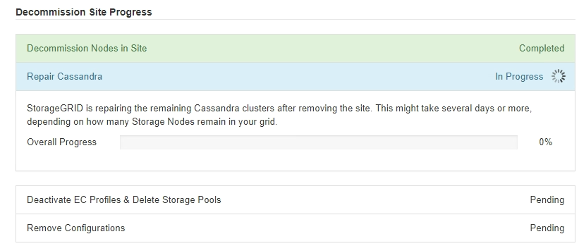
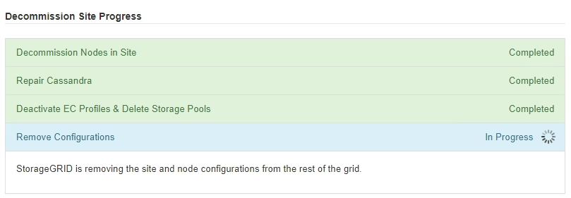
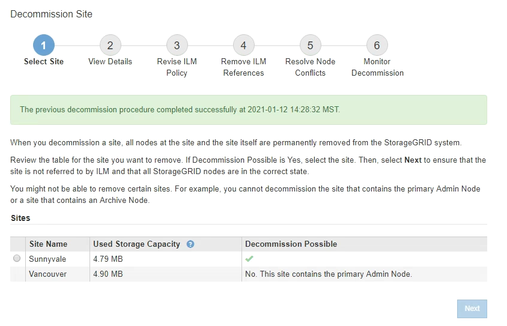

= Step 6: Monitor Decommission
:icons: font
:imagesdir: ../media/

[.lead]
From Step 6 (Monitor Decommission) of the Decommission Site page wizard, you can monitor the progress as the site is removed.

.About this task

When StorageGRID removes a connected site, it removes nodes in this order:

. Gateway Nodes
. Admin Nodes
. Storage Nodes

When StorageGRID removes a disconnected site, it removes nodes in this order:

. Gateway Nodes
. Storage Nodes
. Admin Nodes

Each Gateway Node or Admin Node might only require a few minutes or an hour to remove; however, Storage Nodes might take days or weeks.

.Steps

. As soon as a new Recovery Package has been generated, download the file.
+

+
NOTE: Download the Recovery Package as soon as possible to ensure you can recover your grid if something goes wrong during the decommission procedure.

 .. Select the link in the message, or select *Maintenance* > *System* > *Recovery Package*.
 .. Download the `.zip` file.
+
See the instructions for downloading the Recovery Package.

+
NOTE: The Recovery Package file must be secured because it contains encryption keys and passwords that can be used to obtain data from the StorageGRID system.

. Using the Data Movement chart, monitor the movement of object data from this site to other sites.
+
Data movement started when you activated the new ILM policy in Step 3 (Revise ILM Policy). Data movement will occur throughout the decommission procedure.
+

. In the Node Progress section of the page, monitor the progress of the decommission procedure as nodes are removed.
+
When a Storage Node is removed, each node goes through a series of stages. Although most of these stages occur quickly or even imperceptibly, you might need to wait days or even weeks for other stages to complete, based on how much data needs to moved. Additional time is required to manage erasure-coded data and re-evaluate ILM.
+

+
If you are monitoring the progress of a connected site decommission, refer to this table to understand the decommission stages for a Storage Node:
+
[cols="1a,2a" options="header"]
|===
| Stage| Estimated duration

|Pending
|Minute or less

|Wait for Locks
|Minutes

|Prepare Task
|Minute or less

|Marking LDR Decommissioned
|Minutes

|Decommissioning Replicated and Erasure Coded Data
|Hours, days, or weeks based on the amount of data

*Note*: If you need to perform other maintenance activities, you can pause the site decommission during this stage.

|LDR Set State
|Minutes

|Flush Audit Queues
|Minutes to hours, based on the number of messages and network latency.

|Complete
|Minutes
|===
+
If you are monitoring the progress of a disconnected site decommission, refer to this table to understand the decommission stages for a Storage Node:
+
[cols="1a,1a" options="header"]
|===
| Stage| Estimated duration
|Pending
|Minute or less

|Wait for Locks
|Minutes

|Prepare Task
|Minute or less

|Disable External Services
|Minutes

|Certificate Revocation
|Minutes

|Node Unregister
|Minutes

|Storage Grade Unregister
|Minutes

|Storage Group Removal
|Minutes

|Entity Removal
|Minutes

|Complete
|Minutes
|===
[start=4]
. After all nodes have reached the Complete stage, wait for the remaining site decommission operations to complete.
 ** During the *Repair Cassandra* step, StorageGRID makes any necessary repairs to the Cassandra clusters that remain in your grid. These repairs might take several days or more, depending on how many Storage Nodes remain in your grid.
+

 ** During the *Deactivate EC Profiles & Delete Storage Pools* step, the following ILM changes are made:
  *** Any Erasure Coding profiles that referred to the site are deactivated.
  *** Any Storage Pools that referred to the site are deleted.
+
IMPORTANT: The system-default All Storage Nodes storage pool is also removed because it uses the All Sites site.
 ** Finally, during the *Remove Configuration* step, any remaining references to the site and its nodes are removed from the rest of the grid.
+

. When the decommission procedure has completed, the Decommission Site page shows a success message, and the removed site is no longer shown.
+

.After you finish

Complete these tasks after you complete the site decommission procedure:

* Ensure that the drives of all Storage Nodes in the decommissioned site are wiped clean. Use a commercially available data wiping tool or service to permanently and securely remove data from the drives.
* If the site included one or more Admin Nodes and single sign-on (SSO) is enabled for your StorageGRID system, remove all relying party trusts for the site from Active Directory Federation Services (AD FS).
* After the nodes have been gracefully powered off automatically as part of the connected site decommission procedure, remove the associated virtual machines.

.Related information

xref:downloading-recovery-package.adoc[Downloading the Recovery Package]
