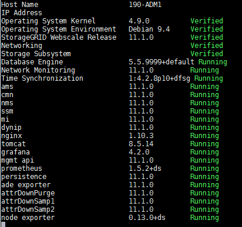

= Viewing current status of all services
:icons: font
:imagesdir: ../media/

[.lead]
You can view the current status of all services running on a grid node at any time.

.What you'll need

You must have the `Passwords.txt` file.

.Steps

. Log in to the grid node:
 .. Enter the following command: `ssh admin@_grid_node_IP_`
 .. Enter the password listed in the `Passwords.txt` file.
 .. Enter the following command to switch to root: `su -`
 .. Enter the password listed in the `Passwords.txt` file.

+
When you are logged in as root, the prompt changes from `$` to `#`.
. View the status of all services running on the grid node: `storagegrid-status`
+
For example, the output for the primary Admin Node shows the current status of the AMS, CMN, and NMS services as Running. This output is updated immediately if the status of a service changes.
+

. Return to the command line, press *Ctrl*+*C*.
. Optionally, view a static report for all services running on the grid node: `/usr/local/servermanager/reader.rb`
+
This report includes the same information as the continuously updated report, but it is not updated if the status of a service changes.

. Log out of the command shell: `exit`
