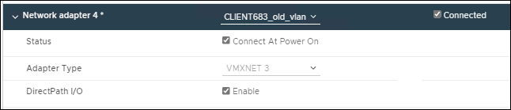

= VMware: Add trunk or access interfaces to a node
:experimental:
:icons: font
:imagesdir: ../media/

[.lead]
You can add a trunk or access interface to a VM node after the node has been installed. The interfaces you add are displayed on the VLAN interfaces page and the HA groups page.

.What you'll need

* You have access to the instructions for installing StorageGRID on your VMware platform.

xref:../vmware/index.adoc[Install VMware]

* You have configured StorageGRID 11.6.
* You have Admin Node and Gateway Node VMware virtual machines.
* You have a network subnet that is not being used as Grid, Admin, or Client network.
* You have the `Passwords.txt` file.
* You have specific access permissions.

IMPORTANT: Do not attempt to add interfaces to a node while a software upgrade, recovery procedure, or expansion procedure is active.

.About this task

Use these steps to add one or more extra interfaces to a VMware node after the node has been installed. For example, you might want to add a trunk interface to an Admin or Gateway Node, so you can use VLAN interfaces to segregate the traffic belonging to different applications or tenants. Or you might want to add an access interface to use in a high availability (HA) group.

If you add a trunk interface, you must configure a VLAN interface in StorageGRID. If you add an access interface, you can add the interface directly to an HA group; you do not need to configure a VLAN interface. 

The node might be unavailable for a brief time when you add interfaces.

.Steps
. In vCenter, add a new network adapter (type VMXNET3) to an Admin Node and Gateway Node VM.  Select *Connected* and *Connect At Power On* check boxes. 

+

. Use SSH to log in to the Admin Node or Gateway Node. 
. Use `ip link show` to confirm the new network interface ens256 is detected.
----
ip link show
1: lo: <LOOPBACK,UP,LOWER_UP> mtu 65536 qdisc noqueue state UNKNOWN mode DEFAULT group default qlen 1000
    link/loopback 00:00:00:00:00:00 brd 00:00:00:00:00:00
2: eth0: <BROADCAST,MULTICAST,UP,LOWER_UP> mtu 1400 qdisc mq state UP mode DEFAULT group default qlen 1000
    link/ether 00:50:56:a0:4e:5b brd ff:ff:ff:ff:ff:ff
3: eth1: <BROADCAST,MULTICAST> mtu 1500 qdisc noop state DOWN mode DEFAULT group default qlen 1000
    link/ether 00:50:56:a0:fa:ce brd ff:ff:ff:ff:ff:ff
4: eth2: <BROADCAST,MULTICAST,UP,LOWER_UP> mtu 1400 qdisc mq state UP mode DEFAULT group default qlen 1000
    link/ether 00:50:56:a0:d6:87 brd ff:ff:ff:ff:ff:ff
5: ens256: <BROADCAST,MULTICAST,UP,LOWER_UP> mtu 1500 qdisc mq master ens256vrf state UP mode DEFAULT group default qlen 1000
    link/ether 00:50:56:a0:ea:88 brd ff:ff:ff:ff:ff:ff
----

.After you finish

* If you added one or more trunk interfaces, go to xref:../admin/configure-vlan-interfaces.html[configure VLAN interfaces] to configure one or more VLAN interfaces for each new parent interface.

* If you added one or more access interfaces, go to xref:../admin/configure-high-availability-group.html[configure high availability groups] to add the new interfaces directly to HA groups. 