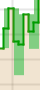
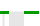
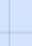
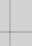
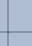

= Chart legend
:icons: font
:imagesdir: ../media/

[.lead]
The lines and colors used to draw charts have specific meaning.

[options="header"]
|===
| Sample| Meaning
a|

a|
Reported attribute values are plotted using dark green lines.
a|

a|
Light green shading around dark green lines indicates that the actual values in that time range vary and have been "`binned`" for faster plotting. The dark line represents the weighted average. The range in light green indicates the maximum and minimum values within the bin. Light brown shading is used for area graphs to indicate volumetric data.
a|

a|
Blank areas (no data plotted) indicate that the attribute values were unavailable. The background can be blue, gray, or a mixture of gray and blue, depending on the state of the service reporting the attribute.
a|

a|
Light blue shading indicates that some or all of the attribute values at that time were indeterminate; the attribute was not reporting values because the service was in an unknown state.
a|

a|
Gray shading indicates that some or all of the attribute values at that time were not known because the service reporting the attributes was administratively down.
a|

a|
A mixture of gray and blue shading indicates that some of the attribute values at the time were indeterminate (because the service was in an unknown state), while others were not known because the service reporting the attributes was administratively down.
|===
