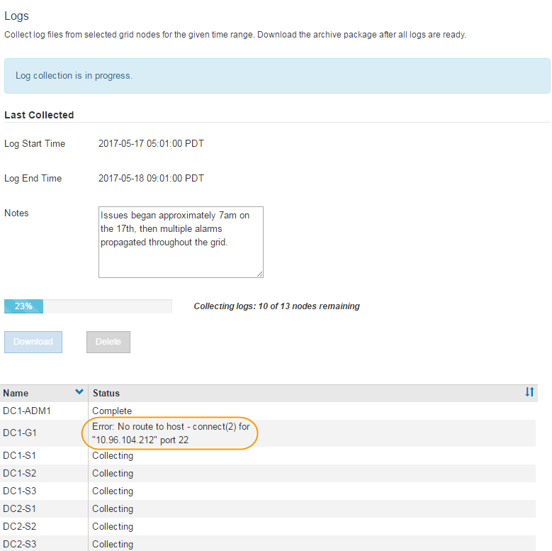

= Collecting log files and system data
:icons: font
:imagesdir: ../media/

[.lead]
You can use the Grid Manager to retrieve log files and system data (including configuration data) for your StorageGRID system.

.What you'll need
* You must be signed in to the Grid Manager using a xref:../admin/web-browser-requirements.adoc[supported web browser].
* You must have specific access permissions.
* You must have the provisioning passphrase.

.About this taak
You can use the Grid Manager to gather log files, system data, and configuration data from any grid node for the time period that you select. Data is collected and archived in a .tar.gz file that you can then download to your local computer.

Because application log files can be very large, the destination directory where you download the archived log files must have at least 1 GB of free space.

.Steps
. Select *Support* > *Tools* > *Logs*.
+
image::../media/support_logs_select_nodes.gif[screenshot of log collection UI]

. Select the grid nodes for which you want to collect log files.
+
As required, you can collect log files for the entire grid or an entire data center site.

. Select a *Start Time* and *End Time* to set the time range of the data to be included in the log files.
+
If you select a very long time period or collect logs from all nodes in a large grid, the log archive could become too large to be stored on a node, or too large to be collected to the primary Admin Node for download. If this occurs, you must restart log collection with a smaller set of data.

. Optionally type notes about the log files you are gathering in the *Notes* text box.
+
You can use these notes to give technical support information about the problem that prompted you to collect the log files. Your notes are added to a file called `info.txt`, along with other information about the log file collection. The `info.txt` file is saved in the log file archive package.

. Enter the provisioning passphrase for your StorageGRID system in the *Provisioning Passphrase* text box.
. Click *Collect Logs*.
+
When you submit a new request, the previous collection of log files is deleted.
+

+
You can use the Logs page to monitor the progress of log file collection for each grid node.
+
If you receive an error message about log size, try collecting logs for a shorter time period or for fewer nodes.

. Click *Download* when log file collection is complete.
+
The _.tar.gz_ file contains all log files from all grid nodes where log collection was successful. Inside the combined _.tar.gz_ file, there is one log file archive for each grid node.

.After you finish
You can re-download the log file archive package later if you need to.

Optionally, you can click *Delete* to remove the log file archive package and free up disk space. The current log file archive package is automatically removed the next time you collect log files.

.Related information

xref:logs-files-reference.adoc[Log files reference]
