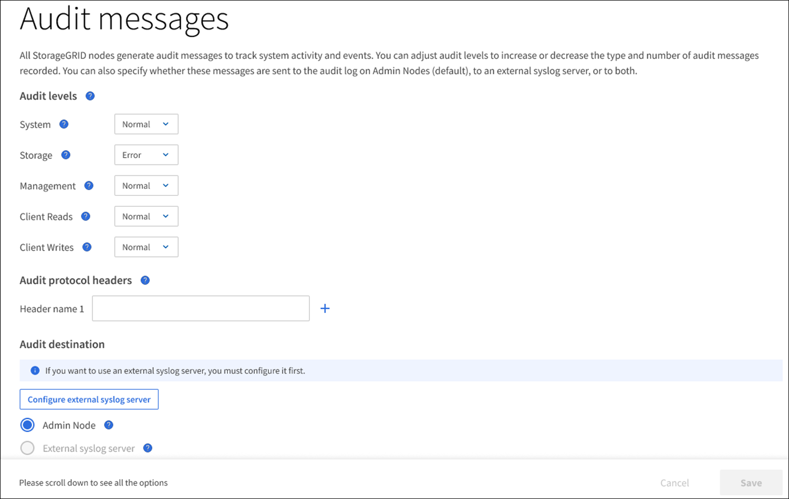

= Configure audit messages and log destinations
:icons: font
:imagesdir: ../media/

[.lead]
Audit messages and logs record system activities and security events, and are essential tools for monitoring and troubleshooting. You can adjust audit levels to increase or decrease the type and number of audit messages recorded. Optionally, you can define any HTTP request headers you want to include in client read and write audit messages. You can also configure an external syslog server and change the destination of audit information.

For more information on audit messages, see xref:../audit/index.adoc[Review audit logs].

.What you'll need

* You are signed in to the Grid Manager using a xref:../admin/web-browser-requirements.adoc[supported web browser].
* You have Maintenance or Root access permissions.

.About this task

All StorageGRID nodes generate audit messages and logs to track system activity and events. By default, audit information is sent to the audit log on Admin Nodes. You can adjust audit levels to increase or decrease the type and number of audit messages recorded in the audit log. Optionally, you can configure audit information to be sent to a remote syslog server or to be stored temporarily on the originating nodes for manual collection. 

== Change audit message levels in the audit log

You can set a different audit level for each of the following categories of messages in the audit log:

[cols="1a,3a" options="header"]
|===
| Audit category| Description
a|
System
a|
By default, this level is set to Normal. See xref:../audit/system-audit-messages.adoc[System audit messages].
a|
Storage
a|
By default, this level is set to Error. See xref:../audit/object-storage-audit-messages.adoc[Object storage audit messages].
a|
Management
a|
By default, this level is set to Normal. See xref:../audit/management-audit-message.adoc[Management audit message].
a|
Client Reads
a|
By default, this level is set to Normal. See xref:../audit/client-read-audit-messages.adoc[Client read audit messages].
a|
Client Writes
a|
By default, this level is set to Normal. See xref:../audit/client-write-audit-messages.adoc[Client write audit messages].
|===

NOTE: These defaults apply if you initially installed StorageGRID using version 10.3 or later. If you have upgraded from an earlier version of StorageGRID, the default for all categories is set to Normal.

NOTE: During upgrades, audit level configurations will not be effective immediately.

.Steps

. Select *CONFIGURATION* > *Monitoring* > *Audit and syslog server*.
+

. For each category of audit message, select an audit level from the drop-down list:
+
[cols="1a,3a" options="header"]
|===
| Audit level| Description
a|
Off
a|
No audit messages from the category are logged.
a|
Error
a|
Only error messages are logged--audit messages for which the result code was not "successful" (SUCS).
a|
Normal
a|
Standard transactional messages are logged--the messages listed in these instructions for the category.
a|
Debug
a|
Deprecated. This level behaves the same as the Normal audit level.
|===
The messages included for any particular level include those that would be logged at the higher levels. For example, the Normal level includes all of the Error messages.

. Optionally, under *Audit protocol headers*, define any HTTP request headers you want to include in client read and write audit messages. Use an asterisk (\*) as a wildcard to match zero or more characters. Use the escape sequence (\*) to match a literal asterisk. 

+
NOTE: Audit protocol headers apply to S3 and Swift requests only.

. Select *Add another header* to create additional headers, if needed.

+
When HTTP headers are found in a request, they are included in the audit message under the field HTRH.
+
NOTE: Audit protocol request headers are logged only if the audit level for *Client Reads* or *Client Writes* is not *Off*.

. Select *Save*
+
A green banner displays indicating your configuration has been saved successfully.

== Use an external syslog server

You can configure an external syslog server if you want to save audit information remotely. 

* If you want to save audit information to an external syslog server, go to xref:../monitor/configuring-syslog-server.adoc[Configure an external syslog server]. 

* If you are not using an external syslog server, go to <<Select-audit-information-destinations,Select audit information destinations>>.

[[Select-audit-information-destinations]]
== Select audit information destinations
You can specify where audit logs, security event logs, and application logs are sent. 

NOTE: Some destination are available only if you are using an external syslog server. See xref:../monitor/configuring-syslog-server.adoc[Configure an external syslog server] to configure an external syslog server. 

NOTE: For more information on StorageGRID software logs, see xref:../monitor/storagegrid-software-logs.adoc#[StorageGRID software logs].

. On the Audit and syslog server page, select the destination for audit information from the listed options: 

+
[cols="1a,2a" options="header"]

|===
| Option| Description

|Default (Admin nodes/local nodes)
|Audit messages are sent to the audit log (`audit.log`) on the Admin Node, and security event logs and application logs are stored on the nodes where they were generated (also referred to as "the local node").

|External syslog server
|Audit information is sent to an external syslog server and saved on the local node. The type of information sent depends upon how you configured the external syslog server. This option is enabled only after you have configured an external syslog server. 

|Admin Node and external syslog server
|Audit messages are sent to the audit log (`audit.log`) on the Admin Node, and audit information is sent to the external syslog server and saved on the local node. The type of information sent depends upon how you configured the external syslog server. This option is enabled only after you have configured an external syslog server.

|Local nodes only
|No audit information is sent to an Admin Node or remote syslog server. Audit information is saved only on the nodes that generated it. 

*Note*: StorageGRID periodically removes these local logs in a rotation to free up space. When the log file for a node reaches 1 GB, the existing file is saved, and a new log file is started. The rotation limit for the log is 21 files. When the 22nd version of the log file is created, the oldest log file is deleted. On average about 20 GB of log data is stored on each node.
|===

NOTE: Audit information generated on every local node is stored in `/var/local/log/localaudit.log`

[start=2]
. Select *Save*.

A warning message appears: 

CAUTION: Change the log destination?

[start=3]
. Confirm that you want to change the destination for audit information by selecting *OK*.

+
A green banner appears notifying you that your audit configuration has been saved successfully. 

+
New logs are sent to the destinations you selected. Existing logs remain in their current location.

.Related information

xref:../monitor/considerations-for-external-syslog-server.adoc[Considerations for external syslog server]

xref:../admin/index.adoc[Administer StorageGRID]

xref:../monitor/troubleshooting-syslog-server.adoc[Troubleshoot the external syslog server]