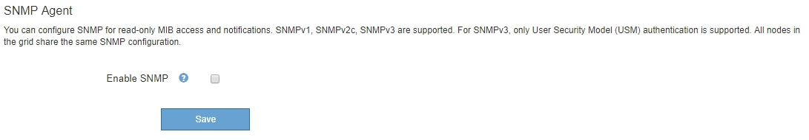
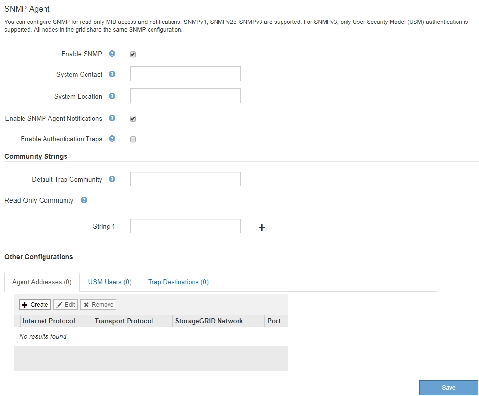
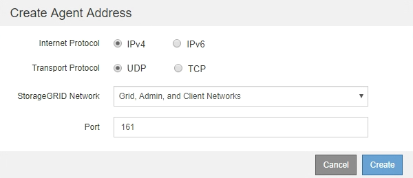
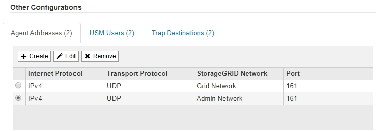
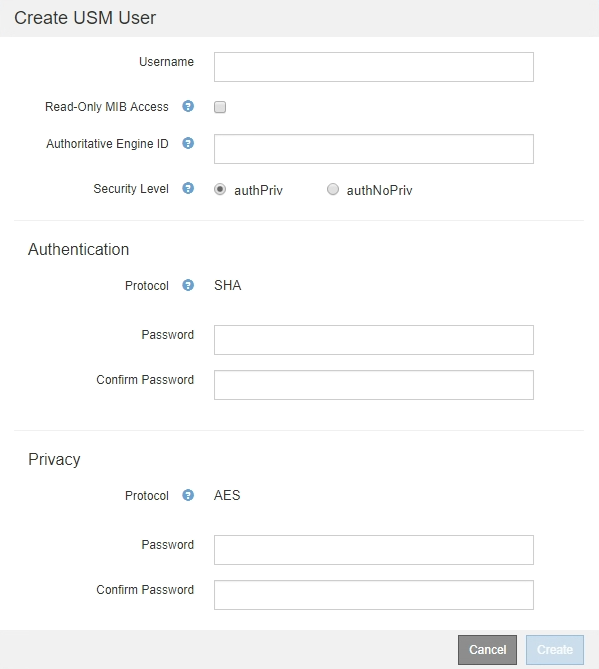
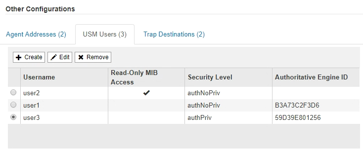
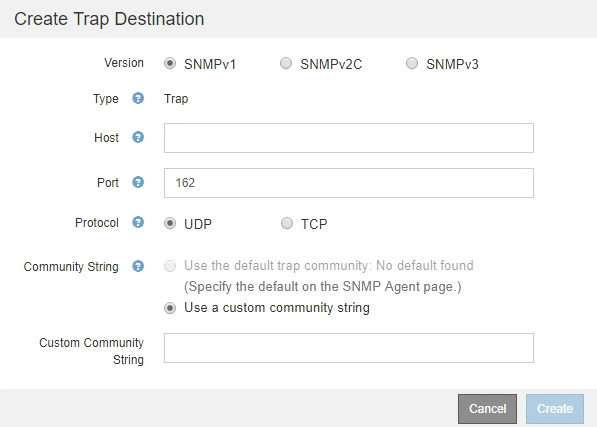
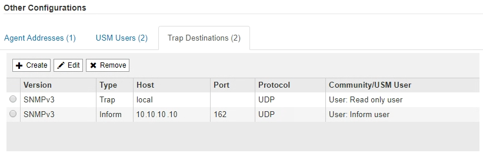

= Configure the SNMP agent
:icons: font
:imagesdir: ../media/

[.lead]
You can configure the StorageGRID SNMP agent if you want to use a third-party SNMP management system for read-only MIB access and notifications.

.What you'll need
* You are signed in to the Grid Manager using a xref:../admin/web-browser-requirements.adoc[supported web browser].
* You have the Root Access permission.

.About this task
The StorageGRID SNMP agent supports all three versions of the SNMP protocol. You can configure the agent for one or more versions.

.Steps
. Select *CONFIGURATION* > *Monitoring* > *SNMP agent*.
+
The SNMP Agent page appears.
+

. To enable the SNMP agent on all grid nodes, select the *Enable SNMP* check box.
+
The fields for configuring an SNMP agent appear.
+

. In the *System Contact* field, enter the value you want StorageGRID to provide in SNMP messages for sysContact.
+
The System Contact typically is an email address. The value you provide applies to all nodes in the StorageGRID system. *System Contact* can be a maximum of 255 characters.

. In the *System Location* field, enter the value you want StorageGRID to provide in SNMP messages for sysLocation.
+
The System Location can be any information that is useful for identifying where your StorageGRID system is located. For example, you might use the street address of a facility. The value you provide applies to all nodes in the StorageGRID system. *System Location* can be a maximum of 255 characters.

. Keep the *Enable SNMP Agent Notifications* check box selected if you want the StorageGRID SNMP agent to send trap and inform notifications.
+
If this check box is unselected, the SNMP agent supports read-only MIB access, but it does not send any SNMP notifications.

. Select the *Enable Authentication Traps* check box if you want the StorageGRID SNMP agent to send an authentication trap if it receives an improperly authenticated protocol message.
. If you use SNMPv1 or SNMPv2c, complete the Community Strings section.
+
The fields in this section are used for community-based authentication in SNMPv1 or SNMPv2c. These fields do not apply to SNMPv3.

 .. In the *Default Trap Community* field, optionally enter the default community string you want to use for trap destinations.
+
As required, you can provide a different ("`custom`") community string when you <<select_trap_destination,define a specific trap destination>>.
+
*Default Trap Community* can be a maximum of 32 characters and cannot contain whitespace characters.

 .. For *Read-Only Community*, enter one or more community strings to allow read-only MIB access on IPv4 and IPv6 agent addresses. Click the plus sign image:../media/icon_plus_sign_black_on_white_old.png[Plus Sign] to add multiple strings.
+
When the management system queries the StorageGRID MIB, it sends a community string. If the community string matches one of the values specified here, the SNMP agent sends a response to the management system.
+
Each community string can be a maximum of 32 characters and cannot contain whitespace characters. Up to five strings are allowed.
+
NOTE: To ensure the security of your StorageGRID system, do not use "`public`" as the community string. If you do not enter a community string, the SNMP agent uses the grid ID of your StorageGRID system as the community string.

. Optionally, select the Agent Addresses tab in the Other Configurations section.
+
Use this tab to specify one or more "`listening addresses.`" These are the StorageGRID addresses on which the SNMP agent can receive queries. Each agent address includes an internet protocol, a transport protocol, a StorageGRID network, and optionally a port.
+
If you do not configure an agent address, the default listening address is UDP port 161 on all StorageGRID networks.

 .. Click *Create*.
+
The Create Agent Address dialog box appears.
+

 .. For *Internet Protocol*, select whether this address will use IPv4 or IPv6.
+
By default, SNMP uses IPv4.

 .. For *Transport Protocol*, select whether this address will use UDP or TCP.
+
By default, SNMP uses UDP.

 .. In the *StorageGRID Network* field, select which StorageGRID network the query will be received on.
  *** Grid, Admin, and Client Networks: StorageGRID should listen for SNMP queries on all three networks.
  *** Grid Network
  *** Admin Network
  *** Client Network
+
NOTE: To ensure that client communications with StorageGRID remain secure, you should not create an agent address for the Client Network.
 .. In the *Port* field, optionally enter the port number that the SNMP agent should listen on.
+
The default UDP port for an SNMP agent is 161, but you can enter any unused port number.
+
NOTE: When you save the SNMP agent, StorageGRID automatically opens the agent address ports on the internal firewall. You must ensure that any external firewalls allow access to these ports.

 .. Click *Create*.
+
The agent address is created and added to the table.
+

. If you are using SNMPv3, select the USM Users tab in the Other Configurations section.
+
Use this tab to define the USM users who are authorized to query the MIB or to receive traps and informs.
+
NOTE: This step does not apply if you are only using SNMPv1 or SNMPv2c.

 .. Click *Create*.
+
The Create USM User dialog box appears.
+

 .. Enter a unique *Username* for this USM user.
+
Usernames have a maximum of 32 characters and cannot contain whitespace characters. The username cannot be changed after the user is created.

 .. Select the *Read-Only MIB Access* check box if this user should have read-only access to the MIB.
+
If you select *Read-Only MIB Access*, the *Authoritative Engine ID* field is disabled.
+
NOTE: USM users who have read-only MIB access cannot have engine IDs.

 .. If this user will be used in an inform destination, enter the *Authoritative Engine ID* for this user.
+
NOTE: SNMPv3 inform destinations must have users with engine IDs. SNMPv3 trap destination cannot have users with engine IDs.
+
The authoritative engine ID can be from 5 to 32 bytes in hexadecimal.

 .. Select a security level for the USM user.
  *** *authPriv*: This user communicates with authentication and privacy (encryption). You must specify an authentication protocol and password and a privacy protocol and password.
  *** *authNoPriv*: This user communicates with authentication and without privacy (no encryption). You must specify an authentication protocol and password.
 .. Enter and confirm the password this user will use for authentication.
+
NOTE: The only authentication protocol supported is SHA (HMAC-SHA-96).

 .. If you selected *authPriv*, enter and confirm the password this user will use for privacy.
+
NOTE: The only privacy protocol supported is AES.

 .. Click *Create*.
+
The USM user is created and added to the table.
+

. [[select_trap_destination, start=10]]In the Other Configurations section, select the Trap Destinations tab.
+
The Trap Destinations tab allows you to define one or more destinations for StorageGRID trap or inform notifications. When you enable the SNMP agent and click *Save*, StorageGRID starts sending notifications to each defined destination. Notifications are sent when alerts and alarms are triggered. Standard notifications are also sent for the supported MIB-II entities (for example, ifDown and coldStart).

 .. Click *Create*.
+
The Create Trap Destination dialog box appears.
+

 .. In the *Version* field, select which SNMP version will be used for this notification.
 .. Complete the form, based on which version you selected
+
[cols="1a,1a" options="header"]
|===
| Version| Specify this information
a|
SNMPv1
a|
*Note:* For SNMPv1, the SNMP agent can only send traps. Informs are not supported.

  ... In the *Host* field, enter an IPv4 or IPv6 address (or FQDN) to receive the trap.
  ... For *Port*, use the default (162), unless you must use another value. (162 is the standard port for SNMP traps.)
  ... For *Protocol*, use the default (UDP). TCP is also supported. (UDP is the standard SNMP trap protocol.)
  ... Use the default trap community, if one was specified on the SNMP Agent page, or enter a custom community string for this trap destination.
+
The custom community string can be a maximum of 32 characters and cannot contain whitespace.

a|
SNMPv2c
a|

  ... Select whether the destination will be used for traps or informs.
  ... In the *Host* field, enter an IPv4 or IPv6 address (or FQDN) to receive the trap.
  ... For *Port*, use the default (162), unless you must use another value. (162 is the standard port for SNMP traps.)
  ... For *Protocol*, use the default (UDP). TCP is also supported. (UDP is the standard SNMP trap protocol.)
  ... Use the default trap community, if one was specified on the SNMP Agent page, or enter a custom community string for this trap destination.
+
The custom community string can be a maximum of 32 characters and cannot contain whitespace.

a|
SNMPv3
a|

  ... Select whether the destination will be used for traps or informs.
  ... In the *Host* field, enter an IPv4 or IPv6 address (or FQDN) to receive the trap.
  ... For *Port*, use the default (162), unless you must use another value. (162 is the standard port for SNMP traps.)
  ... For *Protocol*, use the default (UDP). TCP is also supported. (UDP is the standard SNMP trap protocol.)
  ... Select the USM user that will be used for authentication.
   **** If you selected *Trap*, only USM users without authoritative engine IDs are shown.
   **** If you selected *Inform*, only USM users with authoritative engine IDs are shown.

+
|===

 .. Click *Create*.
+
The trap destination is created and added to the table.
+

. When you have completed the SNMP agent configuration, click *Save*
+
The new SNMP agent configuration becomes active.

.Related information

xref:silencing-alert-notifications.adoc[Silence alert notifications]
