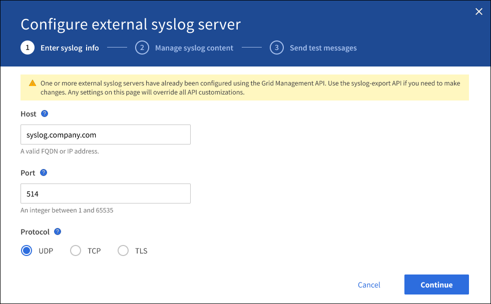
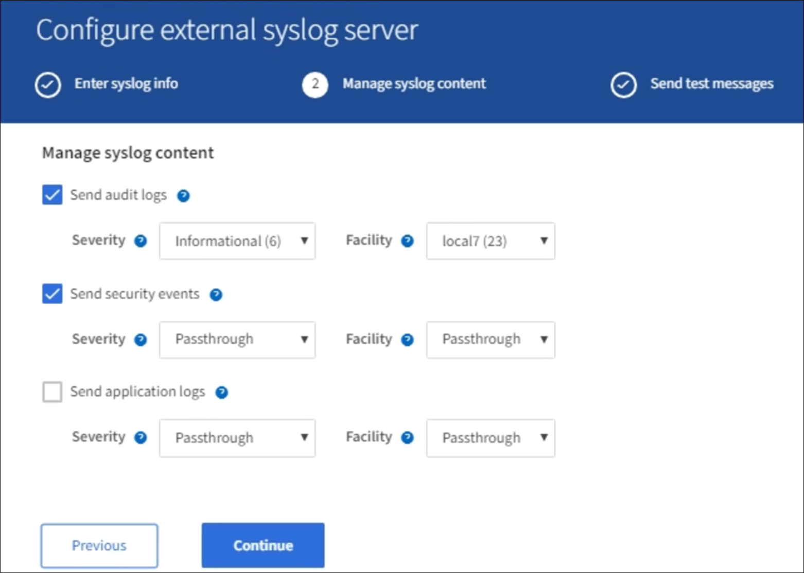
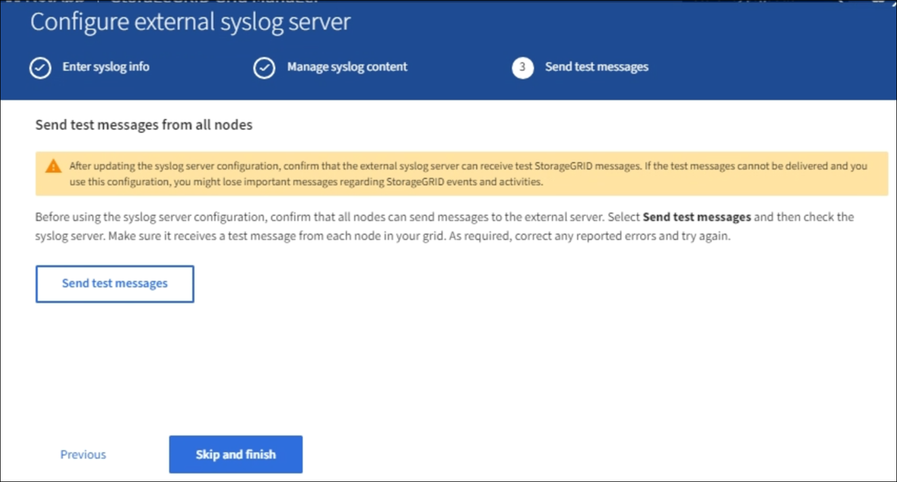

= Configure an external syslog server
:icons: font
:imagesdir: ../media/

[.lead]
If you want to save audit logs, application logs, and security event logs to a location outside of your grid, use this procedure to configure an external syslog server. 

.What you'll need

* You are signed in to the Grid Manager using a xref:../admin/web-browser-requirements.adoc[supported web browser].
* You have Maintenance or Root access permissions.
* You have a syslog server with the capacity to receive and store the log files. For more information, see xref:../monitor/considerations-for-external-syslog-server.adoc[Considerations for external syslog server].
* You have the correct server and client certifications if you plan to use TLS or RELP/TLS.

.About this task

If you want to send audit information to an external syslog server, you must configure the external server first. 

Sending audit information to an external syslog server enables you to:

* Collect and manage audit information such as audit messages, application logs, and security events more efficiently
* Reduce network traffic on your Admin Nodes because audit information is transferred directly from the various Storage Nodes to the external syslog server, without having to go through an Admin Node

+
CAUTION: When logs are sent to an external syslog server, single logs greater than 8192 bytes are truncated at the end of the message to conform with common limitations in external syslog server implementations. 

+
NOTE: To maximize the options for full data recovery in the event of a failure of the external syslog server, up to 20GB of local logs of audit records (localaudit.log) are maintained on each node.
+
NOTE: If the configuration options available in this procedure are not flexible enough to meet your requirements, additional configuration options can be applied using the private API `audit-destinations` endpoints. For example, it is possible to use different syslog servers for different groups of nodes.

[[Access-the-syslog-server-configuration-wizard]]
== Access the syslog server configuration wizard

.Steps
. Select *CONFIGURATION* > *Monitoring* > *Audit and syslog server*.
+
image::../media/audit-messages-main-page.png[Audit messages main page]
. From the Audit and syslog server page, select *Configure external syslog server*. If you have previously configured an external syslog server, select *Edit external syslog server*. 

=== Enter syslog info

. Enter a valid fully qualified domain name or an IPv4 or IPv6 address for the external syslog server in the *Host* field.
. Enter the destination port on the external syslog server (must be an integer between 1 and 65535). The default port is 514. 
. Select the protocol used to send audit information to the external syslog server.  

+
TLS or RELP/TLS is recommended. You must upload a server certificate to use either of these options. 

+
Using certificates helps secure the connections between your grid and the external syslog server. For more information, see xref:../admin/using-storagegrid-security-certificates.adoc[Use StorageGRID security certificates].

+
All protocol options require support by, and configuration of, the external syslog server. You must choose an option that is compatible with the external syslog server.

+
NOTE: Reliable Event Logging Protocol (RELP) extends the functionality of the syslog protocol to provide reliable delivery of event messages. Using RELP can help prevent the loss of audit information if your external syslog server has to restart. 

[start=4]
. Select *Continue*.
. [[attach-certificate]]If you selected *TLS* or *RELP/TLS*, upload the following certificates:

* *Server CA certificates*: One or more trusted CA certificates for verifying the  external syslog server (in PEM encoding). If omitted, the default Grid CA certificate will be used. The file you upload here might be a CA bundle. 
* *Client certificate*: The client certificate for authentication to the external syslog server (in PEM encoding).
* *Client private key*: Private key for the client certificate (in PEM encoding).
+
NOTE: If you use a client certificate you must also use a client private key. If you provide an encrypted private key, you must also provide the passphrase.  There is no significant security benefit from using an encrypted private key because the key and passphrase must be stored; using an unencrypted private key, if available, is recommended for simplicity.

.. Select *Browse* for the certificate or key you want to use. 
.. Select the certificate file or key file.
.. Select *Open* to upload the file.

+ 
A green check appears next to the certificate or key file name, notifying you that it has been uploaded successfully.

[start=6]
. Select *Continue*.

=== Manage syslog content

. Select each type of audit information you want to send to the external syslog server.

+
* *Send audit logs*: StorageGRID events and system activities

+
* *Send security events*: Security events such as when an unauthorized user attempts to sign in or a user signs in as root

+
* *Send application logs*: Log files useful for troubleshooting including:

** bycast-err.log
** bycast.log
** jaeger.log
** nms.log (Admin Nodes only)
** prometheus.log
** raft.log
** hagroups.log 

. Use the drop-down menus to select the severity and facility (type of message) for the category of audit information you want to send. 
+
If you select *Passthrough* for severity and facility, the information sent to the remote syslog server will receive the same severity and facility as it did when logged locally onto the node. Setting facility and severity can help you aggregate the logs in customizable ways for easier analysis. 

+
NOTE: For more information on StorageGRID software logs, see xref:../monitor/storagegrid-software-logs.adoc#[StorageGRID software logs].

.. For *Severity*, select *Passthrough* if you want each message sent to the external syslog to have the same severity value as it does in the local syslog.

+
For audit logs, if you select *Passthrough* the severity is 'info.'

+
For security events, if you select *Passthrough*, the severity values are generated by the linux distribution on the nodes.

+
For application logs, if you select *Passthrough*, the severities vary between 'info' and 'notice,' depending on what the issue is. For example, adding an NTP server and configuring an HA group gives a value of 'info,' while intentionally stopping the ssm or rsm service gives a value of 'notice.'

.. If you do not want to use the passthrough value, select a severity value between 0 and 7. 

+
The selected value will be applied to all messages of this type. Information about different severities will be lost when you choose to override severity with a fixed value.

+
[cols="1a,3a" options="header"]
|===
| Severity| Description
|0
|Emergency: System is unusable

|1
|Alert: Action must be taken immediately

|2
|Critical: Critical conditions

|3
|Error: Error conditions

|4
|Warning: Warning conditions

|5
|Notice: Normal but significant condition

|6
|Informational: Informational messages

|7
|Debug: Debug-level messages
|===

.. For *Facility*, select *Passthrough* if you want each message sent to the external syslog to have the same facility value as it does in the local syslog. 

+
For audit logs, if you select *Passthrough* the facility sent to the external syslog server is 'local7.'

+
For security events, if you select *Passthrough*, the facility values are generated by the linux distribution on the nodes.

+
For application logs, if you select *Passthrough*, the application logs sent to the external syslog server have the following facility values: 

+
[cols="1a,2a" options="header"]
|===
| Application log| Passthrough value

|bycast.log
|user or daemon

|bycast-err.log
|user, daemon, local3, or local4

|jaeger.log
|local2

|nms.log
|local3

|prometheus.log
|local4

|raft.log
|local5

|hagroups.log
|local6
|===

+
.. If you do not want to use the passthrough value, select the facility value between 0 and 23. 

+
The selected value will be applied to all messages of this type. Information about different facilities will be lost when you choose to override facility with a fixed value.

+
[cols="1a,3a" options="header"]
|===
|Facility| Description

|0
|kern (kernel messages)

|1
|user (user-level messages)

|2
|mail

|3
|daemon (system daemons)

|4 
|auth (security/authorization messages)

|5 
|syslog (messages generated internally by syslogd)

|6 
|lpr (line printer subsystem)

|7 
|news (network news subsystem)

|8 
|UUCP

|9 
|cron (clock daemon)

|10 
|security (security/authorization messages)

|11 
|FTP

|12 
|NTP

|13 
|logaudit (log audit)

|14 
|logalert (log alert)

|15 
|clock (clock daemon)

|16 
|local0

|17 
|local1

|18 
|local2

|19 
|local3

|20 
|local4

|21 
|local5

|22 
|local6

|23 
|local7
|===

[start=3]
. Select *Continue*.

=== Send test messages

Before starting to use an external syslog server, you should request that all nodes in your grid send test messages to the external syslog server. You should use these test messages to help you validate your entire log collection infrastructure before you commit to sending data to the external syslog server.

CAUTION: Do not use the external syslog server configuration until you confirm that the external syslog server received a test message from each node in your grid and that the message was processed as expected.

. If you do not want to send test messages and you are certain your external syslog server is configured properly and can receive audit information from all the nodes in your grid, select *Skip and finish*. 

+
A green banner appears indicating your configuration has been saved successfully. 

[start=2]
. Otherwise, select *Send test messages*.
 
+
Test results continuously appear on the page until you stop the test. While the test is in progress, your audit messages continue to be sent to your previously configured destinations. 

. If you receive any errors, correct them and select *Send test messages* again. See xref:../monitor/troubleshooting-syslog-server.adoc[Troubleshooting the external syslog server] to help you resolve any errors.

[start=3]
. Wait until you see a green banner indicating all nodes have passed testing. 
. Check your syslog server to determine if test messages are being received and processed as expected. 

+
IMPORTANT: If you are using UDP, check your entire log collection infrastructure. The UDP protocol does not allow for as rigorous error detection as the other
protocols.

. Select *Stop and finish*.

+
You are returned to the *Audit and syslog server* page. A green banner appears notifying you that your syslog server configuration has been saved successfully. 

+
NOTE: Your StorageGRID audit information is not sent to the external syslog server until you select a destination that includes the external syslog server. 

== Select audit information destinations
You can specify where security event logs, application logs, and audit message logs are sent. 

NOTE: For more information on StorageGRID software logs, see xref:../monitor/storagegrid-software-logs.adoc#[StorageGRID software logs].

. On the Audit and syslog server page, select the destination for audit information from the listed options: 

+
[cols="1a,2a" options="header"]

|===
| Option| Description

|Default (Admin nodes/local nodes)
|Audit messages are sent to the audit log (`audit.log`) on the Admin Node, and security event logs and application logs are stored on the nodes where they were generated (also referred to as "the local node").

|External syslog server
|Audit information is sent to an external syslog server and saved on the local node. The type of information sent depends upon how you configured the external syslog server. This option is enabled only after you have configured an external syslog server.

|Admin Node and external syslog server
|Audit messages are sent to the audit log (`audit.log`) on the Admin Node, and audit information is sent to the external syslog server and saved on the local node. The type of information sent depends upon how you configured the external syslog server. This option is enabled only after you have configured an external syslog server.

|Local nodes only
|No audit information is sent to an Admin Node or remote syslog server. Audit information is saved only on the nodes that generated it. 

*Note*: StorageGRID periodically removes these local logs in a rotation to free up space. When the log file for a node reaches 1 GB, the existing file is saved, and a new log file is started. The rotation limit for the log is 21 files. When the 22nd version of the log file is created, the oldest log file is deleted. On average about 20 GB of log data is stored on each node.
|===

NOTE: Audit information generated on every local node is stored in `/var/local/log/localaudit.log`

[start=2]
. Select *Save*. Then, select OK to accept the change to the log destination.

. If you selected either *External syslog server* or *Admin Nodes and external syslog server* as the destination for audit information, an additional warning appears. Review the warning text. 

IMPORTANT: You must confirm that the external syslog server can receive test StorageGRID messages.

[start=4]
. Confirm that you want to change the destination for audit information by selecting *OK*.

+
A green banner appears notifying you that your audit configuration has been saved successfully. 

+
New logs are sent to the destinations you selected. Existing logs remain in their current location.

.Related information

xref:../audit/index.adoc[Audit message overview]

xref:../monitor/configure-audit-messages.adoc[Configure audit messages and log destinations]

xref:../audit/system-audit-messages.adoc[System audit messages]

xref:../audit/object-storage-audit-messages.adoc[Object storage audit messages]

xref:../audit/management-audit-message.adoc[Management audit message]

xref:../audit/client-read-audit-messages.adoc[Client read audit messages]

xref:../admin/index.adoc[Administer StorageGRID]