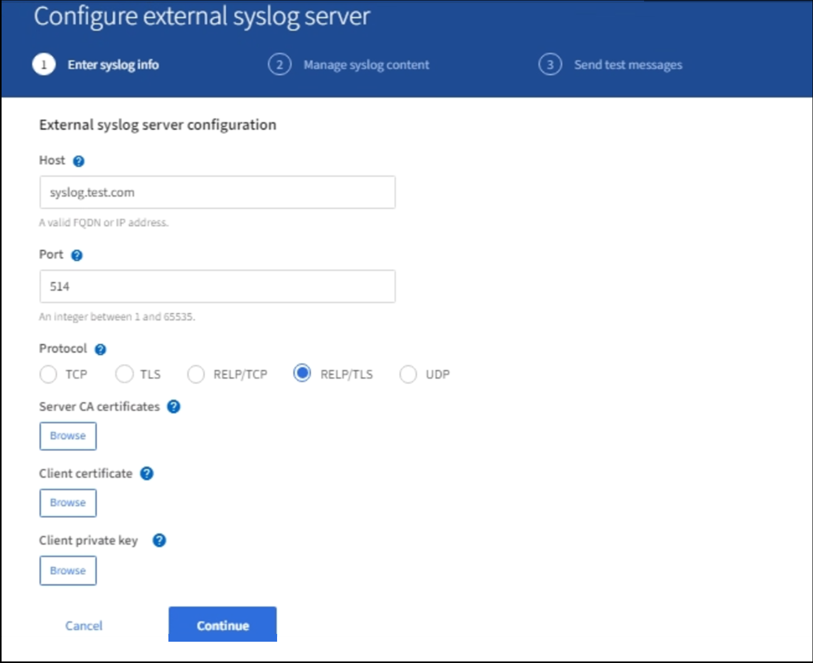

= Configure an external syslog server
:icons: font
:imagesdir: ../media/

[.lead]
If you want to save audit messages and a subset of logs to a location outside of your grid, use this procedure to configure an external syslog server. 

.What you'll need

* You are signed in to the Grid Manager using a xref:../admin/web-browser-requirements.adoc[supported web browser].
* You have Maintenance or Root Access permissions.
* You have a syslog server with the capacity to receive and store the log files. 
//need specs

.About this task

If you want to send audit information to an external syslog server, you must configure it first. Local logs of audit records continue to be generated and stored when an external syslog server is used.

Any of these types of logs can be sent to the external syslog server:
•	Audit logs containing the audit messages generated during normal system operation
•	Security events that might compromise your StorageGRID system
•	Application logs that are frequently needed for troubleshooting

Sending audit information to an external syslog server enables you to:

* Collect and manage audit information such as audit messages, application logs, and authentication events more efficiently
* Reduce network traffic on your admin nodes

+
IMPORTANT: When using an external syslog server, single logs greater than 8K are truncated at the end of the message. 

.Steps

. Select *CONFIGURATION* > *Monitoring* > *Audit and syslog server*.
+
image::../media/audit-messages-main-page.png[Audit messages main page]
//need update all screens

== [[Access-the-syslog-server-configuration-wizard]]Access the syslog server configuration wizard
. From the Audit and syslog server page, Select *Configure external syslog server*.
+
image::../media/audit-message-configure-syslog-server.png[Configure external syslog server]

=== Enter syslog server address information
The Configure external syslog server page appears: 

. Enter a valid fully qualified domain name or an IPv4 or IPv6 address for the external syslog server in the Host field.
. Enter the destination port on the external syslog server (must be an integer between 1 and 65535). The default port is 514. 
. Select the protocol used to send audit information to the external syslog server. TLS or RELP/TLS is recommended. You must upload a server certificate to use either of these two options.  
* *TCP*
* *TLS*
* *RELP/TCP*
* *RELP/TLS*
* *UDP*
//add detail and recommendation
+
. If you selected UDP or TCP, select *Continue*.
[#attach-certificate]
. If you selected TLS or RELP/TLS, you must attach at least one server certificate, but you can attach more. 

Using certificatse secures the connections between your grid and the external syslog server. 
//see xxx for more information about certificates.

When you select TLS or RELP/TLS as the protocol for your audit information, the following options appear:

* *Server CA certificates*: The certificate file in PEM encoding. This may be a CA bundle. 
//get description
* *Client certificate*: The certificate file in PEM encoding.
* *Client private key*: The custom server certificate private key file.

+
NOTE: EC private keys must be 224 bits or larger. RSA private keys must be 2048 bits or larger.
// private key restriction true?
//can you upload more then one CA certificate? why? 

.. Select *Browse* for the certificate or key you want to use. 
+
NOTE: If you use a client certificate you must also use a client private key. 

.. Select the certificate file or key file.
.. select *Open* to upload the file.
.. Select *Continue*
.. 
//in what situations would you use one or the other? 
//of the remote server? Select Browse to upload the new certificate.

//can this be used for syslog? ** *CA bundle*: A single optional file containing the certificates from each intermediate issuing certificate authority (CA). The file should contain each of the PEM-encoded CA certificate files, concatenated in certificate chain order.

=== Manage Syslog content
//. Select **.
//can you configure an external syslog server and not use it? 

. Select each type of audit information you want to send to the external syslog server.

+
* *Audit logs*: StorageGRID events and system activities

+
* *Security events*: Security events such as when an unauthorized user attempts to sign in or a user signs in as root

+
* *Application logs*: Log files useful for troubleshooting including:

** bycast-err.log
** bycast.log
** jaeger.log
** nms.log (Admin nodes only)
** prometheus.log
** raft.log
** hagroups.log 

. Use the dropdowns to select the severity and facility (type of message) for the category of audit information you want to send. 

+
*Severity*

+
Select Passthrough if you want each message sent to the external syslog to have the same severity value as it does in the local syslog. 

+
Otherwise, enter the severity value you want to use for your audit logs, security events, and application logs. You can enter any value between 0 and 7.

+
[options="header"]
|===
| Severity| Description
a|
0
a|
Emergency: System is unusable
a|
1
a|
Alert: Action must be taken immediately
a|2
a|
Critical: Critical conditions
a|
3
a|
Error: Error conditions
a|
4
a|
Warning: Warning conditions
a|
5
a|Notice: Normal but significant condition
a|
6
a|
Informational: Informational messages
a|
7
a|
Debug: Debug-level messages
|===

+
*Facility*

+
Select Passthrough if you want each message sent to the external syslog to have the same facility value as it does in the local syslog. 

+
Otherwise, enter the facility value you want to use for your audit logs, security events, and application logs. You can enter any value between 0 and 23.

+
[options="header"]
|===
|Facility| Description

a|
0
a|
kern (kernel messages)
a|
1
a|
user (user-level messages)
a|
2
a|
mail
a|
3
a|
daemon (system daemons)
a|
4 
a|
auth (security/authorization messages)
a|
5 
a|
syslog (messages generated internally by syslogd)
a|
6 
a|
lpr (line printer subsystem)
a|
7 
a|
news (network news subsystem)
a|
8 
a|
UUCP
a|
9 
a|
cron (clock daemon)
a|
10 
a|
security (security/authorization messages)
a|
11 
a|
FTP
a|
12 
a|
NTP
a|
13 
a|
logaudit (log audit)
a|
14 
a|
logalert (log alert)
a|
15 
a|
clock (clock daemon - note 2)
a|
16 
a|
local0
a|
17 
a|
local1
a|
18 
a|
local2
a|
19 
a|
local3
a|
20 
a|
local4
a|
21 
a|
local5
a|
22 
a|
local6
a|
23 
a|local7
|===

. Select *Continue*.

=== Send test messages
StorageGRID enables you to request that all nodes in your grid send test messages to the syslog server. You should use these test messages as part of your validation of your log collection infrastructure before you commit to sending data to the external syslog server.

CAUTION: Do not use the syslog server configuration until you confirm that the syslog server received a test message from each node in your grid and that the message was processed as expected.

. If you are certain your external syslog server is configured properly and can receive audit information from all the nodes in your grid, select *Skip and finish*. 

A green banner appears indicating your configuration has been saved successfully. 

[start=2]
. Otherwise, select *Send test messages* 
 
+
Test results continuously appear on the page until you stop the test. While the test is in progress, your audit messages continue to be sent to your previously configured destinations. 

. If you received any errors, correct them and select *Send test messages* again. See xref:../monitor/troubleshooting-syslog-server.adoc[Troubleshooting the external syslog server] to help you resolve errors.

//when does this warning appear: One or more external syslog servers have already been configured using the Grid Management API. Use the syslog-export API if you need to make changes. Any settings on this page will override all API customizations. 

[start=3]
. Wait until all nodes have passed the test, and then select *Stop and finish*.

A green banner appears notifying you that your syslog server configuration has been saved successfully. 

Your audit information is not sent to the external syslog server until you select a destination that includes the external syslog server. See xref:../monitor/configure-audit-messages.adoc#Select-the-destination-for-audit-information[Select the destination for audit information] to send your audit information to the external syslog server. 
//no audit message are sent to the syslog server yet at this point, correct? 

.Related information

xref:../audit/audit-message-overview.adoc[Audit message overview]

xref:../admin/system-audit-messages.adoc[System audit messages]

xref:../admin/object-storage-audit-messages.adoc[Object storage audit messages]

xref:../admin/management-audit-message.adoc[Management audit message]

xref:../admin/client-read-audit-messages.adoc[Client read audit messages]

xref:../admin/index.adoc[Administer StorageGRID]